# Comprehensive System Integration Plan v3.0 — Deep Enhancement Edition
**Created:** 2026-01-04 00:15 CST  
**Enhanced:** 2026-01-04 16:45 CST (PSYCHOSCORE Integration Added)  
**Priority:** CRITICAL - User Requirements  
**Scope:** Complete integration of all systems with 498 psychometric mappings + Professional Film Score Techniques + PSYCHOSCORE Custom Model

> [!NOTE]
> This plan is part of the MPN v3.2 Master Implementation Plan. See [mpn_master_implementation_plan.md](./mpn_master_implementation_plan.md) for the full roadmap.

---

## 🎬 SECTION A: PROFESSIONAL LEITMOTIF FRAMEWORK

Based on analysis of John Williams (Star Wars, Harry Potter) and Howard Shore (Lord of the Rings), this section codifies professional transformation techniques for our leitmotif system.

### A.1 Modal Transformation Rules

> [!IMPORTANT]
> Map RSI (Real-Symbolic-Imaginary) registers to professional modal choices:

| RSI Dominant | Mode | Emotional Effect | Example |
|--------------|------|------------------|---------|
| **Real** | Aeolian / Dorian | Grounded, serious, reality-facing | LOTR Fellowship theme |
| **Symbolic** | Lydian / Mixolydian | Elevated, magical, transcendent | Hedwig's Theme (#4) |
| **Imaginary** | Phrygian / Locrian | Unstable, anxious, illusory | Ring corruption motif |

**Implementation in `leitmotif_generator.ts`:**
```typescript
function getModalTransformation(rsi: RSI, trauma: number): string {
  const dominant = Object.entries(rsi).sort((a, b) => b[1] - a[1])[0][0];
  
  if (dominant === 'real') {
    return trauma > 0.6 ? 'Aeolian' : 'Dorian';
  } else if (dominant === 'symbolic') {
    return trauma > 0.6 ? 'Mixolydian' : 'Lydian'; // Lydian #4 for magic
  } else {
    return trauma > 0.6 ? 'Locrian' : 'Phrygian';
  }
}
```

### A.2 Orchestration Evolution (Character Arc)

Derived from John Williams' technique of evolving instrumentation during character development:

```mermaid
graph LR
    subgraph Character Growth
        A[Introduction: Solo Celeste] --> B[Development: Woodwinds]
        B --> C[Crisis: Full Brass]
        C --> D[Resolution: Full Orchestra]
    end
    
    subgraph Trauma Correlation
        T1[τ < 0.3: Chamber] --> T2[τ 0.3-0.6: Section]
        T2 --> T3[τ 0.6-0.8: Full]
        T3 --> T4[τ > 0.8: Tutti + Percussion]
    end
```



**Instrument Intensity Mapping:**
```typescript
function getOrchestrationLevel(trauma: number, entropy: number): OrchestrationLevel {
  if (trauma < 0.3 && entropy < 0.4) return 'SOLO';        // Intimate, reflective
  if (trauma < 0.5) return 'CHAMBER';                       // Small ensemble
  if (trauma < 0.7) return 'SECTION';                       // Full section
  if (trauma < 0.9) return 'FULL_ORCHESTRA';               // All sections
  return 'TUTTI_FORTISSIMO';                                // Crisis peak
}
```

### A.3 Harmonic Recontextualization

**Williams' Technique:** Same melody over different chord progressions creates emotional shift.

| Original Harmony | Transformation | Emotional Shift | Example |
|------------------|----------------|-----------------|---------|
| I - IV - V - I | i - IV - V - i | Heroic → Tragic | Force Theme: Hope → Loss |
| I - ♭III - IV | i - ♭VI - ♭VII | Magic → Corruption | Ring Theme corruption |
| ii - V - I | ii° - V⁷ - i | Stable → Unstable | Fellowship fragmentation |

```typescript
function harmonicallyRecontextualize(
  chord: string, 
  fromEmotion: string, 
  toEmotion: string
): string {
  const transformations: Record<string, Record<string, string>> = {
    'hope_to_despair': { 'Cmaj': 'Cm', 'Gmaj': 'Gm', 'Fmaj': 'Fm' },
    'innocence_to_corruption': { 'Cmaj7': 'Cdim7', 'Am7': 'Am♭5' },
    'unity_to_fragmentation': { 'Cmaj': 'Csus2', 'Gmaj': 'G/D' }
  };
  // Apply transformation
}
```

### A.4 Fragmentation Algorithm (High Entropy)

**Shore's Technique (LOTR):** Fellowship theme breaks into motifs as group splinters.

```typescript
function fragmentLeitmotif(
  leitmotif: Leitmotif,
  entropy: number,
  trauma: number
): NoteEvent[] {
  const fragmentationLevel = Math.floor((entropy + trauma) / 0.5);
  
  switch (fragmentationLevel) {
    case 0: return leitmotif.fullTheme;           // Complete statement
    case 1: return leitmotif.firstHalf;            // Truncated
    case 2: return leitmotif.coreMotif;            // Essential 4-note cell
    case 3: return leitmotif.intervalOnly;         // Just intervals, sparse
    default: return leitmotif.singleNote;          // Dissolution
  }
}
```

### A.5 Contrapuntal Layering (Multi-Actor Scenes)

When multiple actors speak/interact, layer their themes:

```typescript
function layerThemesContrapuntally(
  activeActors: ActorStave[]
): NoteEvent[][] {
  // Sort by activation (speaking = highest)
  const sorted = activeActors.sort((a, b) => b.activation - a.activation);
  
  return sorted.map((actor, index) => ({
    notes: actor.leitmotif,
    voice: index === 0 ? 'soprano' : index === 1 ? 'alto' : 'tenor',
    volume: -6 * index, // Each layer -6dB quieter
    octave: 4 - index    // Spread across octaves
  }));
}
```

---

## 🤖 SECTION B: ADVANCED AI MODEL INVENTORY

### B.1 MIDI Generation Models

| Model | Source | Best For | Emotion Support | Integration Priority |
|-------|--------|----------|-----------------|---------------------|
| **Text2midi** | [AMAAI-Lab](https://github.com/AMAAI-Lab/Text2midi) | Text → MIDI generation | Mood score 5.70 | HIGH |
| **LAMC** | [Los Angeles Music Composer](https://github.com) | Multi-instrumental | LLM-assisted | MEDIUM |
| **Magenta Music Transformer** | Google | Continuation/variation | Pattern-based | MEDIUM |

**Integration Pattern:**
```typescript
// New: src/lib/ai_midi_generator.ts
export async function generateMIDIFromPsychometrics(
  psychometrics: PsychometricState,
  duration: number
): Promise<ArrayBuffer> {
  const prompt = buildText2MidiPrompt(psychometrics);
  // Example: "Compose melancholic piano in C minor, tempo 72, 
  //          mood: sad, intensity: 0.7"
  
  const response = await fetch('https://api.amaai.dev/text2midi', {
    method: 'POST',
    body: JSON.stringify({ prompt, duration })
  });
  
  return response.arrayBuffer();
}
```

### B.2 Neural Audio Synthesis

| Model | Source | Output | Quality | Use Case |
|-------|--------|--------|---------|----------|
| **MusicGen** | Meta AudioCraft | Audio waveform | High | Full composition |
| **EnCodec** | Meta AudioCraft | Compressed audio | High | Streaming |
| **DDSP** | Google Magenta | Instrument synthesis | Medium | Timbre control |

### B.3 PSYCHOSCORE Custom Model ✅ IMPLEMENTED

> [!IMPORTANT]
> PSYCHOSCORE is now implemented and ready for training. See [psychoscore_training_plan.md](./psychoscore_training_plan.md) for full details.

**PSYCHOSCORE Implementation Status:**

| Component | Status | Location |
|-----------|--------|----------|
| Tokenizer | ✅ Complete | `ml/psychoscore/tokenizer/` |
| Data Generator | ✅ Complete | `ml/psychoscore/data/` |
| Training Script | ✅ Complete | `ml/psychoscore/train/` |
| Inference Server | ✅ Complete | `ml/psychoscore/inference/` |

**Enhanced Architecture (57D Input):**
```
┌─────────────────────────────────────────────────────────────────────┐
│                    PSYCHOSCORE TRANSFORMER v1.0                      │
├─────────────────────────────────────────────────────────────────────┤
│ INPUT LAYER                                                          │
│   ├── Psychometric Vector (57 dimensions)                           │
│   │   ├── DISC: 4D (Dominance, Influence, Steadiness, Compliance)   │
│   │   ├── OCEAN: 5D (O, C, E, A, N)                                  │
│   │   ├── RSI: 3D (Real, Symbolic, Imaginary)                        │
│   │   ├── McKenney-Lacan: 2D (trauma τ, entropy H)                   │
│   │   ├── Dark Triad: 3D (Mach, Narc, Psych)                         │
│   │   ├── Cognitive Biases: 30D (one-hot or multi-hot)               │
│   │   └── Physics State: 10D (Hamiltonian, Ising, Lyapunov...)       │
├─────────────────────────────────────────────────────────────────────┤
│ CONDITIONING LAYER                                                   │
│   ├── Linear(57 → 512)                                              │
│   ├── Global Style Token (GST) Embedding (8 heads × 256 dim)        │
│   └── Cross-attention conditioning for transformer blocks            │
├─────────────────────────────────────────────────────────────────────┤
│ TRANSFORMER DECODER (RWKV-based)                                     │
│   ├── 12 blocks, hidden_dim=1024                                    │
│   ├── QLoRA adapters (rank=32, alpha=64)                            │
│   └── Layer norm + residual connections                              │
├─────────────────────────────────────────────────────────────────────┤
│ OUTPUT LAYER                                                         │
│   ├── REMI Token Vocabulary (~30,000 tokens)                         │
│   └── Autoregressive generation (512-2048 tokens)                    │
└─────────────────────────────────────────────────────────────────────┘
```

**Training Configuration (16GB VRAM):**
```yaml
model: brianflakes/rwkv-midi-piano
quantization: 4-bit (NF4)
lora_rank: 32
batch_size: 2 (effective 32 with gradient accumulation)
learning_rate: 1e-4
epochs: 10
```

**Token Vocabulary Summary:**
- DISC: 44 tokens | OCEAN: 55 tokens | RSI: 36 tokens
- McKenney-Lacan: 22 tokens | Dark Triad: 33 tokens
- Cognitive Biases: 30 tokens | Physics: 35 tokens
- Musical Context: 30 tokens | **Total: ~1,700 new tokens**

---

## 🎭 SECTION C: EMOTIONAL TTS FRAMEWORK

### C.1 Scientific Foundation: Global Style Tokens (GST)

The academic framework for emotional speech synthesis is **Global Style Tokens**, first introduced in GST-Tacotron. This allows:
- Latent emotion vectors (anger, fear, joy, sadness)
- Continuous interpolation between emotions
- Disentanglement of prosody from content

### C.2 Provider Selection Matrix

| Provider | Emotion Control | Granularity | Open Source | Best For |
|----------|----------------|-------------|-------------|----------|
| **Microsoft Azure Speech** | `<mstts:express-as style="fearful">` | Phrase-level | No | Production |
| **ElevenLabs** | Stability/Similarity only | Voice-level | No | Baseline |
| **Bark (Suno)** | `[angry]` tokens | Word-level | Yes | Experimentation |
| **Chatterbox** | `[happy]`, `[sad]` | Word-level | Yes | Fine control |

### C.3 SSML Emotional Markup Integration

```typescript
// New: src/lib/emotional_tts_renderer.ts
import { SSML } from './ssml_builder';

export async function renderEmotionalSpeech(
  text: string,
  speaker: string,
  psychometrics: PsychometricState
): Promise<ArrayBuffer> {
  const emotion = mapPsychometricsToEmotion(psychometrics);
  
  // Build Azure SSML with emotion
  const ssml = SSML.create()
    .voice('en-US-JennyNeural')
    .expressAs(emotion.style) // 'cheerful', 'angry', 'sad', 'fearful'
    .prosody({ rate: emotion.rate, pitch: emotion.pitch })
    .text(text)
    .build();
  
  return await azureSpeechSynthesize(ssml);
}

function mapPsychometricsToEmotion(p: PsychometricState): EmotionStyle {
  if (p.trauma > 0.8) return { style: 'fearful', rate: '1.1', pitch: '+10%' };
  if (p.trauma > 0.5) return { style: 'sad', rate: '0.9', pitch: '-5%' };
  if (p.entropy > 0.7) return { style: 'excited', rate: '1.2', pitch: '+5%' };
  return { style: 'default', rate: '1.0', pitch: '0%' };
}
```

---

## 🗄️ SECTION D: POSTGRESQL DEEP OPTIMIZATION

### D.1 Comprehensive Index Strategy

```sql
-- ============================================================
-- JSONB METADATA INDEXES (GIN + jsonb_path_ops)
-- ============================================================
CREATE INDEX idx_documents_metadata_tags ON documents USING GIN (
    (metadata->'tags') jsonb_path_ops
);

CREATE INDEX idx_documents_psychometric_data ON documents USING GIN (
    (metadata->'psychometric_data') jsonb_path_ops
);

CREATE INDEX idx_documents_musical_metadata ON documents USING GIN (
    (metadata->'musical_metadata') jsonb_path_ops
);

-- ============================================================
-- B-TREE EXPRESSION INDEXES (Exact Match on Extracted Fields)
-- ============================================================
CREATE INDEX idx_documents_author ON documents USING BTREE (
    ((metadata->>'author')::text)
);

CREATE INDEX idx_documents_creation_date ON documents USING BTREE (
    ((metadata->>'original_creation_date')::timestamp)
);

CREATE INDEX idx_documents_loaded_at ON documents USING BTREE (loaded_at);

-- ============================================================
-- FULL-TEXT SEARCH (tsvector + GIN)
-- ============================================================
ALTER TABLE documents ADD COLUMN content_search tsvector
    GENERATED ALWAYS AS (
        setweight(to_tsvector('english', coalesce(title, '')), 'A') ||
        setweight(to_tsvector('english', coalesce(content, '')), 'B')
    ) STORED;

CREATE INDEX idx_documents_fts ON documents USING GIN (content_search);

-- ============================================================
-- PARTIAL INDEXES (For Specific Subsets)
-- ============================================================
CREATE INDEX idx_published_documents ON documents USING BTREE (published_at)
    WHERE is_published = TRUE;

CREATE INDEX idx_processed_scripts ON documents USING GIN (metadata)
    WHERE (metadata->>'is_processed')::boolean = TRUE;
```

### D.2 Document Ingestion Schema

```sql
CREATE TABLE scripts (
    id UUID PRIMARY KEY DEFAULT gen_random_uuid(),
    title TEXT NOT NULL,
    author TEXT,
    original_creation_date DATE,
    theme TEXT,
    
    -- Content
    raw_content TEXT NOT NULL,
    
    -- Metadata
    metadata JSONB DEFAULT '{}',
    
    -- System Timestamps
    loaded_at TIMESTAMPTZ DEFAULT CURRENT_TIMESTAMP,
    processed_at TIMESTAMPTZ,
    
    -- Search
    content_search tsvector GENERATED ALWAYS AS (
        to_tsvector('english', coalesce(title, '') || ' ' || coalesce(raw_content, ''))
    ) STORED,
    
    -- Versioning
    version INTEGER DEFAULT 1,
    parent_version_id UUID REFERENCES scripts(id)
);

-- Audit Trail
CREATE TABLE script_audit_log (
    id SERIAL PRIMARY KEY,
    script_id UUID REFERENCES scripts(id),
    action TEXT NOT NULL, -- 'CREATE', 'UPDATE', 'DELETE'
    changed_by TEXT,
    changed_at TIMESTAMPTZ DEFAULT CURRENT_TIMESTAMP,
    old_values JSONB,
    new_values JSONB
);
```

---

## 🎛️ SECTION E: DYNAMIC CONDUCTOR INTERFACE

### E.1 Actor Instrument Override UI

```typescript
// New: src/components/mpn-lab/ActorInstrumentPicker.tsx
interface ActorInstrumentPickerProps {
  actorId: string;
  actorName: string;
  currentInstrument: InstrumentName;
  suggestedInstrument: InstrumentName; // AI suggestion
  onInstrumentChange: (instrument: InstrumentName) => void;
}

export function ActorInstrumentPicker(props: ActorInstrumentPickerProps) {
  return (
    <div className="actor-instrument-picker">
      <span className="actor-name">{props.actorName}</span>
      
      {/* AI Suggestion Badge */}
      <span className="ai-suggestion">
        🤖 Suggested: {props.suggestedInstrument}
      </span>
      
      {/* Manual Override Dropdown */}
      <select 
        value={props.currentInstrument}
        onChange={(e) => props.onInstrumentChange(e.target.value as InstrumentName)}
      >
        {AVAILABLE_INSTRUMENTS.map(inst => (
          <option key={inst.id} value={inst.id}>{inst.name}</option>
        ))}
      </select>
      
      {/* Regenerate Button */}
      <button onClick={() => regenerateMusicForActor(props.actorId)}>
        🔄 Regenerate
      </button>
    </div>
  );
}
```

### E.2 Real-Time Re-generation Flow


---

## 🔗 SECTION F: SYSTEMS INTEGRATION PERSPECTIVE

### F.1 Complete Data Flow Architecture


### F.2 Component Dependency Matrix

| Component | Depends On | Provides To | Integration Status |
|-----------|-----------|-------------|-------------------|
| ScoreOrchestrator | GeniusComposer, LeitmotifGen | MPNSynthesizer | ✅ Complete |
| GeniusComposer | AI Clients, Style API | ScoreOrchestrator | ✅ Complete |
| LeitmotifGenerator | Psychometric Mapper | GeniusComposer | ✅ Complete |
| MPNSynthesizer | Tone.js, Samplers | Audio Output | ✅ Complete |
| ElevenLabsClient | API Key | LeadVoiceManager | ✅ Complete |
| OrchestratorWorker | ScoreOrchestrator | page.tsx | ✅ Complete |
| **Text2MidiClient** | API | GeniusComposer | ✅ Complete |
| **AzureSpeechClient** | API | EmotionalTTSRenderer | 🔲 Planned |
| **PSYCHOSCORE Model** | Training | AI Engine | ✅ Phase 1 Complete |

### F.3 Future Integration Points

1. **VR Conductor Mode** - WebXR integration with spatial audio
2. **Real-time Collaboration** - Multiple conductors via WebSocket
3. **Spotify Integration** - Reference track analysis for style matching
4. **Mobile Responsive** - Touch-optimized conductor interface
5. **Plugin Architecture** - User-contributed instrument packs

---

## 📅 ENHANCED IMPLEMENTATION TIMELINE

### Phase 1: Leitmotif Enhancement (Week 1) ✅
- [x] Implement modal transformation rules in `leitmotif_generator.ts`
- [x] Add fragmentation algorithm
- [x] Create orchestration level selector
- [x] Add contrapuntal layering for multi-actor scenes

### Phase 2: AI Model Deep Integration (Week 2) ✅
- [x] Integrate Text2midi API
- [x] Create `text2midi_client.ts` with HuggingFace integration
- [x] Implement psychometric → prompt conversion
- [x] Wire into GeniusComposer with fallback logic
- [x] Add 192 passing tests

### Phase 3: Emotional TTS Enhancement (Week 3) 🔄
- [x] Configure ElevenLabs as primary TTS provider
- [ ] Add emotion → voice parameter mapping
- [ ] Implement SSML markup integration
- [ ] Test prosody control (rate, pitch, volume)

### Phase 4: Database Optimization (Week 4) ⏳
- [ ] Apply all index optimizations
- [ ] Implement temporal versioning for scripts
- [ ] Add audit logging
- [ ] Create bulk ingestion pipeline

### Phase 5: Dynamic Conductor UI (Week 5) ⏳
- [ ] Build ActorInstrumentPicker component
- [ ] Implement real-time regeneration
- [ ] Add AI suggestion display
- [ ] Create conductor session persistence

### Phase 6: PSYCHOSCORE Training (Weeks 6-10) 🔄 NEW
- [x] Create custom tokenizer with 1,700+ psychometric tokens
- [x] Implement synthetic data generator with MPN theory rules
- [x] Create QLoRA training script for 16GB GPU
- [x] Build FastAPI inference server
- [ ] Download and process EMOPIA + Lakh MIDI datasets
- [ ] Run training on RTX 5070 Ti (~48-72 hours)
- [ ] Evaluate on held-out test set (target: >70% emotion accuracy)
- [ ] Integrate trained model into GeniusComposer

---

## 📚 REFERENCES

### Film Score Analysis
- [Film Music Notes: John Williams Themes](https://filmmusicnotes.com/john-williams-themes-part-1-the-force-theme/)
- [Howard Shore's Ring Cycle Analysis](https://human.libretexts.org/Courses/Prince_Georges_Community_College/Music_Appreciation:_A_Topical_Approach_to_Music_Genre_and_Style/13:_Music_in_Film/13.04:_Howard_Shore's_Score_to_Lord_of_the_Rings)

### AI Music Models
- [Text2midi (AMAAI-Lab)](https://github.com/AMAAI-Lab/Text2midi)
- [EMOPIA Dataset](https://github.com/AMAAI-Lab/ai-audio-datasets-list)
- [EmoPiano Dataset](https://www.kaggle.com/datasets/ziya07/emopiano-dataset-for-emotion-recognition-in-piano)

### Emotional TTS
- [GST-Tacotron (Google)](https://google.github.io/tacotron/publications/global_style_tokens/)
- [Microsoft Azure Emotional Styles](https://learn.microsoft.com/en-us/azure/ai-services/speech-service/speech-synthesis-markup-voice)

---

**Status:** Enhanced plan ready for review and phased implementation.
