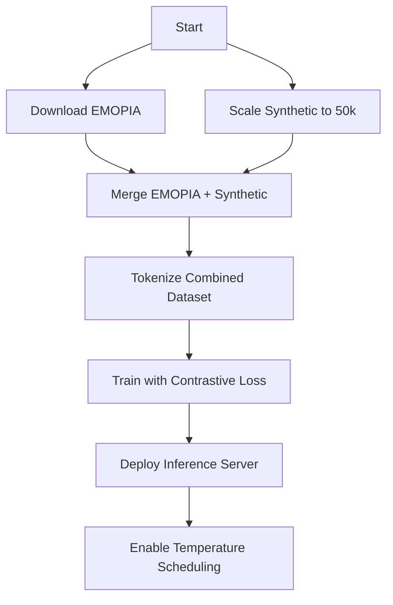

# PSYCHOSCORE Model Improvements - Implementation Plan

**Date:** 2026-01-05  
**Status:** Ready for Approval  
**Scope:** All 4 ICE-scored improvements  

---

## Overview

| # | Improvement | ICE Score | Priority |
|---|-------------|-----------|----------|
| 1 | **EMOPIA Dataset Training** | 8.5 | HIGH |
| 2 | **Scale to 50k+ Pairs** | 7.5 | HIGH |
| 3 | **Temperature Scheduling** | 6.5 | MEDIUM |
| 4 | **Contrastive Learning** | 6.0 | MEDIUM |

> [!NOTE]
> These improvements can be run in parallel. EMOPIA integration and 50k+ scaling happen during data preparation. Temperature scheduling and contrastive learning are inference/training modifications.

---

## 1. EMOPIA Dataset Integration (ICE: 8.5)

### Background
EMOPIA is a dataset of 1,087 emotion-labeled piano MIDI clips from pop music.
- **Source:** `https://zenodo.org/record/5257995/files/EMOPIA_2.2.zip`
- **License:** CC-BY 4.0
- **Labels:** Emotion class encoded in filename (position 1)

### Files to Create/Modify

#### [NEW] `ml/psychoscore/data/emopia_loader.py`
```python
"""Load EMOPIA dataset and convert to PSYCHOSCORE format"""
# - Download from Zenodo if not present
# - Parse filename for emotion class
# - Map emotion to psychometric values:
#   - 1/2 (positive valence) → lower trauma, higher entropy
#   - 3/4 (negative valence) → higher trauma, lower entropy
# - Extract MIDI tokens for training targets
```

#### [MODIFY] `ml/psychoscore/scripts/run_training_pipeline.py`
- Add `phase_download_emopia()` method
- Add `phase_merge_emopia_data()` method
- Include EMOPIA pairs in final dataset

#### [NEW] `ml/psychoscore/scripts/download_emopia.sh`
```bash
#!/bin/bash
# Download EMOPIA 2.2 from Zenodo
wget https://zenodo.org/record/5257995/files/EMOPIA_2.2.zip
unzip EMOPIA_2.2.zip -d data/raw/EMOPIA
```

### Emotion → Psychometric Mapping

| EMOPIA Class | Valence | Arousal | → trauma | → entropy |
|--------------|---------|---------|----------|-----------|
| 1 (HAHV) | High | High | 0.1-0.3 | 0.7-0.9 |
| 2 (HALV) | High | Low | 0.1-0.3 | 0.2-0.4 |
| 3 (LAHV) | Low | High | 0.7-0.9 | 0.6-0.8 |
| 4 (LALV) | Low | Low | 0.7-0.9 | 0.1-0.3 |

---

## 2. Scale to 50k+ Synthetic Pairs (ICE: 7.5)

### Background
Current: 15,000 pairs → Target: 50,000+ pairs for better generalization.

### Files to Modify

#### [MODIFY] `ml/psychoscore/data/generate_synthetic_pairs.py`
- Increase variance in psychometric ranges
- Add more musical pattern templates
- Improve music-theoretic mapping (mode, rhythm, phrase)

#### [MODIFY] `ml/psychoscore/scripts/run_training_pipeline.py`
- Change default `num_pairs` from 15000 to 50000
- Add data augmentation (transposition, tempo variation)

### Synthetic Data Improvements

| Enhancement | Current | New |
|-------------|---------|-----|
| Pair count | 15,000 | 50,000+ |
| Key variety | Random | All 12 keys |
| Tempo range | Fixed | 60-180 BPM |
| Phrase length | 4-16 bars | 4-32 bars |
| Augmentation | None | Transpose, time-stretch |

---

## 3. Temperature Scheduling (ICE: 6.5)

### Background
Dynamic temperature based on entropy/trauma: high entropy → more variation.

### Files to Modify

#### [MODIFY] `ml/psychoscore/inference/server.py`

```python
def calculate_dynamic_temperature(profile: PsychometricProfile) -> float:
    """Calculate temperature from psychometric profile"""
    base_temp = 0.7
    entropy_factor = profile.entropy * 0.5  # +0 to +0.5
    trauma_factor = profile.trauma * 0.3    # +0 to +0.3
    return min(1.5, max(0.4, base_temp + entropy_factor - trauma_factor))
```

#### [MODIFY] `ml/psychoscore/inference/server.py` → `generate()`
- If temperature not explicitly set, use dynamic calculation
- Add `use_dynamic_temperature: bool = True` parameter

### Temperature Schedule

| Profile State | Base | Entropy Bonus | Trauma Penalty | Final |
|---------------|------|---------------|----------------|-------|
| Low E, Low T | 0.7 | +0.0 | -0.0 | **0.70** |
| High E, Low T | 0.7 | +0.4 | -0.0 | **1.10** |
| Low E, High T | 0.7 | +0.0 | -0.21 | **0.49** |
| High E, High T | 0.7 | +0.4 | -0.21 | **0.89** |

---

## 4. Contrastive Learning (ICE: 6.0)

### Background
Train model so similar psychometric profiles produce similar MIDI embeddings.

### Files to Create/Modify

#### [NEW] `ml/psychoscore/train/contrastive_loss.py`

```python
"""Contrastive loss for PSYCHOSCORE training"""
import torch
import torch.nn.functional as F

def profile_similarity(p1, p2) -> float:
    """Calculate similarity between two profiles (0-1)"""
    # Cosine similarity on flattened profile vectors

def contrastive_loss(embeddings, profiles, margin=0.5):
    """InfoNCE-style contrastive loss"""
    # Similar profiles → pull together
    # Dissimilar profiles → push apart
```

#### [MODIFY] `ml/psychoscore/train/train_psychoscore.py`
- Add `--contrastive-weight` argument (default 0.1)
- Combine `loss = lm_loss + contrastive_weight * c_loss`
- Extract embeddings from final hidden state

#### [NEW] `ml/psychoscore/train/profile_sampler.py`
- Sample triplets: (anchor, positive, negative)
- Positive = similar profile (high cosine sim)
- Negative = dissimilar profile (low cosine sim)

### Loss Function

```
L_total = L_causal_lm + λ * L_contrastive

where:
  L_causal_lm = cross-entropy on next token prediction
  L_contrastive = InfoNCE loss on profile→embedding mapping
  λ = 0.1 (contrastive weight)
```

---

## Execution Order



### Commands

```bash
# Phase 1: Data Preparation (parallel)
docker compose run psychoscore-train bash scripts/download_emopia.sh
docker compose run psychoscore-train python data/generate_synthetic_pairs.py --num-pairs 50000

# Phase 2: Data Integration
docker compose run psychoscore-train python scripts/run_training_pipeline.py \
    --include-emopia \
    --num-synthetic 50000

# Phase 3: Training with Contrastive Loss
docker compose run psychoscore-train python train/train_psychoscore.py \
    --config train/config.yaml \
    --contrastive-weight 0.1

# Phase 4: Deploy with Temperature Scheduling
docker compose up -d psychoscore-inference
```

---

## Expected Improvements

| Metric | Current | Target |
|--------|---------|--------|
| Final Loss | 6.03 | < 4.5 |
| Training Data | 15k synthetic | 50k+ mixed |
| Real Music | None | 1,087 EMOPIA clips |
| Profile Coherence | Low | Higher (contrastive) |
| Output Variety | Fixed temp | Dynamic per profile |

---

## Task Checklist

- [ ] Download EMOPIA dataset
- [ ] Create `emopia_loader.py`
- [ ] Scale synthetic pairs to 50k+
- [ ] Implement temperature scheduling
- [ ] Implement contrastive loss
- [ ] Retrain model with all improvements
- [ ] Verify inference quality
