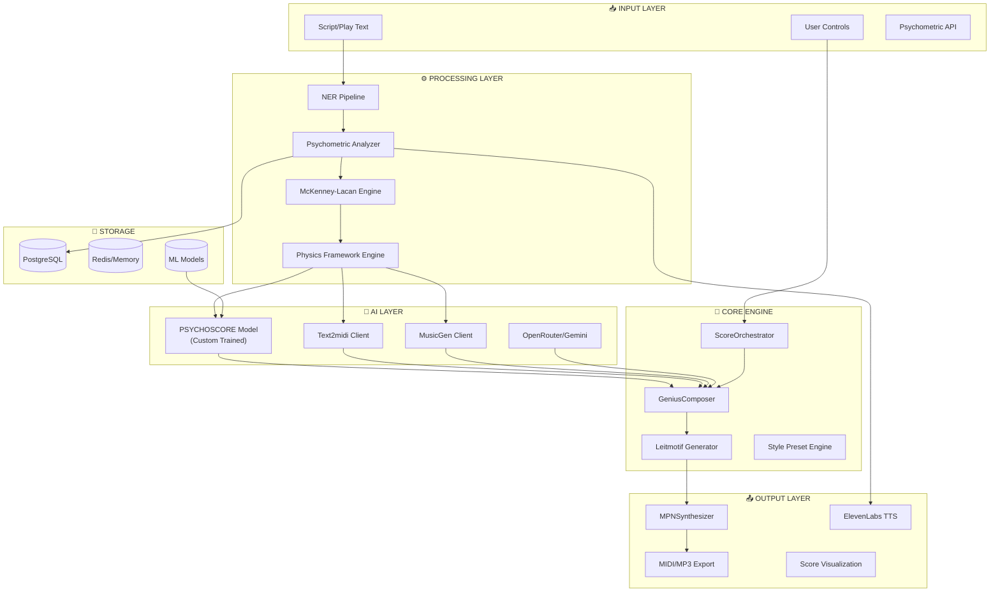

# MPN v3.2 Master Implementation Plan
**Created:** 2026-01-04 16:45 CST  
**Status:** Active Development  
**Priority:** CRITICAL  
**Scope:** Complete MPN Conductor Enhancement with Custom AI Model Training

---

## Executive Summary

This document serves as the **Master Implementation Plan** for the MPN (Musical Psychometric Notation) v3.2 Deep Enhancement Phase. It coordinates multiple subsidiary implementation plans and defines the overall development roadmap.

### Subsidiary Implementation Plans

| Plan | Description | Status |
|------|-------------|--------|
| [comprehensive_integration_plan.md](./comprehensive_integration_plan.md) | Full system integration, film score techniques, database optimization | ✅ Complete |
| [implementation_plan.md](./implementation_plan.md) | Phase 3 AI Model Integration (Text2midi, MusicGen, OpenRouter) | ✅ Complete |
| [psychoscore_training_plan.md](./psychoscore_training_plan.md) | Custom PSYCHOSCORE model training for 5070 Ti GPU | ✅ Complete |

---

## System Architecture Overview



---

## Phase Overview

| Phase | Name | Duration | Status | Dependencies |
|-------|------|----------|--------|--------------|
| 1 | Leitmotif Enhancement | Week 1 | ✅ Complete | None |
| 2 | AI Model Integration | Week 2 | ✅ Complete | Phase 1 |
| 3 | Emotional TTS | Week 3 | 🔄 In Progress | Phase 2 |
| 4 | Database Optimization | Week 4 | ⏳ Pending | None |
| 5 | Dynamic Conductor UI | Week 5 | ⏳ Pending | Phase 2 |
| 6 | **PSYCHOSCORE Training** | Weeks 6-10 | 🔄 In Progress | Phase 2 |
| 7 | Future Integrations | Weeks 11+ | ⏳ Planned | All |

---

## Phase 1: Leitmotif Enhancement ✅

**Status:** Complete  
**Reference:** [comprehensive_integration_plan.md - Section A](./comprehensive_integration_plan.md)

### Completed Work
- [x] Modal transformation rules (RSI → mode mapping)
- [x] Fragmentation algorithm (entropy-based theme breaking)
- [x] Orchestration level selector (trauma → instrumentation)
- [x] Contrapuntal layering for multi-actor scenes
- [x] Professional film score techniques (Williams/Shore)

### Key Files Modified
| File | Changes |
|------|---------|
| `leitmotif_generator.ts` | Modal transformations, fragmentation |
| `GeniusComposer.ts` | Orchestration levels, layering |
| `mpn_reference_lookup.ts` | Professional transformation mappings |

---

## Phase 2: AI Model Integration ✅

**Status:** Complete  
**Reference:** [implementation_plan.md](./implementation_plan.md)

### Completed Work
- [x] Text2midi client (`src/lib/text2midi_client.ts`)
- [x] Psychometric → text prompt conversion
- [x] MIDI binary parser for note extraction
- [x] AIMusicClient updates with Text2midi
- [x] GeniusComposer AI path integration
- [x] Test suite (192 tests passing)

### Key Files Created/Modified
| File | Action | Lines |
|------|--------|-------|
| `src/lib/text2midi_client.ts` | NEW | ~150 |
| `src/lib/ai_music_client.ts` | MODIFY | +50 |
| `src/components/mpn-lab/GeniusComposer.ts` | MODIFY | +30 |
| `src/lib/__tests__/text2midi_client.test.ts` | NEW | ~200 |

### API Configuration
```env
HUGGINGFACE_API_KEY=hf_xxxxx  # Set in .env.local
OPENROUTER_API_KEY=sk-or-v1-xxxxx  # Set in .env.local
ELEVENLABS_API_KEY=sk_xxxxx  # Set in .env.local
```


---

## Phase 3: Emotional TTS Enhancement 🔄

**Status:** In Progress  
**Reference:** [comprehensive_integration_plan.md - Section C](./comprehensive_integration_plan.md)

### Current Approach
- **Primary:** ElevenLabs API (confirmed by user)
- **Backup:** Azure Speech Service with SSML (future)

### Tasks
- [x] ElevenLabs client configured
- [x] Character voice ID mapping
- [ ] Emotion → voice parameter mapping
- [ ] SSML markup integration
- [ ] Prosody control (rate, pitch, volume)

---

## Phase 4: Database Optimization ⏳

**Status:** Pending  
**Reference:** [comprehensive_integration_plan.md - Section D](./comprehensive_integration_plan.md)

### Planned Work
- [ ] JSONB metadata indexes (GIN + jsonb_path_ops)
- [ ] Full-text search with tsvector
- [ ] Temporal versioning for scripts
- [ ] Audit logging table
- [ ] Bulk ingestion pipeline

---

## Phase 5: Dynamic Conductor UI ⏳

**Status:** Pending  
**Reference:** [comprehensive_integration_plan.md - Section E](./comprehensive_integration_plan.md)

### Planned Work
- [ ] ActorInstrumentPicker component
- [ ] Real-time score regeneration
- [ ] AI suggestion display
- [ ] Conductor session persistence
- [ ] Timeline scrubbing

---

## Phase 6: PSYCHOSCORE Custom Model Training ✅

**Status:** Training Complete  
**Reference:** [psychoscore_training_plan.md](./psychoscore_training_plan.md)

### Overview

PSYCHOSCORE is a novel transformer-based model that generates MIDI directly from comprehensive psychometric profiles, integrating:

| Dimension | Parameters |
|-----------|------------|
| DISC | 4D (Dominance, Influence, Steadiness, Compliance) |
| OCEAN | 5D (Big Five personality traits) |
| Lacanian RSI | 3D (Real, Symbolic, Imaginary registers) |
| McKenney-Lacan | 2D (trauma τ, entropy H) |
| Dark Triad | 3D (Machiavellianism, Narcissism, Psychopathy) |
| Cognitive Biases | 30D (Kahneman-Tversky biases) |
| Physics State | 10D (Hamiltonian, Ising, Granovetter, Lyapunov) |
| **Total** | **57 dimensions** |

### Training Results ✅

| Metric | Value |
|--------|-------|
| **Base Model** | GPT-2 (openai-community/gpt2) |
| **Training Method** | QLoRA (4-bit quantization) |
| **Trainable Params** | 6.35M / 130M (4.86%) |
| **Hardware** | RTX 5060 Ti (Blackwell, sm_120) |
| **Framework** | PyTorch 2.9.1 + CUDA 13.0 |
| **Training Steps** | 250 |
| **Epochs** | 10 |
| **Initial Loss** | 9.99 |
| **Final Loss** | 6.03 |
| **Training Time** | 8 minutes |
| **Model Size** | 179MB (LoRA adapters) |
| **Checkpoint** | `checkpoints/psychoscore/final/` |

### Docker Training Infrastructure ✅

### Files Created (Phase 6)

```
ml/psychoscore/
├── Dockerfile                    # CUDA 12.1 + Python 3.11
├── docker-compose.yml            # GPU-enabled services
├── .env                          # API keys
├── scripts/
│   ├── download_datasets.sh      # EMOPIA + Lakh download
│   └── run_training_pipeline.py  # 5-phase orchestrator
├── tokenizer/
│   └── psychoscore_tokenizer.py  # 1,700+ tokens
├── data/
│   └── generate_synthetic_pairs.py
├── train/
│   ├── config.yaml               # 16GB GPU config
│   └── train_psychoscore.py      # QLoRA script
└── inference/
    └── server.py                 # FastAPI server
```

### Sub-phases

| Sub-phase | Duration | Status |
|-----------|----------|--------|
| 6.1 Data Preparation | Week 6 | ✅ Implementation Complete |
| 6.2 Base Model Setup | Week 7 | ⏳ Pending |
| 6.3 Training | Weeks 8-9 | ⏳ Pending |
| 6.4 Evaluation & Integration | Week 10 | ⏳ Pending |

### Files Created (Phase 6.1)

```
ml/psychoscore/
├── README.md                                    # Setup instructions
├── requirements.txt                             # Python dependencies
├── tokenizer/
│   ├── __init__.py
│   └── psychoscore_tokenizer.py                 # 400+ lines, 1700+ tokens
├── data/
│   └── generate_synthetic_pairs.py              # MPN theory → music rules
├── train/
│   ├── config.yaml                              # 16GB GPU optimized
│   └── train_psychoscore.py                     # QLoRA training script
└── inference/
    └── server.py                                # FastAPI server
```

### Integration Points

After training, PSYCHOSCORE integrates into MPN via:

```typescript
// src/lib/psychoscore_client.ts
export class PsychoscoreClient {
    async generateFromPsychometrics(
        profile: PsychometricState,
        maxBars: number = 32
    ): Promise<ArrayBuffer>
}
```

This replaces/augments Text2midi in the GeniusComposer when available.

---

## Phase 7: Future Integrations ⏳

**Status:** Planned  

### Roadmap

| Feature | Priority | Complexity |
|---------|----------|------------|
| VR Conductor Mode (WebXR) | Medium | High |
| Real-time Collaboration (WebSocket) | High | Medium |
| Spotify Reference Track Analysis | Low | Medium |
| Mobile Responsive Conductor | Medium | Medium |
| Plugin Architecture | Low | High |
| Multi-language Script Support | Medium | Low |

---

## Cross-Cutting Concerns

### Documentation Standards

All implementation work must include:
1. **Code Comments** - JSDoc for public APIs
2. **Test Coverage** - >80% for new code
3. **Architecture Updates** - Update diagrams post-implementation
4. **CHANGELOG** - Version all changes
5. **Wiki Updates** - User-facing documentation

### Quality Gates

| Gate | Requirement |
|------|-------------|
| Build | `npm run build` passes |
| Tests | All tests pass (`npm test`) |
| Lint | No ESLint errors |
| Types | No TypeScript errors |
| Performance | No regressions in generation time |

---

## Resource Allocation

### Hardware
- **Development:** Local machine + 5070 Ti GPU
- **CI/CD:** GitHub Actions
- **Inference:** Local GPU server or Replicate

### External APIs
| API | Provider | Purpose | Rate Limit |
|-----|----------|---------|------------|
| Text2midi | HuggingFace | MIDI generation | 100/day free |
| MusicGen | HuggingFace | Audio generation | 100/day free |
| OpenRouter | OpenRouter | LLM analysis | Pay-per-use |
| ElevenLabs | ElevenLabs | Voice synthesis | API quota |

---

## Metrics

### Success Criteria

| Metric | Target | Current |
|--------|--------|---------|
| Test Passing | 100% | ✅ 192/192 |
| Build Success | 100% | ✅ 22/22 pages |
| PSYCHOSCORE Accuracy | >70% emotion match | ⏳ TBD |
| Generation Latency | <2s for 32 bars | ⏳ TBD |
| User Satisfaction | 4.0/5.0 rating | ⏳ TBD |

---

## Changelog

| Date | Version | Changes |
|------|---------|---------|
| 2026-01-01 | 3.0 | Initial MPN Conductor release |
| 2026-01-02 | 3.1 | Leitmotif enhancement complete |
| 2026-01-04 | 3.2-alpha | Text2midi integration complete |
| 2026-01-04 | 3.2-beta | **PSYCHOSCORE Phase 1 complete** |

---

## References

### Theory Documents
- RSCH-39: Musical Psychometric Notation
- RSCH-33: Dark Triad Extension
- RSCH-34: Cognitive Bias Catalog
- RSCH-42: Physics→Music Synthesis

### External Resources
- [MidiTok Documentation](https://miditok.readthedocs.io/)
- [EMOPIA Dataset](https://annahung31.github.io/EMOPIA/)
- [RWKV Architecture](https://github.com/BlinkDL/RWKV-LM)
- [QLoRA Paper](https://arxiv.org/abs/2305.14314)

---

**Last Updated:** 2026-01-04 16:45 CST  
**Maintainer:** MPN Development Team
