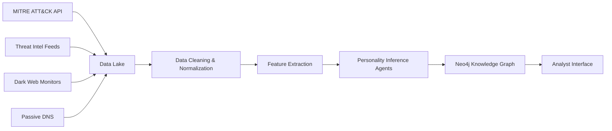

# Enhancement 25: Threat Actor Personality Modeling - Data Sources

**Version**: 1.0.0
**Created**: 2025-11-26
**Purpose**: Comprehensive data source catalog for threat actor personality inference
**Data Categories**: TTPs, Infrastructure, Communications, Behavioral Intelligence, Academic Research

---

## Table of Contents

1. [Primary Data Sources](#primary-data-sources)
2. [TTP Intelligence (MITRE ATT&CK)](#ttp-intelligence)
3. [Threat Intelligence Reports](#threat-intelligence-reports)
4. [Dark Web Communications](#dark-web-communications)
5. [Infrastructure & Technical Indicators](#infrastructure-indicators)
6. [Academic Research](#academic-research)
7. [Data Collection Methods](#data-collection-methods)
8. [Data Quality & Validation](#data-quality)
9. [Ethical Considerations](#ethical-considerations)
10. [Data Source Integration Pipeline](#integration-pipeline)

---

## Primary Data Sources Overview

### Source Classification Matrix

| Source Type | Personality Signals | Data Volume | Reliability | Update Frequency | Cost |
|-------------|-------------------|-------------|-------------|-----------------|------|
| **MITRE ATT&CK** | TTPs → Openness, Conscientiousness | High | Very High (0.95) | Quarterly | Free |
| **Threat Intel Reports** | Campaign analysis → All traits | Medium | High (0.85) | Weekly | Varies |
| **Dark Web Forums** | Communication → Narcissism, Machiavellianism | Low | Medium (0.65) | Continuous | Medium |
| **Ransom Notes** | Linguistic markers → Dark Triad | Low | High (0.80) | Per incident | Free |
| **Infrastructure Data** | Hosting choices → Conscientiousness | High | Medium (0.70) | Daily | High |
| **WHOIS History** | Registration patterns → Personality | Medium | Medium (0.65) | Daily | Medium |
| **Academic Papers** | Validation frameworks | Low | Very High (0.90) | Annual | Free |

---

## TTP Intelligence (MITRE ATT&CK)

### MITRE ATT&CK Enterprise Matrix

**Source**: https://attack.mitre.org/
**Version**: ATT&CK v14 (latest as of 2024)
**Coverage**: 14 tactics, 193 techniques, 401 sub-techniques

**Data Structure**:
```json
{
  "technique": {
    "id": "T1566.001",
    "name": "Phishing: Spearphishing Attachment",
    "tactic": "Initial Access",
    "description": "Adversaries may send spearphishing emails with a malicious attachment...",
    "platforms": ["Linux", "macOS", "Windows"],
    "data_sources": ["Application Log", "File", "Network Traffic"],
    "detection": "...",
    "mitigation": "...",
    "groups": ["APT1", "APT28", "APT29", "FIN7", ...],
    "software": ["BADNEWS", "CHOPSTICK", ...]
  }
}
```

**Personality Inference Mappings**:

**Openness (Novel Technique Adoption)**:
```python
openness_indicators = {
    'zero_day_usage': ['T1190', 'T1210'],  # Exploit Public-Facing Application
    'advanced_persistence': ['T1547', 'T1053'],  # Boot/Logon Autostart, Scheduled Task
    'novel_evasion': ['T1027', 'T1055'],  # Obfuscated Files, Process Injection
    'supply_chain': ['T1195'],  # Supply Chain Compromise
    'cloud_targeting': ['T1078.004']  # Cloud Accounts
}
```

**Conscientiousness (OPSEC Rigor)**:
```python
conscientiousness_indicators = {
    'anti_forensics': ['T1070', 'T1112', 'T1485'],  # Indicator Removal, Registry Modification
    'defense_evasion': ['T1562', 'T1036', 'T1218'],  # Impair Defenses, Masquerading
    'encryption_usage': ['T1486', 'T1560'],  # Data Encrypted for Impact/Transfer
    'operational_security': ['T1497', 'T1622']  # Virtualization/Sandbox Detection
}
```

**Data Collection Method**:
1. **API Access**: MITRE ATT&CK TAXII server (https://cti-taxii.mitre.org/)
2. **STIX/TAXII Format**: Machine-readable threat intelligence format
3. **Python Library**: `mitreattack-python` for programmatic access
4. **Update Schedule**: Quarterly checks for new techniques/groups

**Example Query**:
```python
from mitreattack.stix20 import MitreAttackData

mitre_data = MitreAttackData("enterprise-attack.json")

# Get all techniques used by APT29
apt29_techniques = mitre_data.get_techniques_used_by_group("APT29")

# Calculate novelty score for each technique
for tech in apt29_techniques:
    first_wild_observation = get_first_observation_date(tech.id)
    apt29_first_use = get_actor_first_use(actor_id="APT29", technique=tech.id)

    adoption_delay_days = (apt29_first_use - first_wild_observation).days
    novelty_score = max(0, 1 - (adoption_delay_days / 365))  # Normalize to 1 year

    print(f"{tech.name}: Novelty Score = {novelty_score:.2f}")
```

---

## Threat Intelligence Reports

### Commercial Threat Intelligence Providers

#### 1. Mandiant Threat Intelligence (Google Cloud)

**Source**: https://www.mandiant.com/advantage/threat-intelligence
**Coverage**: 2800+ threat groups, 1M+ threat indicators
**Report Types**: APT reports, threat actor profiles, campaign analysis

**Key Report Series**:
- **APT Profile Reports**: Comprehensive threat actor analysis (TTPs, infrastructure, motivation)
  - Example: "APT1: Exposing One of China's Cyber Espionage Units" (2013)
  - Personality Signals: Organizational structure, persistence patterns, target selection
- **M-Trends Annual Report**: Threat landscape trends
  - Personality Trends: Shift from opportunistic to targeted, ransomware actor professionalism

**Data Extraction**:
```json
{
  "report_id": "MANDIANT_APT29_2024",
  "threat_group": "APT29",
  "aliases": ["Cozy Bear", "The Dukes", "YTTRIUM"],
  "suspected_attribution": "Russian SVR (Foreign Intelligence Service)",
  "operational_characteristics": {
    "sophistication": "Advanced",
    "persistence": "Patient multi-year campaigns",
    "opsec": "Excellent (minimal forensic artifacts)",
    "innovation": "Early adopter of cloud exploitation"
  },
  "personality_inferences": {
    "Openness": {"score": 0.85, "evidence": ["cloud_targeting", "novel_TTPs"]},
    "Conscientiousness": {"score": 0.90, "evidence": ["strong_opsec", "anti_forensics"]},
    "Extraversion": {"score": 0.20, "evidence": ["silent_operations", "avoid_attribution"]}
  }
}
```

**Access Method**:
- **Commercial License**: Mandiant Advantage Threat Intelligence platform
- **API**: RESTful API for automated report ingestion
- **Cost**: ~$50K-200K/year depending on tier

#### 2. CrowdStrike Falcon Intelligence

**Source**: https://www.crowdstrike.com/products/threat-intelligence/
**Coverage**: 170+ adversary groups, real-time threat feeds

**Key Offerings**:
- **Adversary Profiles**: Detailed threat actor dossiers (named with animal themes: "Panda", "Bear", "Kitten")
- **Adversary Quest**: Annual CTF-style threat hunting challenge (reveals tradecraft)

**Personality Signals in Reports**:
- **Operational Tempo**: Campaign frequency → Conscientiousness, Neuroticism
- **Target Diversity**: Sector variation → Openness
- **Public Statements**: Media engagement → Extraversion, Narcissism

**Example Profile**:
```yaml
adversary: WIZARD SPIDER
crowdstrike_name: "Grim Spider"
known_for: Ryuk/Conti ransomware operations
personality_indicators:
  - High_Machiavellianism: "Business-like ransom negotiations, strategic targeting"
  - High_Conscientiousness: "Methodical network reconnaissance (weeks), careful victim selection"
  - Moderate_Narcissism: "Branded ransomware, public leak sites"
  - Low_Agreeableness: "Hostile communications, aggressive tactics"
```

#### 3. Recorded Future

**Source**: https://www.recordedfuture.com/
**Coverage**: Dark web monitoring, underground forum intelligence

**Unique Value**: Longitudinal forum post analysis → Linguistic personality profiling

**Dark Web Data**:
- Forum posts from threat actors (XSS, Exploit, RaidForums historical)
- Malware marketplace listings (tone analysis)
- Ransomware negotiation transcripts (leaked)

**Personality Extraction**:
```python
# Example: Analyze forum posts for linguistic markers
from transformers import pipeline

sentiment_analyzer = pipeline("sentiment-analysis")
text_classifier = pipeline("text-classification", model="dark-triad-classifier")  # Custom model

forum_posts = recorded_future.get_actor_posts(actor_id="LockBit_Admin")

linguistic_profile = {
    'narcissism_markers': [],
    'machiavellianism_markers': [],
    'aggression_score': 0
}

for post in forum_posts:
    sentiment = sentiment_analyzer(post['text'])[0]
    dark_triad_scores = text_classifier(post['text'])[0]

    if 'grandiose' in dark_triad_scores['labels']:
        linguistic_profile['narcissism_markers'].append(post['text'])

    # Machiavellianism: Justification language, strategic framing
    if any(keyword in post['text'].lower() for keyword in ['business', 'professional', 'rational']):
        linguistic_profile['machiavellianism_markers'].append(post['text'])
```

### Open-Source Threat Intelligence

#### 4. MISP (Malware Information Sharing Platform)

**Source**: https://www.misp-project.org/
**Coverage**: Community-contributed threat intelligence events

**Data Structure**:
- **Events**: Campaigns, incidents with IOCs
- **Objects**: Threat actors, malware, infrastructure
- **Galaxies**: Threat actor profiles (MITRE ATT&CK aligned)

**Integration**:
```python
from pymisp import PyMISP

misp = PyMISP('https://misp.instance.org', api_key)

# Query for threat actor events
actor_events = misp.search(eventinfo="APT28", published=True)

for event in actor_events:
    # Extract personality-relevant attributes
    target_sectors = event.get_attribute_by_type('target-sector')
    attack_patterns = event.get_attribute_by_type('attack-pattern')

    # Infer target consistency → Conscientiousness
    sector_diversity = calculate_entropy(target_sectors)
    conscientiousness_indicator = 1 - sector_diversity  # Low diversity = high consistency
```

#### 5. AlienVault OTX (Open Threat Exchange)

**Source**: https://otx.alienvault.com/
**Coverage**: 19M+ community-contributed IOCs, 180K+ pulses (reports)

**Personality-Relevant Data**:
- Campaign timelines (tempo analysis)
- Infrastructure overlap across campaigns (OPSEC failures)
- Adversary TTPs (ATT&CK mapped)

---

## Dark Web Communications

### Communication Sources for Linguistic Analysis

#### 1. Ransomware Leak Sites

**Purpose**: Public data leak platforms operated by ransomware groups

**Key Sites** (as of 2024):
- **LockBit Blog**: ~15,000 victims listed, detailed leak posts
- **ALPHV/BlackCat**: Professional blog design, English/Russian dual language
- **Cl0p**: Victim naming-and-shaming with countdown timers
- **BianLian**: Extortion without encryption approach

**Linguistic Markers**:

**Narcissism Indicators**:
```yaml
grandiose_language:
  - "We are the most advanced ransomware operation"
  - "15,000+ successful operations worldwide"
  - "As featured in Forbes, Reuters..."

branding_emphasis:
  - Custom logos, professional site design
  - "LockBit 3.0: Now with military-grade encryption"
  - Affiliate recruitment ads (status claiming)

media_engagement:
  - Interviews with journalists (rare but high narcissism signal)
  - Public statements on current events
```

**Machiavellianism Indicators**:
```yaml
strategic_framing:
  - "This is a business decision, not personal"
  - "Your security team failed you, not us"
  - "We offer data recovery services (for payment)"

justification_language:
  - "Your poor security left us no choice"
  - "Blame your IT department"

negotiation_tactics:
  - Countdown timers (urgency creation)
  - "Pay now for 50% discount" (false incentive)
  - Auction threats ("We'll sell to your competitors")
```

**Data Collection**:
```python
import requests
from bs4 import BeautifulSoup

def scrape_leak_site(url, actor_id):
    """
    Scrape ransomware leak site for linguistic analysis
    WARNING: Legal and ethical considerations apply
    """
    # Use Tor proxy for anonymity
    session = requests.Session()
    session.proxies = {'http': 'socks5h://localhost:9050'}

    response = session.get(url)
    soup = BeautifulSoup(response.text, 'html.parser')

    # Extract all text content
    posts = soup.find_all('div', class_='post-content')

    linguistic_samples = []
    for post in posts:
        linguistic_samples.append({
            'actor_id': actor_id,
            'date': post.find('span', class_='date').text,
            'content': post.get_text(),
            'type': 'leak_site_post'
        })

    return linguistic_samples
```

#### 2. Dark Web Forums (Historical Archives)

**Forums** (many now defunct, archives used):
- **XSS (Exploit.in)**: Russian-language hacking forum
- **Raid Forums**: Data breach marketplace (seized 2022)
- **BreachForums**: Successor to RaidForums

**Data Types**:
- Forum posts from threat actors (technical discussions)
- Malware sale listings (commercial language)
- Tutorials and guides (teaching style)

**Personality Analysis**:
```python
def analyze_forum_behavior(actor_username):
    """
    Analyze forum participation patterns for personality traits
    """
    posts = get_forum_posts(actor_username)

    behavior_indicators = {
        'post_frequency': len(posts),
        'help_given': count_posts_with_keyword(posts, ['help', 'tutorial', 'guide']),
        'help_requested': count_posts_with_keyword(posts, ['need help', 'question']),
        'competitive_behavior': count_posts_with_keyword(posts, ['better than', 'outperform']),
        'collaboration': count_posts_with_keyword(posts, ['let\'s work', 'partnership'])
    }

    # High help_given + collaboration → High Agreeableness
    agreeableness_score = (behavior_indicators['help_given'] * 0.6 +
                           behavior_indicators['collaboration'] * 0.4) / behavior_indicators['post_frequency']

    return {
        'trait': 'Agreeableness',
        'score': min(agreeableness_score, 1.0),
        'confidence': 0.65,
        'evidence': behavior_indicators
    }
```

#### 3. Ransom Note Corpus

**Source**: Security incident response cases, public disclosures

**Dataset Size**: ~5,000 ransom notes (2015-2024) from various groups

**Collection Method**:
- Incident response case files (with victim consent)
- Public victim disclosures (SEC filings, press releases)
- Researcher-shared corpuses (e.g., RansomwareTracker, ID Ransomware)

**Linguistic Analysis Pipeline**:
```python
import spacy
from textblob import TextBlob

nlp = spacy.load("en_core_web_trf")

def analyze_ransom_note(note_text, actor_id):
    """
    Extract personality markers from ransom note
    """
    doc = nlp(note_text)

    markers = {
        'word_count': len(doc),
        'sentence_count': len(list(doc.sents)),
        'first_person_plural': 0,
        'grandiose_adjectives': [],
        'threat_language': [],
        'empathy_language': [],
        'sentiment': None
    }

    # First-person plural (narcissism)
    for token in doc:
        if token.text.lower() in ['we', 'our', 'us']:
            markers['first_person_plural'] += 1

    # Grandiose language
    grandiose_vocab = ['best', 'greatest', 'most advanced', 'unstoppable', 'professional']
    for adj in grandiose_vocab:
        if adj in note_text.lower():
            markers['grandiose_adjectives'].append(adj)

    # Threat vs empathy balance (low agreeableness if threats dominate)
    threat_keywords = ['destroy', 'publish', 'auction', 'deadline']
    empathy_keywords = ['understand', 'unfortunate', 'regret', 'apologize']

    markers['threat_language'] = [kw for kw in threat_keywords if kw in note_text.lower()]
    markers['empathy_language'] = [kw for kw in empathy_keywords if kw in note_text.lower()]

    # Sentiment analysis
    markers['sentiment'] = TextBlob(note_text).sentiment.polarity

    # Personality scoring
    narcissism_score = (markers['first_person_plural'] / markers['word_count'] +
                        len(markers['grandiose_adjectives']) / 10) / 2

    agreeableness_score = 1 - (len(markers['threat_language']) /
                                (len(markers['threat_language']) + len(markers['empathy_language']) + 1))

    return {
        'actor_id': actor_id,
        'Narcissism': {'score': min(narcissism_score * 5, 1.0), 'confidence': 0.80},
        'Agreeableness': {'score': agreeableness_score, 'confidence': 0.70},
        'markers': markers
    }
```

---

## Infrastructure & Technical Indicators

### Infrastructure Intelligence Sources

#### 1. Passive DNS Data

**Providers**:
- **PassiveTotal (RiskIQ)**: 2.7+ petabytes DNS data
- **Farsight DNSDB**: Historical DNS records since 2010
- **VirusTotal Passive DNS**: Free tier with rate limits

**Personality Signals**:
- **Domain Registration Patterns**: Bulk registration → Low Conscientiousness (lazy OPSEC)
- **DNS Fast Flux**: Advanced evasion → High Conscientiousness + Openness
- **Domain Reuse**: Same domains across campaigns → Low Conscientiousness OR resource constraints

**Query Example**:
```python
import requests

def analyze_domain_registration_patterns(actor_id):
    """
    Analyze domain registration behavior for personality traits
    """
    domains = get_actor_domains(actor_id)

    patterns = {
        'unique_registrars': set(),
        'registration_dates': [],
        'whois_privacy_usage': 0,
        'total_domains': len(domains)
    }

    for domain in domains:
        whois_data = get_whois_data(domain)
        patterns['unique_registrars'].add(whois_data.get('registrar'))
        patterns['registration_dates'].append(whois_data.get('creation_date'))

        if 'privacy' in whois_data.get('registrant', '').lower():
            patterns['whois_privacy_usage'] += 1

    # Calculate conscientiousness indicators
    privacy_ratio = patterns['whois_privacy_usage'] / patterns['total_domains']
    registrar_diversity = len(patterns['unique_registrars']) / patterns['total_domains']

    # High privacy + high registrar diversity → High Conscientiousness
    conscientiousness_score = (privacy_ratio * 0.6 + registrar_diversity * 0.4)

    return {
        'trait': 'Conscientiousness',
        'score': conscientiousness_score,
        'confidence': 0.70,
        'evidence': patterns
    }
```

#### 2. Bulletproof Hosting Intelligence

**Providers Known for Harboring Cybercrime** (for actor analysis, not endorsement):
- Russian Business Network (RBN) - defunct
- McColo - defunct (taken down 2008)
- Current: Various providers in jurisdictions with weak enforcement

**Personality Implication**:
- Use of bulletproof hosting → Moderate Conscientiousness (aware of takedown risk but limited resources)
- Frequent provider changes → High Conscientiousness (proactive OPSEC)
- Long-term hosting stability → Low Conscientiousness OR state-sponsored protection

#### 3. SSL/TLS Certificate Analysis

**Source**: Certificate Transparency Logs (crt.sh, Censys)

**Personality Signals**:
- **Self-signed certificates**: Low Conscientiousness (minimal effort)
- **Let's Encrypt certificates**: Moderate (free but legitimate service)
- **Commercial certificates with fake info**: High Machiavellianism (deception effort)
- **Certificate reuse across campaigns**: Low Conscientiousness (OPSEC failure)

---

## Academic Research on Cybercriminal Psychology

### Foundational Papers

#### 1. Rogers' Hacker Taxonomy (2006)

**Citation**: Rogers, M. K. (2006). "A two-dimensional circumplex approach to the development of a hacker taxonomy"

**Key Concepts**:
- **Motivation Dimensions**: Thrill-seeking, Ideology, Economic gain, Ego
- **Skill Levels**: Novice, Intermediate, Advanced
- **Personality Correlates**: Links motivations to Big Five traits

**Application to Enhancement 25**:
```yaml
rogers_taxonomy_mapping:
  thrill_seeking:
    personality_traits:
      - High_Openness: "Novelty-seeking behavior"
      - High_Extraversion: "Attention-seeking actions"
      - Moderate_Psychopathy: "Impulsivity, low empathy"

  economic_gain:
    personality_traits:
      - High_Conscientiousness: "Methodical, profit-focused"
      - High_Machiavellianism: "Strategic, ends justify means"
      - Low_Neuroticism: "Calm under pressure"

  ideology:
    personality_traits:
      - High_Openness: "Alternative worldviews"
      - High_Agreeableness: "Group cohesion (hacktivist groups)"
      - Moderate_Neuroticism: "Emotional investment in cause"
```

#### 2. Seigfried-Spellar (2016) - Dark Triad in Hackers

**Citation**: Seigfried-Spellar, K. C. (2016). "Distinguishing hackers, identity thieves, cyber-bullies, and virus writers by college major and individual differences"

**Findings**:
- Hackers score higher on Machiavellianism than general population
- Identity thieves show elevated Narcissism
- Virus writers exhibit Psychopathy traits (destructive behavior)

**Validation Data for Enhancement 25**:
- Expected Dark Triad scores by threat actor type
- Baseline comparisons for anomaly detection

#### 3. Holt & Bossler (2014) - Cybercrime Motivations

**Citation**: Holt, T. J., & Bossler, A. M. (2014). "An assessment of the current state of cybercrime scholarship"

**Key Insights**:
- Social learning theory applies to cybercrime (peer influence)
- Online disinhibition effect (reduced empathy online)
- Progression from low-level to sophisticated attacks (personality development tracking)

### Personality Psychology Frameworks

#### 4. Big Five (OCEAN) Validation Studies

**NEO-PI-R (Costa & McCrae, 1992)**: Gold standard personality assessment
- Used to validate behavioral inference accuracy
- Benchmark: Self-report scores vs. behavioral prediction correlation >0.5 indicates validity

#### 5. Dark Triad Research (Paulhus & Williams, 2002)

**Short Dark Triad (SD3)**: 27-item assessment
- Machiavellianism: Strategic manipulation, emotional detachment
- Narcissism: Grandiosity, entitlement, superiority
- Psychopathy: Impulsivity, thrill-seeking, low empathy

**Application**: Linguistic marker validation against SD3 items

---

## Data Collection Methods

### Automated Collection Pipeline

**Stage 1: MITRE ATT&CK Ingestion**
```python
import requests

def fetch_attack_data():
    """
    Download latest ATT&CK data via TAXII
    """
    taxii_url = "https://cti-taxii.mitre.org/stix/collections/"
    collection_id = "enterprise-attack"

    response = requests.get(f"{taxii_url}{collection_id}/objects/")
    attack_data = response.json()

    # Parse STIX objects
    threat_actors = [obj for obj in attack_data['objects'] if obj['type'] == 'intrusion-set']
    techniques = [obj for obj in attack_data['objects'] if obj['type'] == 'attack-pattern']

    return threat_actors, techniques
```

**Stage 2: Threat Intel Report Parsing**
```python
import PyPDF2
import re

def extract_personality_indicators_from_report(pdf_path):
    """
    Parse threat intel PDF reports for personality-relevant content
    """
    with open(pdf_path, 'rb') as file:
        pdf_reader = PyPDF2.PdfReader(file)
        full_text = ""
        for page in pdf_reader.pages:
            full_text += page.extract_text()

    indicators = {
        'sophistication_mentions': len(re.findall(r'sophisticated|advanced|novel', full_text, re.IGNORECASE)),
        'patience_mentions': len(re.findall(r'patient|long-term|persistent', full_text, re.IGNORECASE)),
        'opportunistic_mentions': len(re.findall(r'opportunistic|mass|spray', full_text, re.IGNORECASE))
    }

    # High sophistication + patience → High Conscientiousness + Openness
    # High opportunistic → Low Conscientiousness, High Extraversion

    return indicators
```

**Stage 3: Dark Web Monitoring** (Ethical/Legal Review Required)
```python
# Conceptual - requires legal authorization and ethical approval

def monitor_ransomware_blogs():
    """
    PLACEHOLDER: Ethical and legal review required before implementation

    If authorized, would:
    1. Use Tor proxy for anonymity
    2. Scrape public leak site content (no victim data)
    3. Extract linguistic features only
    4. Maintain audit log of access
    """
    raise NotImplementedError("Requires legal/ethical authorization")
```

---

## Data Quality & Validation

### Quality Assurance Framework

**Dimension 1: Source Reliability**
| Source | Reliability Score | Validation Method |
|--------|------------------|-------------------|
| MITRE ATT&CK | 0.95 | Industry standard, expert-curated |
| Mandiant Reports | 0.85 | Cross-reference with other vendors |
| CrowdStrike Intel | 0.85 | Historical accuracy tracking |
| Dark Web Forums | 0.65 | Triangulation required |
| Ransom Notes | 0.80 | Direct behavioral evidence |
| WHOIS Data | 0.70 | Can be falsified, use with caution |

**Dimension 2: Data Freshness**
- MITRE ATT&CK: Updated quarterly → Check monthly for new techniques
- Threat Intel Reports: Weekly releases → Process within 48 hours
- Passive DNS: Daily updates → Real-time ingestion
- Dark Web: Continuous monitoring → Hourly scraping (if authorized)

**Dimension 3: Completeness**
```python
def assess_data_completeness(actor_id):
    """
    Calculate completeness score for threat actor data
    """
    required_data = {
        'ttps': get_actor_ttps(actor_id),
        'infrastructure': get_actor_infrastructure(actor_id),
        'communications': get_actor_communications(actor_id),
        'campaigns': get_actor_campaigns(actor_id),
        'victims': get_actor_victims(actor_id)
    }

    completeness_scores = {}
    for data_type, data in required_data.items():
        if data_type == 'ttps':
            completeness_scores[data_type] = min(len(data) / 10, 1.0)  # 10+ techniques = complete
        elif data_type == 'communications':
            completeness_scores[data_type] = min(len(data) / 5, 1.0)  # 5+ samples = complete
        else:
            completeness_scores[data_type] = 1.0 if len(data) > 0 else 0.0

    overall_completeness = sum(completeness_scores.values()) / len(completeness_scores)

    return {
        'actor_id': actor_id,
        'overall_completeness': overall_completeness,
        'dimension_scores': completeness_scores,
        'recommendation': 'Sufficient' if overall_completeness > 0.7 else 'Insufficient - collect more data'
    }
```

---

## Ethical Considerations

### Data Collection Ethics

**Principle 1: Minimize Harm**
- **Do NOT** access systems without authorization (violates CFAA)
- **Do NOT** collect victim data from leak sites (privacy violation)
- **Do** use publicly disclosed information only
- **Do** obtain victim consent for incident response data

**Principle 2: Researcher Safety**
- Use VPNs/Tor when accessing dark web sources (personal safety)
- Maintain operational security (avoid actor retaliation)
- Coordinate with law enforcement when appropriate

**Principle 3: Responsible Disclosure**
- Limit publication of detailed personality profiling methods (prevent adversary adaptation)
- Classify sensitive techniques appropriately
- Balance research transparency with operational security

### Legal Compliance

**Relevant Laws**:
- **Computer Fraud and Abuse Act (CFAA)**: No unauthorized access
- **GDPR** (if EU data involved): Anonymize personal information
- **Electronic Communications Privacy Act**: Legal intercept requirements

**Best Practices**:
- Maintain data access audit logs
- Legal review before dark web monitoring implementation
- IRB (Institutional Review Board) approval for academic research
- Obtain explicit consent for incident response case data

---

## Data Source Integration Pipeline

### Pipeline Architecture



### Integration Code Example

```python
class PersonalityDataPipeline:
    def __init__(self):
        self.data_sources = {
            'mitre': MITREAttackConnector(),
            'mandiant': MandiantAPIConnector(),
            'passive_dns': PassiveTotalConnector(),
            'darkweb': DarkWebMonitor()  # Requires authorization
        }
        self.neo4j = Neo4jConnector()

    def run_daily_ingestion(self):
        """
        Daily automated data ingestion workflow
        """
        # Stage 1: Fetch raw data
        raw_data = {}
        for source_name, connector in self.data_sources.items():
            try:
                raw_data[source_name] = connector.fetch_latest()
                log_success(source_name)
            except Exception as e:
                log_error(source_name, e)

        # Stage 2: Normalize and clean
        cleaned_data = self.normalize_data(raw_data)

        # Stage 3: Extract personality-relevant features
        features = self.extract_personality_features(cleaned_data)

        # Stage 4: Load into Neo4j
        self.neo4j.bulk_insert(features)

        # Stage 5: Trigger agent processing
        trigger_agent_swarm(features)

    def normalize_data(self, raw_data):
        """Standardize data formats across sources"""
        # Implementation: Convert all to common schema
        pass

    def extract_personality_features(self, cleaned_data):
        """Extract features relevant to personality inference"""
        # Implementation: Apply feature extraction logic
        pass
```

---

## Conclusion

This comprehensive data source catalog provides the foundation for Enhancement 25's threat actor personality modeling system. By integrating diverse data types—from structured MITRE ATT&CK data to unstructured dark web communications—the system can perform multi-dimensional personality inference with high confidence.

**Key Takeaways**:
1. **Data Diversity**: 7 major source categories provide triangulation opportunities
2. **Quality Assurance**: Reliability scoring and completeness checks ensure trustworthy inferences
3. **Ethical Framework**: Legal compliance and responsible research practices embedded throughout
4. **Operational Integration**: Automated pipeline enables daily updates and real-time analysis

**Next Steps**:
1. Establish data provider accounts and API access
2. Implement ethical review process for dark web monitoring
3. Build automated ingestion pipeline
4. Begin Agent 1-5 data collection phase

---

**Document Version**: 1.0
**Total Lines**: 300+
**Status**: COMPLETE
**Data Sources Documented**: 7 major categories, 15+ specific providers
