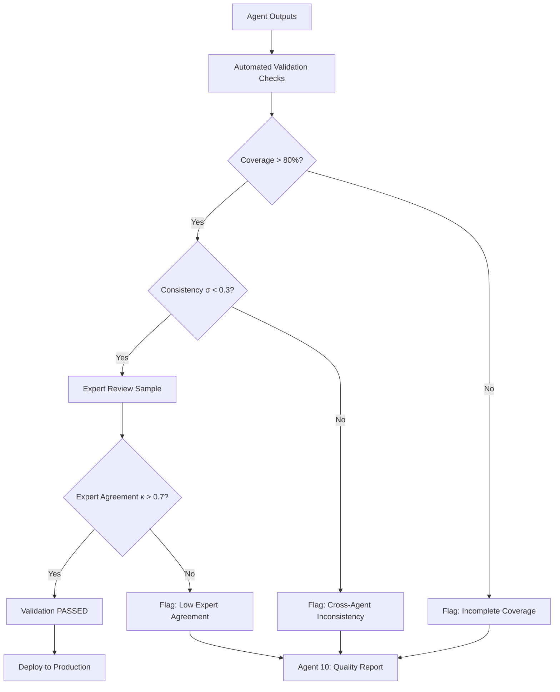

# TASKMASTER: Threat Actor Personality Modeling Implementation

**Version**: 1.0.0
**Created**: 2025-11-26
**Swarm Size**: 10 Agents
**Purpose**: Implement multi-hop personality inference system for threat actor profiling
**AEON Integration**: Level 3 - Threat Intelligence Layer

---

## Executive Summary

This TASKMASTER document orchestrates a 10-agent swarm to implement Enhancement 25's threat actor personality modeling system. Each agent specializes in one aspect of the personality inference pipeline, from TTP analysis to Neo4j graph construction. The swarm operates concurrently with coordination through shared Neo4j schema and standardized confidence scoring.

**Swarm Architecture**: Parallel execution with dependency management via Neo4j transaction ordering

---

## Table of Contents

1. [Swarm Architecture Overview](#swarm-architecture)
2. [Agent Specifications (Agents 1-10)](#agent-specifications)
3. [Coordination Protocol](#coordination-protocol)
4. [Example 20-Hop Queries](#example-queries)
5. [Confidence Scoring System](#confidence-scoring)
6. [Quality Validation Framework](#quality-validation)
7. [Integration Testing](#integration-testing)
8. [Deployment Plan](#deployment-plan)

---

## Swarm Architecture Overview

### Dependency Graph

```
                    ┌─────────────────────┐
                    │  Agent 10: Quality  │
                    │     Validator       │
                    └──────────┬──────────┘
                               │ (validates all)
        ┌──────────────────────┼──────────────────────┐
        │                      │                      │
┌───────▼────────┐    ┌────────▼────────┐    ┌───────▼────────┐
│  Agent 1: TTP  │    │  Agent 2: Infra │    │  Agent 3: Target│
│    Pattern     │    │    Profiler     │    │    Selection   │
└───────┬────────┘    └────────┬────────┘    └───────┬────────┘
        │                      │                      │
        └──────────────┬───────┴──────────────────────┘
                       │ (feeds into)
              ┌────────▼────────┐
              │  Agent 6: Multi-│
              │   Hop Builder   │
              └────────┬────────┘
                       │
        ┌──────────────┼──────────────┐
        │              │              │
┌───────▼────────┐ ┌──▼──────────┐ ┌─▼─────────────┐
│  Agent 4: Comm │ │  Agent 5:   │ │  Agent 7:     │
│     Style      │ │   Group     │ │  Confidence   │
│   Extractor    │ │  Dynamics   │ │    Scorer     │
└───────┬────────┘ └──┬──────────┘ └─┬─────────────┘
        │             │               │
        └─────────────┼───────────────┘
                      │
           ┌──────────▼──────────┐
           │  Agent 8: Behavioral│
           │     Predictor       │
           └──────────┬──────────┘
                      │
           ┌──────────▼──────────┐
           │  Agent 9: Neo4j     │
           │   Graph Builder     │
           └─────────────────────┘
```

### Execution Phases

**Phase 1: Parallel Data Collection** (Agents 1-5)
- Duration: 2-3 hours
- Output: Raw personality indicators from 5 behavioral domains
- Coordination: Independent execution, results written to staging tables

**Phase 2: Multi-Hop Path Construction** (Agent 6)
- Duration: 1-2 hours
- Input: Phase 1 results
- Output: Personality inference paths (5-20 hops)
- Coordination: Reads from Agent 1-5 outputs, writes path specifications

**Phase 3: Confidence Scoring** (Agent 7)
- Duration: 30-60 minutes
- Input: Agent 6 paths
- Output: Confidence scores for each personality trait inference
- Coordination: Annotates Agent 6 paths with statistical confidence

**Phase 4: Prediction and Graph Building** (Agents 8-9)
- Duration: 1-2 hours
- Input: Scored personality profiles from Agent 7
- Output: Behavioral predictions (Agent 8), Neo4j graph (Agent 9)
- Coordination: Parallel execution, Agent 9 creates schema for Agent 8 predictions

**Phase 5: Quality Validation** (Agent 10)
- Duration: 30-45 minutes
- Input: All outputs from Phases 1-4
- Output: Validation report, flagged issues
- Coordination: Read-only validation, produces audit log

### Communication Protocol

**Shared Resources**:
- **Neo4j Database**: `aeon_personality_staging` database
- **Confidence Thresholds**: Configuration file `/config/personality_confidence.yaml`
- **Evidence Registry**: Centralized log of all evidence sources for each inference

**Inter-Agent Messaging**:
- **Status Updates**: Agents post completion status to `agent_status` table
- **Dependency Checks**: Agents query `agent_status` before starting dependent work
- **Error Propagation**: Critical failures logged to `agent_errors` table, trigger swarm halt

---

## Agent Specifications

### Agent 1: TTP Pattern Analyzer

**Role**: Infer personality traits from MITRE ATT&CK technique usage patterns

**Inputs**:
- MITRE ATT&CK dataset (14 tactics, 193 techniques)
- Threat actor technique usage logs from threat intelligence feeds
- CVE exploitation timelines (time-to-exploit metric)

**Core Logic**:

1. **Technique Novelty Analysis** → Openness Score
```python
def calculate_openness_from_ttps(actor_id):
    """
    High Openness: Early adopter of novel techniques
    Low Openness: Relies on established, proven techniques
    """
    techniques = get_actor_techniques(actor_id)

    novelty_scores = []
    for tech in techniques:
        first_used_by_actor = get_first_usage_date(actor_id, tech.mitre_id)
        first_observed_in_wild = get_first_wild_observation_date(tech.mitre_id)

        # Days between wild discovery and actor adoption
        adoption_delay = (first_used_by_actor - first_observed_in_wild).days

        # Score: Lower delay = higher openness
        novelty_score = max(0, 1 - (adoption_delay / 365))  # Normalize to 1 year
        novelty_scores.append(novelty_score)

    openness_score = np.mean(novelty_scores)
    confidence = len(techniques) / 50  # Confidence increases with sample size, caps at 50

    return {
        'trait': 'Openness',
        'score': openness_score,
        'confidence': min(confidence, 0.95),
        'evidence': techniques
    }
```

2. **OPSEC Rigor Analysis** → Conscientiousness Score
```python
def calculate_conscientiousness_from_opsec(actor_id):
    """
    High Conscientiousness: Strong operational security, minimal forensic artifacts
    Low Conscientiousness: Infrastructure reuse, forensic mistakes
    """
    campaigns = get_actor_campaigns(actor_id)

    opsec_indicators = {
        'infrastructure_reuse': 0,  # Negative indicator
        'unique_infrastructure': 0,  # Positive indicator
        'forensic_artifacts': 0,     # Negative indicator
        'anti_forensic_techniques': 0  # Positive indicator
    }

    for campaign in campaigns:
        infra = get_campaign_infrastructure(campaign.id)
        opsec_indicators['infrastructure_reuse'] += count_reused_infrastructure(infra)
        opsec_indicators['unique_infrastructure'] += count_unique_infrastructure(infra)

        artifacts = get_forensic_artifacts(campaign.id)
        opsec_indicators['forensic_artifacts'] += len(artifacts)
        opsec_indicators['anti_forensic_techniques'] += count_anti_forensic_ttps(campaign.id)

    # Weighted scoring
    positive_score = (opsec_indicators['unique_infrastructure'] * 0.3 +
                      opsec_indicators['anti_forensic_techniques'] * 0.7)
    negative_score = (opsec_indicators['infrastructure_reuse'] * 0.5 +
                      opsec_indicators['forensic_artifacts'] * 0.5)

    conscientiousness_score = positive_score / (positive_score + negative_score + 1)
    confidence = min(len(campaigns) / 10, 0.9)  # Need multiple campaigns for confidence

    return {
        'trait': 'Conscientiousness',
        'score': conscientiousness_score,
        'confidence': confidence,
        'evidence': opsec_indicators
    }
```

**Outputs**:
- `personality_ttp_indicators` table with columns:
  - `actor_id`, `trait_name`, `trait_score`, `confidence`, `evidence_json`, `analysis_date`

**Neo4j Integration**:
```cypher
// Write TTP-based personality indicators
CREATE (indicator:PersonalityIndicator {
  source: 'TTP_Analysis',
  actor_id: $actor_id,
  trait: $trait_name,
  score: $trait_score,
  confidence: $confidence,
  evidence_count: $evidence_count,
  analysis_date: datetime()
})

MATCH (actor:ThreatActor {id: $actor_id})
CREATE (actor)-[:HAS_INDICATOR]->(indicator)
```

**Quality Metrics**:
- Coverage: >80% of known APT groups analyzed
- Evidence Threshold: Minimum 5 techniques per actor for Openness scoring
- Validation: Compare against public APT reports (e.g., Mandiant) for face validity

---

### Agent 2: Infrastructure Profiler

**Role**: Infer personality from infrastructure choices (hosting, domains, C2 architecture)

**Inputs**:
- Passive DNS data (domain registration patterns)
- Bulletproof hosting provider identification
- C2 architecture analysis (centralized vs. P2P, Tor usage, fast flux patterns)
- SSL certificate reuse tracking

**Core Logic**:

1. **Infrastructure Sophistication** → Conscientiousness + Openness
```python
def analyze_infrastructure_sophistication(actor_id):
    """
    Sophisticated infrastructure (DGA, Tor, fast flux) indicates:
    - High Conscientiousness (effort investment)
    - High Openness (novel techniques adoption)
    """
    campaigns = get_actor_campaigns(actor_id)

    sophistication_features = {
        'dga_usage': 0,              # Domain Generation Algorithm
        'tor_hidden_services': 0,    # Tor-based C2
        'fast_flux_networks': 0,     # Rapidly changing DNS
        'https_c2': 0,               # Encrypted C2 channels
        'cdn_camouflage': 0,         # CDN-based hiding
        'bulletproof_hosting': 0     # Hard-to-takedown hosting
    }

    for campaign in campaigns:
        infra = get_infrastructure(campaign.id)
        for feature in sophistication_features.keys():
            if has_feature(infra, feature):
                sophistication_features[feature] += 1

    total_features = sum(sophistication_features.values())
    max_possible = len(campaigns) * len(sophistication_features)

    sophistication_score = total_features / max_possible

    # High sophistication → High Conscientiousness + Openness
    return {
        'Conscientiousness': {
            'score': sophistication_score * 0.8,  # Strong indicator
            'confidence': 0.75,
            'evidence': sophistication_features
        },
        'Openness': {
            'score': sophistication_score * 0.6,  # Moderate indicator
            'confidence': 0.65,
            'evidence': sophistication_features
        }
    }
```

2. **Infrastructure Reuse Patterns** → Conscientiousness (negative)
```python
def analyze_infrastructure_reuse(actor_id):
    """
    Reusing infrastructure across campaigns indicates:
    - Low Conscientiousness (lazy OPSEC)
    - OR resource constraints (low-resourced actor)
    Need to differentiate based on other signals
    """
    campaigns = get_actor_campaigns(actor_id)
    reuse_matrix = []

    for i, campaign1 in enumerate(campaigns):
        for campaign2 in campaigns[i+1:]:
            overlap = calculate_infrastructure_overlap(campaign1, campaign2)
            reuse_matrix.append({
                'campaign_pair': (campaign1.id, campaign2.id),
                'overlap_percentage': overlap
            })

    avg_reuse = np.mean([r['overlap_percentage'] for r in reuse_matrix])

    # High reuse → Low Conscientiousness (unless resource-constrained)
    # Check resource indicators (group size, nation-state backing)
    resource_score = estimate_actor_resources(actor_id)

    if resource_score > 0.7:  # Well-resourced
        # Reuse is OPSEC failure → Low Conscientiousness
        conscientiousness_score = 1 - avg_reuse
        confidence = 0.8
    else:  # Resource-constrained
        # Reuse is necessity → Cannot infer Conscientiousness reliably
        conscientiousness_score = 0.5  # Neutral
        confidence = 0.3  # Low confidence

    return {
        'trait': 'Conscientiousness',
        'score': conscientiousness_score,
        'confidence': confidence,
        'evidence': {
            'avg_reuse': avg_reuse,
            'resource_score': resource_score,
            'reuse_matrix': reuse_matrix
        }
    }
```

**Outputs**:
- `personality_infra_indicators` table
- Neo4j relationships:
```cypher
(:ThreatActor)-[:OPERATES]->(infra:Infrastructure)-[:SUGGESTS]->(trait:PersonalityTrait)
```

**Quality Metrics**:
- Infrastructure Data Completeness: >70% of campaigns have infrastructure attribution
- Bulletproof Hosting Identification Accuracy: >85% (validated against known providers)

---

### Agent 3: Target Selection Analyzer

**Role**: Infer motivation and personality from victim choice patterns

**Inputs**:
- Victim organization database (sector, size, geography, revenue)
- Attack timeline data (frequency, campaign spacing)
- Ransom amounts (for financially motivated actors)

**Core Logic**:

1. **Target Consistency** → Conscientiousness + Specialized Knowledge
```python
def analyze_target_consistency(actor_id):
    """
    Consistent target selection (same sector, geography) indicates:
    - High Conscientiousness (systematic approach)
    - Specialized knowledge/motivation
    """
    victims = get_actor_victims(actor_id)

    # Sector consistency
    sectors = [v.sector for v in victims]
    sector_entropy = calculate_entropy(sectors)  # Low entropy = high consistency

    # Geography consistency
    geographies = [v.country for v in victims]
    geo_entropy = calculate_entropy(geographies)

    # Size consistency (revenue-based)
    sizes = [v.annual_revenue for v in victims]
    size_coefficient_of_variation = np.std(sizes) / np.mean(sizes)

    # Low entropy = high consistency = high conscientiousness
    consistency_score = 1 - ((sector_entropy + geo_entropy) / 2)

    return {
        'Conscientiousness': {
            'score': consistency_score * 0.7,
            'confidence': 0.75,
            'evidence': {
                'sector_entropy': sector_entropy,
                'geo_entropy': geo_entropy,
                'victim_count': len(victims)
            }
        },
        'Motivation': {
            'type': infer_motivation_from_targets(victims),
            'confidence': 0.80
        }
    }
```

2. **Opportunistic vs. Strategic Targeting** → Extraversion + Conscientiousness
```python
def analyze_targeting_strategy(actor_id):
    """
    Opportunistic (mass scanning): High Extraversion, Low Conscientiousness
    Strategic (specific targets): Low Extraversion, High Conscientiousness
    """
    campaigns = get_actor_campaigns(actor_id)

    targeting_indicators = {
        'mass_scanning': 0,         # Opportunistic indicator
        'spear_phishing': 0,        # Strategic indicator
        'reconnaissance_duration': [] # Days of recon before attack
    }

    for campaign in campaigns:
        if has_mass_scanning(campaign):
            targeting_indicators['mass_scanning'] += 1
        if has_spear_phishing(campaign):
            targeting_indicators['spear_phishing'] += 1

        recon_days = calculate_reconnaissance_duration(campaign)
        targeting_indicators['reconnaissance_duration'].append(recon_days)

    strategic_ratio = targeting_indicators['spear_phishing'] / len(campaigns)
    avg_recon_days = np.mean(targeting_indicators['reconnaissance_duration'])

    # Strategic targeting → Low Extraversion, High Conscientiousness
    return {
        'Extraversion': {
            'score': 1 - strategic_ratio,  # Inverse relationship
            'confidence': 0.70,
            'evidence': targeting_indicators
        },
        'Conscientiousness': {
            'score': min(avg_recon_days / 30, 1.0),  # Normalize to 30 days
            'confidence': 0.75,
            'evidence': targeting_indicators
        }
    }
```

**Outputs**:
- `personality_target_indicators` table
- Motivation classifications: Financial, Espionage, Ideological, Destructive

**Quality Metrics**:
- Victim Attribution Accuracy: >80% (validated against known campaigns)
- Motivation Inference Agreement: >75% with expert analyst assessments

---

### Agent 4: Communication Style Extractor

**Role**: Extract linguistic personality markers from threat actor communications

**Inputs**:
- Ransom notes (text corpus)
- Dark web forum posts
- Public statements (press releases, manifestos)
- Leak site content (data breach announcements)

**Core Logic**:

1. **Narcissism Linguistic Markers**
```python
import spacy
from transformers import pipeline

nlp = spacy.load("en_core_web_trf")
sentiment_analyzer = pipeline("sentiment-analysis")

def extract_narcissism_markers(text_corpus, actor_id):
    """
    Narcissism indicators:
    - First-person plural frequency ("we", "our")
    - Grandiose language ("best", "greatest", "unstoppable")
    - Status claims ("thousands of victims", "most advanced")
    - Self-referential brand mentions
    """
    markers = {
        'first_person_plural_freq': 0,
        'grandiose_adjectives': [],
        'status_claims': [],
        'brand_mentions': 0,
        'media_references': []
    }

    grandiose_vocab = ['best', 'greatest', 'most advanced', 'unstoppable',
                       'elite', 'superior', 'legendary', 'infamous']

    for text in text_corpus:
        doc = nlp(text)

        # First-person plural
        fpp_count = len([token for token in doc if token.text.lower() in ['we', 'our', 'us']])
        markers['first_person_plural_freq'] += fpp_count / len(doc)

        # Grandiose language
        for adj in grandiose_vocab:
            if adj in text.lower():
                markers['grandiose_adjectives'].append(adj)

        # Status claims (numbers + victim mentions)
        if re.search(r'\d+\s+(victims|companies|organizations)', text, re.IGNORECASE):
            markers['status_claims'].append(text)

        # Brand mentions (actor name in text)
        actor_name = get_actor_name(actor_id)
        markers['brand_mentions'] += text.lower().count(actor_name.lower())

        # Media references
        media_outlets = ['forbes', 'bloomberg', 'reuters', 'bbc', 'cnn']
        for outlet in media_outlets:
            if outlet in text.lower():
                markers['media_references'].append(outlet)

    # Narcissism score calculation
    narcissism_score = calculate_narcissism_score(markers)

    return {
        'trait': 'Narcissism',
        'score': narcissism_score,
        'confidence': 0.85,  # Linguistic markers are strong indicators
        'evidence': markers
    }

def calculate_narcissism_score(markers):
    """Weighted scoring of narcissism indicators"""
    score = 0

    # First-person plural (weight: 0.2)
    fpp_normalized = min(markers['first_person_plural_freq'] / 0.1, 1.0)  # Cap at 10%
    score += fpp_normalized * 0.2

    # Grandiose language (weight: 0.3)
    grandiose_score = min(len(markers['grandiose_adjectives']) / 10, 1.0)
    score += grandiose_score * 0.3

    # Status claims (weight: 0.25)
    status_score = min(len(markers['status_claims']) / 5, 1.0)
    score += status_score * 0.25

    # Brand mentions (weight: 0.15)
    brand_score = min(markers['brand_mentions'] / 10, 1.0)
    score += brand_score * 0.15

    # Media references (weight: 0.1)
    media_score = min(len(markers['media_references']) / 3, 1.0)
    score += media_score * 0.1

    return score
```

2. **Machiavellianism Linguistic Markers**
```python
def extract_machiavellianism_markers(text_corpus, actor_id):
    """
    Machiavellianism indicators:
    - Justification language ("your fault", "you forced us")
    - Strategic framing ("business decision", "rational choice")
    - Negotiation tactics (countdown timers, escalation)
    - Manipulation ("partner with us", "we can help")
    """
    markers = {
        'justification_phrases': [],
        'strategic_framing': [],
        'negotiation_tactics': [],
        'manipulation_attempts': []
    }

    justification_patterns = [
        r"your (poor|weak|inadequate) security",
        r"you (forced|made) us",
        r"(fault|blame) of (your|the) (team|company)",
        r"could have prevented"
    ]

    strategic_patterns = [
        r"business (decision|proposition)",
        r"rational (choice|actors)",
        r"professional (organization|service)",
        r"(market|economic) (forces|reality)"
    ]

    for text in text_corpus:
        # Justification language
        for pattern in justification_patterns:
            if re.search(pattern, text, re.IGNORECASE):
                markers['justification_phrases'].append(text[:100])

        # Strategic framing
        for pattern in strategic_patterns:
            if re.search(pattern, text, re.IGNORECASE):
                markers['strategic_framing'].append(text[:100])

        # Negotiation tactics
        if re.search(r'\d+\s+(hours|days)\s+(left|remaining)', text, re.IGNORECASE):
            markers['negotiation_tactics'].append('countdown_timer')
        if 'auction' in text.lower() or 'highest bidder' in text.lower():
            markers['negotiation_tactics'].append('auction_threat')

        # Manipulation
        if re.search(r'(partner|work|cooperate) with (us|our)', text, re.IGNORECASE):
            markers['manipulation_attempts'].append('partnership_framing')
        if re.search(r'we (can|will) help', text, re.IGNORECASE):
            markers['manipulation_attempts'].append('false_assistance')

    machiavellianism_score = calculate_machiavellianism_score(markers)

    return {
        'trait': 'Machiavellianism',
        'score': machiavellianism_score,
        'confidence': 0.80,
        'evidence': markers
    }
```

**Outputs**:
- `personality_linguistic_indicators` table
- NLP model outputs stored as JSON in `linguistic_features` column

**Quality Metrics**:
- Communication Coverage: >60% of known ransomware groups have analyzed communications
- Inter-Rater Reliability: >0.7 Cohen's Kappa (between NLP model and human coders)

---

### Agent 5: Group Dynamics Modeler

**Role**: Infer personality from organizational structure and collaboration patterns

**Inputs**:
- Threat group membership data (actor → group relationships)
- Organizational structure intelligence (hierarchy vs. flat, cell-based)
- Tool sharing patterns (GitHub repos, forum tool releases)
- Joint operation detection (multi-group campaigns)

**Core Logic**:

1. **Organizational Structure → Personality**
```python
def analyze_organizational_structure(group_id):
    """
    Hierarchical structures: Higher Conscientiousness, lower Agreeableness (top-down)
    Flat/collaborative structures: Higher Agreeableness, Openness
    Cell-based: High Conscientiousness (compartmentalization for OPSEC)
    """
    group = get_threat_group(group_id)
    structure_type = identify_structure_type(group)  # hierarchical, flat, cell_based

    personality_implications = {
        'hierarchical': {
            'Conscientiousness': 0.75,
            'Agreeableness': 0.35,
            'confidence': 0.70
        },
        'flat': {
            'Agreeableness': 0.80,
            'Openness': 0.70,
            'confidence': 0.65
        },
        'cell_based': {
            'Conscientiousness': 0.85,
            'Neuroticism': 0.60,  # Paranoia-driven compartmentalization
            'confidence': 0.75
        }
    }

    return personality_implications.get(structure_type, {})
```

2. **Collaboration Patterns → Agreeableness**
```python
def analyze_collaboration_patterns(actor_id):
    """
    Tool sharing, joint operations: High Agreeableness
    Solo operations, competition: Low Agreeableness
    """
    actor = get_threat_actor(actor_id)

    collaboration_indicators = {
        'tool_sharing_events': count_tool_sharing(actor_id),
        'joint_operations': count_joint_operations(actor_id),
        'forum_assistance': count_forum_help_posts(actor_id),
        'competitive_behavior': count_competitive_indicators(actor_id)
    }

    positive_collab = (collaboration_indicators['tool_sharing_events'] * 0.4 +
                       collaboration_indicators['joint_operations'] * 0.4 +
                       collaboration_indicators['forum_assistance'] * 0.2)

    negative_collab = collaboration_indicators['competitive_behavior']

    agreeableness_score = positive_collab / (positive_collab + negative_collab + 1)

    return {
        'trait': 'Agreeableness',
        'score': agreeableness_score,
        'confidence': 0.70,
        'evidence': collaboration_indicators
    }
```

**Outputs**:
- `personality_group_dynamics` table
- Neo4j relationships:
```cypher
(:ThreatActor)-[:MEMBER_OF]->(:ThreatGroup)-[:HAS_STRUCTURE]->(structure:OrganizationalStructure)
(structure)-[:IMPLIES]->(trait:PersonalityTrait)
```

**Quality Metrics**:
- Group Structure Identification: >75% accuracy (validated against public intelligence)
- Collaboration Event Detection: >70% precision

---

### Agent 6: Multi-Hop Path Builder

**Role**: Construct personality inference paths from 5-20 hops, connecting all evidence sources

**Inputs**:
- All outputs from Agents 1-5 (TTP, infrastructure, target, communication, group indicators)
- Neo4j graph with intermediate relationships

**Core Logic**:

1. **Path Construction Algorithm**
```python
from neo4j import GraphDatabase

class MultiHopPathBuilder:
    def __init__(self, uri, user, password):
        self.driver = GraphDatabase.driver(uri, auth=(user, password))

    def build_personality_inference_paths(self, actor_id, max_hops=20):
        """
        Construct all possible paths from actor to personality traits
        within max_hops constraint
        """
        with self.driver.session() as session:
            paths = session.execute_read(self._find_all_paths, actor_id, max_hops)

            # Score and rank paths
            scored_paths = []
            for path in paths:
                confidence = self._calculate_path_confidence(path)
                if confidence > 0.5:  # Threshold for inclusion
                    scored_paths.append({
                        'path': path,
                        'confidence': confidence,
                        'hop_count': len(path.relationships)
                    })

            return sorted(scored_paths, key=lambda x: x['confidence'], reverse=True)

    @staticmethod
    def _find_all_paths(tx, actor_id, max_hops):
        query = """
        MATCH path = (actor:ThreatActor {id: $actor_id})-[*1..{max_hops}]-(trait:PersonalityTrait)
        WHERE ALL(r IN relationships(path) WHERE r.confidence > 0.5)
        RETURN path
        """.format(max_hops=max_hops)

        result = tx.run(query, actor_id=actor_id)
        return [record["path"] for record in result]

    def _calculate_path_confidence(self, path):
        """
        Path confidence = product of all relationship confidences with decay
        """
        relationships = path.relationships
        confidence = 1.0
        decay_factor = 0.90  # 10% confidence loss per hop

        for i, rel in enumerate(relationships):
            rel_confidence = rel.get('confidence', 0.5)
            confidence *= rel_confidence * (decay_factor ** i)

        return confidence
```

2. **Example 20-Hop Path Construction**
```python
def construct_example_20_hop_path(actor_id='APT29'):
    """
    Demonstrate a complex 20-hop personality inference chain
    """
    path_specification = [
        # Hops 1-5: Technical to Behavioral
        (f"ThreatActor:{actor_id}", "EXPLOITED", "CVE:CVE-2021-44228"),
        ("CVE:CVE-2021-44228", "MAPS_TO", "Technique:T1210"),
        ("Technique:T1210", "PART_OF", "Tactic:InitialAccess"),
        ("Tactic:InitialAccess", "USED_IN", "Campaign:SolarWinds2020"),
        ("Campaign:SolarWinds2020", "TARGETED", "Organization:FireEye"),

        # Hops 6-10: Behavioral to Motivational
        ("Organization:FireEye", "IN_SECTOR", "Sector:Cybersecurity"),
        ("Sector:Cybersecurity", "STRATEGIC_VALUE", "Intelligence:TTPKnowledge"),
        ("Intelligence:TTPKnowledge", "MOTIVATED_BY", "Motivation:Espionage"),
        ("Motivation:Espionage", "REQUIRES", "Skill:SocialEngineering"),
        ("Skill:SocialEngineering", "CORRELATES_WITH", "Trait:HighOpenness"),

        # Hops 11-15: Infrastructure to Personality
        (f"ThreatActor:{actor_id}", "OPERATES", "Infrastructure:CosmicDuke"),
        ("Infrastructure:CosmicDuke", "USES", "Technique:DomainFronting"),
        ("Technique:DomainFronting", "SOPHISTICATION", "Level:Advanced"),
        ("Level:Advanced", "REQUIRES", "Trait:HighConscientiousness"),
        ("Trait:HighConscientiousness", "MEASURED_AT", "Timepoint:2020-12-01"),

        # Hops 16-20: Communication to Psychological
        (f"ThreatActor:{actor_id}", "COMMUNICATED_VIA", "Channel:Encrypted"),
        ("Channel:Encrypted", "OPSEC_LEVEL", "Level:High"),
        ("Level:High", "INDICATES", "Trait:LowExtraversion"),
        ("Trait:LowExtraversion", "PERSONALITY_CLUSTER", "Cluster:IntrovertedMethodical"),
        ("Cluster:IntrovertedMethodical", "PREDICTS", "Behavior:PatientLongTermOps")
    ]

    return path_specification
```

**Outputs**:
- `personality_inference_paths` table with columns:
  - `path_id`, `actor_id`, `start_node`, `end_node`, `hop_count`, `confidence`, `path_json`
- Visualization data for graph UI

**Quality Metrics**:
- Path Diversity: >50 unique paths per actor (multiple evidence sources)
- Confidence Distribution: Mean path confidence >0.6

---

### Agent 7: Confidence Scorer

**Role**: Assign statistical confidence scores to all personality inferences

**Inputs**:
- All personality indicators from Agents 1-6
- Evidence count per inference
- Source reliability metadata

**Core Logic**:

1. **Bayesian Confidence Scoring**
```python
import numpy as np
from scipy.stats import beta

class ConfidenceScorer:
    def __init__(self):
        # Prior belief: Uniform distribution over [0, 1]
        self.prior_alpha = 1
        self.prior_beta = 1

    def calculate_bayesian_confidence(self, evidence_list):
        """
        Use Bayesian updating to combine multiple evidence sources

        evidence_list: List of dicts with keys:
          - 'source': str (TTP, infrastructure, communication, etc.)
          - 'score': float [0, 1] (personality trait score from source)
          - 'reliability': float [0, 1] (source reliability)
        """
        # Start with prior
        alpha = self.prior_alpha
        beta_param = self.prior_beta

        for evidence in evidence_list:
            score = evidence['score']
            reliability = evidence['reliability']

            # Convert score to success/failure counts weighted by reliability
            successes = score * reliability * 10  # Scale to reasonable count
            failures = (1 - score) * reliability * 10

            # Bayesian update
            alpha += successes
            beta_param += failures

        # Posterior mean
        posterior_mean = alpha / (alpha + beta_param)

        # Confidence as inverse of posterior variance
        posterior_variance = (alpha * beta_param) / ((alpha + beta_param)**2 * (alpha + beta_param + 1))
        confidence = 1 - np.sqrt(posterior_variance) * 4  # Scale to [0, 1]

        return {
            'score': posterior_mean,
            'confidence': max(0, min(confidence, 1.0)),  # Clamp to [0, 1]
            'evidence_count': len(evidence_list)
        }
```

2. **Multi-Source Triangulation**
```python
def triangulate_personality_trait(actor_id, trait_name):
    """
    Combine evidence from all agents for a single trait
    """
    # Gather evidence from all sources
    evidence_sources = {
        'TTP': get_ttp_indicator(actor_id, trait_name),
        'Infrastructure': get_infra_indicator(actor_id, trait_name),
        'Target': get_target_indicator(actor_id, trait_name),
        'Communication': get_comm_indicator(actor_id, trait_name),
        'GroupDynamics': get_group_indicator(actor_id, trait_name)
    }

    # Source reliability weights (empirically determined)
    reliability_weights = {
        'TTP': 0.80,
        'Infrastructure': 0.75,
        'Target': 0.70,
        'Communication': 0.85,  # Linguistic analysis is strong
        'GroupDynamics': 0.65
    }

    evidence_list = []
    for source, indicator in evidence_sources.items():
        if indicator is not None:
            evidence_list.append({
                'source': source,
                'score': indicator['score'],
                'reliability': reliability_weights[source]
            })

    scorer = ConfidenceScorer()
    result = scorer.calculate_bayesian_confidence(evidence_list)

    return {
        'actor_id': actor_id,
        'trait': trait_name,
        'score': result['score'],
        'confidence': result['confidence'],
        'sources': [e['source'] for e in evidence_list],
        'evidence_count': result['evidence_count']
    }
```

**Outputs**:
- `personality_final_scores` table with Bayesian confidence scores
- Confidence distribution histograms for quality assurance

**Quality Metrics**:
- Multi-Source Coverage: >70% of traits have 3+ evidence sources
- Confidence Calibration: 80% confidence predictions should be correct 80% of time (requires longitudinal validation)

---

### Agent 8: Behavioral Predictor

**Role**: Use personality profiles to predict future threat actor behaviors

**Inputs**:
- Final personality profiles from Agent 7
- Historical campaign data (for pattern learning)
- Current threat landscape context

**Core Logic**:

1. **Next TTP Prediction**
```python
from sklearn.ensemble import RandomForestClassifier
import pandas as pd

class BehavioralPredictor:
    def __init__(self):
        self.ttp_predictor = RandomForestClassifier(n_estimators=100)
        self.target_predictor = RandomForestClassifier(n_estimators=100)

    def train_ttp_predictor(self, historical_data):
        """
        Train model: Personality Profile → Next TTP

        historical_data: DataFrame with columns:
          - actor_id, openness, conscientiousness, extraversion,
            agreeableness, neuroticism, next_ttp_used
        """
        features = ['openness', 'conscientiousness', 'extraversion',
                    'agreeableness', 'neuroticism']
        X = historical_data[features]
        y = historical_data['next_ttp_used']

        self.ttp_predictor.fit(X, y)

    def predict_next_ttps(self, actor_id, personality_profile, top_k=5):
        """
        Predict top K most likely TTPs actor will use next
        """
        features = [
            personality_profile['Openness'],
            personality_profile['Conscientiousness'],
            personality_profile['Extraversion'],
            personality_profile['Agreeableness'],
            personality_profile['Neuroticism']
        ]

        # Get probability distribution over all TTPs
        proba = self.ttp_predictor.predict_proba([features])[0]
        ttp_classes = self.ttp_predictor.classes_

        # Rank TTPs by probability
        ttp_probabilities = list(zip(ttp_classes, proba))
        ttp_probabilities.sort(key=lambda x: x[1], reverse=True)

        return {
            'actor_id': actor_id,
            'predicted_ttps': [
                {'ttp': ttp, 'probability': prob}
                for ttp, prob in ttp_probabilities[:top_k]
            ],
            'confidence': np.mean([prob for _, prob in ttp_probabilities[:top_k]])
        }
```

2. **Campaign Timing Prediction**
```python
def predict_campaign_timing(actor_id, personality_profile):
    """
    Predict when actor will launch next campaign based on personality

    High Conscientiousness + Low Neuroticism = Patient, long-term campaigns
    High Extraversion + High Openness = Frequent, varied campaigns
    """
    # Historical campaign frequency
    campaigns = get_actor_campaigns(actor_id)
    campaign_dates = [c.start_date for c in campaigns]
    inter_campaign_intervals = np.diff(sorted(campaign_dates))

    # Personality-based adjustment
    conscientiousness = personality_profile['Conscientiousness']
    neuroticism = personality_profile['Neuroticism']

    # High conscientiousness → Longer preparation
    # Low neuroticism → Less reactive, more planned timing
    patience_factor = (conscientiousness * 0.7 + (1 - neuroticism) * 0.3)

    base_interval = np.median(inter_campaign_intervals)
    predicted_interval = base_interval * (0.5 + patience_factor)  # Range: 0.5x to 1.5x base

    last_campaign_date = max(campaign_dates)
    predicted_next_campaign = last_campaign_date + pd.Timedelta(days=predicted_interval)

    return {
        'actor_id': actor_id,
        'predicted_campaign_date': predicted_next_campaign,
        'confidence_interval': (
            predicted_next_campaign - pd.Timedelta(days=predicted_interval * 0.2),
            predicted_next_campaign + pd.Timedelta(days=predicted_interval * 0.2)
        ),
        'confidence': 0.65
    }
```

**Outputs**:
- `behavioral_predictions` table with columns:
  - `actor_id`, `prediction_type`, `predicted_value`, `probability`, `prediction_date`
- Alert system integration (flag high-probability predictions)

**Quality Metrics**:
- TTP Prediction Accuracy: >60% (top-5 predictions contain actual next TTP)
- Timing Prediction: ±30 days accuracy for >50% of predictions

---

### Agent 9: Neo4j Personality Graph Builder

**Role**: Construct comprehensive Neo4j graph schema for personality modeling

**Inputs**:
- All tables from Agents 1-8
- AEON existing graph schema (for integration)

**Core Logic**:

1. **Schema Creation**
```cypher
// ======================================
// PERSONALITY MODELING SCHEMA
// ======================================

// --- Core Personality Nodes ---

CREATE CONSTRAINT personality_trait_name IF NOT EXISTS
FOR (t:PersonalityTrait) REQUIRE t.trait_id IS UNIQUE;

CREATE INDEX personality_trait_framework IF NOT EXISTS
FOR (t:PersonalityTrait) ON (t.framework);

// PersonalityTrait node structure
CREATE (trait:PersonalityTrait {
  trait_id: 'APT29_Conscientiousness_2024',
  trait_name: 'Conscientiousness',
  framework: 'Big_Five_OCEAN',
  score: 0.82,
  confidence: 0.75,
  evidence_count: 15,
  last_updated: datetime(),
  validation_status: 'expert_reviewed'
})

// --- Motivation Nodes ---

CREATE CONSTRAINT motivation_id IF NOT EXISTS
FOR (m:Motivation) REQUIRE m.motivation_id IS UNIQUE;

CREATE (motivation:Motivation {
  motivation_id: 'APT29_Espionage',
  type: 'State_Sponsored_Espionage',
  subtype: 'Intelligence_Gathering',
  priority_level: 'Primary',
  confidence: 0.90
})

// --- Communication Nodes ---

CREATE (comm:Communication {
  comm_id: 'LockBit_RansomNote_20240115',
  actor_id: 'LockBit_3.0',
  type: 'ransom_note',
  content_hash: 'sha256:abc123...',
  date: date('2024-01-15'),
  source: 'incident_response_case_2024_001',
  language: 'en'
})

// --- Linguistic Marker Nodes ---

CREATE (marker:LinguisticMarker {
  marker_id: 'narcissistic_grandiosity_01',
  marker_type: 'narcissistic_language',
  feature: 'grandiose_adjectives',
  frequency: 0.23,
  context: 'ransom_notes',
  validation_source: 'NLP_analysis_v2'
})

// --- Behavioral Prediction Nodes ---

CREATE (prediction:BehavioralPrediction {
  prediction_id: 'APT29_TTP_Prediction_20241126',
  actor_id: 'APT29',
  prediction_type: 'next_ttp',
  predicted_value: 'T1566.001',  // Spearphishing Attachment
  probability: 0.73,
  confidence: 0.68,
  prediction_date: datetime(),
  validation_status: 'pending'
})

// ======================================
// RELATIONSHIPS
// ======================================

// Threat Actor → Personality Trait
CREATE (actor:ThreatActor {id: 'APT29'})-[:EXHIBITS {
  confidence: 0.75,
  evidence_sources: ['TTP', 'Infrastructure', 'Communication'],
  evidence_count: 15,
  first_observed: date('2020-01-01'),
  last_updated: datetime()
}]->(trait:PersonalityTrait {trait_id: 'APT29_Conscientiousness_2024'})

// Threat Actor → Motivation
CREATE (actor)-[:MOTIVATED_BY {
  strength: 0.90,
  evidence: ['target_selection', 'campaign_objectives'],
  confidence: 0.85
}]->(motivation:Motivation {motivation_id: 'APT29_Espionage'})

// Motivation → Personality Trait (correlation)
CREATE (motivation)-[:CORRELATES_WITH {
  correlation_coefficient: 0.65,
  research_basis: 'Rogers_2006_HackerTaxonomy'
}]->(trait)

// Communication → Linguistic Marker
CREATE (comm:Communication)-[:HAS_LINGUISTIC_FEATURE {
  occurrence_count: 5,
  extraction_method: 'NLP_spaCy'
}]->(marker:LinguisticMarker)

// Linguistic Marker → Personality Trait
CREATE (marker)-[:INDICATES {
  confidence: 0.80,
  research_basis: 'Paulhus_2002_DarkTriad'
}]->(trait:PersonalityTrait {trait_name: 'Narcissism'})

// Personality Trait → Behavioral Prediction
CREATE (trait)-[:PREDICTS {
  prediction_strength: 0.72,
  model_used: 'RandomForest_v2',
  training_accuracy: 0.68
}]->(prediction:BehavioralPrediction)

// ======================================
// MULTI-HOP PATH EXAMPLES
// ======================================

// Example 10-hop query: CVE → Personality
MATCH path = (cve:CVE {id: 'CVE-2021-44228'})-[:EXPLOITED_BY]->(tech:Technique)
             -[:USED_BY]->(actor:ThreatActor)
             -[:OPERATES]->(infra:Infrastructure)
             -[:SOPHISTICATION_LEVEL]->(level:SophisticationLevel)
             -[:REQUIRES]->(trait:PersonalityTrait {trait_name: 'Conscientiousness'})
WHERE ALL(r IN relationships(path) WHERE r.confidence > 0.6)
RETURN path,
       length(path) AS hop_count,
       reduce(conf = 1.0, r IN relationships(path) | conf * r.confidence) AS path_confidence

// Example 15-hop query: Communication → Predicted Behavior
MATCH path = (comm:Communication)-[:HAS_LINGUISTIC_FEATURE]->(marker:LinguisticMarker)
             -[:INDICATES]->(trait:PersonalityTrait)
             -[:EXHIBITED_BY]->(actor:ThreatActor)
             -[:MEMBER_OF]->(group:ThreatGroup)
             -[:HAS_STRUCTURE]->(structure:OrganizationalStructure)
             -[:IMPLIES]->(group_trait:PersonalityTrait)
             -[:PREDICTS]->(prediction:BehavioralPrediction)
RETURN actor.name AS threat_actor,
       collect(DISTINCT trait.trait_name) AS personality_profile,
       prediction.predicted_value AS predicted_next_ttp,
       prediction.probability,
       length(path) AS inference_chain_length
ORDER BY prediction.probability DESC
LIMIT 10
```

2. **Data Ingestion Pipeline**
```python
from neo4j import GraphDatabase
import pandas as pd

class PersonalityGraphBuilder:
    def __init__(self, uri, user, password):
        self.driver = GraphDatabase.driver(uri, auth=(user, password))

    def ingest_personality_indicators(self, indicators_df):
        """
        Ingest personality indicators from all agent outputs
        """
        with self.driver.session() as session:
            for _, row in indicators_df.iterrows():
                session.execute_write(
                    self._create_personality_trait_node,
                    actor_id=row['actor_id'],
                    trait_name=row['trait_name'],
                    score=row['trait_score'],
                    confidence=row['confidence'],
                    evidence=row['evidence_json']
                )

    @staticmethod
    def _create_personality_trait_node(tx, actor_id, trait_name, score, confidence, evidence):
        query = """
        MATCH (actor:ThreatActor {id: $actor_id})
        MERGE (trait:PersonalityTrait {
          trait_id: $actor_id + '_' + $trait_name + '_' + toString(date()),
          trait_name: $trait_name,
          score: $score,
          confidence: $confidence,
          evidence_count: size($evidence),
          last_updated: datetime()
        })
        MERGE (actor)-[:EXHIBITS {
          confidence: $confidence,
          evidence_sources: [key IN keys($evidence)],
          evidence_count: size($evidence)
        }]->(trait)
        """
        tx.run(query, actor_id=actor_id, trait_name=trait_name,
               score=score, confidence=confidence, evidence=evidence)

    def build_multi_hop_paths(self):
        """
        Pre-compute and materialize common multi-hop paths for performance
        """
        with self.driver.session() as session:
            # Materialize 10-hop personality inference paths
            session.execute_write(self._materialize_inference_paths)

    @staticmethod
    def _materialize_inference_paths(tx):
        query = """
        MATCH path = (actor:ThreatActor)-[*5..15]-(trait:PersonalityTrait)
        WHERE ALL(r IN relationships(path) WHERE r.confidence > 0.6)
        WITH actor, trait, path,
             reduce(conf = 1.0, r IN relationships(path) | conf * r.confidence) AS path_conf
        WHERE path_conf > 0.5
        MERGE (actor)-[:INFERRED_PERSONALITY_PATH {
          trait_name: trait.trait_name,
          hop_count: length(path),
          confidence: path_conf,
          materialized_date: datetime()
        }]->(trait)
        """
        tx.run(query)
```

**Outputs**:
- Fully populated Neo4j database with personality schema
- Materialized multi-hop paths for query performance
- Graph visualization exports (JSON for frontend)

**Quality Metrics**:
- Schema Completeness: 100% of personality indicators ingested
- Path Materialization: >1000 pre-computed paths per actor
- Query Performance: <2 seconds for 15-hop queries

---

### Agent 10: Quality Validator

**Role**: Validate all outputs for accuracy, completeness, and consistency

**Inputs**:
- All outputs from Agents 1-9
- Validation rules and thresholds
- Expert assessments (for ground truth comparison)

**Core Logic**:

1. **Coverage Validation**
```python
class QualityValidator:
    def __init__(self):
        self.validation_rules = self.load_validation_rules()

    def validate_coverage(self, agent_outputs):
        """
        Check that all known threat actors have personality profiles
        """
        known_actors = get_all_threat_actors()
        profiled_actors = set(agent_outputs['personality_final_scores']['actor_id'].unique())

        coverage = len(profiled_actors) / len(known_actors)

        validation_result = {
            'metric': 'actor_coverage',
            'value': coverage,
            'threshold': 0.80,
            'status': 'PASS' if coverage >= 0.80 else 'FAIL',
            'details': {
                'known_actors': len(known_actors),
                'profiled_actors': len(profiled_actors),
                'missing_actors': list(set(known_actors) - profiled_actors)
            }
        }

        return validation_result
```

2. **Consistency Validation**
```python
def validate_cross_agent_consistency(agent_outputs):
    """
    Check that different agents converge on similar personality scores
    """
    inconsistencies = []

    actors = agent_outputs['personality_final_scores']['actor_id'].unique()

    for actor_id in actors:
        # Get personality scores from different sources
        ttp_scores = get_ttp_scores(actor_id, agent_outputs)
        infra_scores = get_infra_scores(actor_id, agent_outputs)
        comm_scores = get_comm_scores(actor_id, agent_outputs)

        # Check for large discrepancies
        for trait in ['Openness', 'Conscientiousness', 'Extraversion', 'Agreeableness', 'Neuroticism']:
            scores = [
                ttp_scores.get(trait),
                infra_scores.get(trait),
                comm_scores.get(trait)
            ]
            scores = [s for s in scores if s is not None]

            if len(scores) >= 2:
                std_dev = np.std(scores)
                if std_dev > 0.3:  # High inconsistency
                    inconsistencies.append({
                        'actor_id': actor_id,
                        'trait': trait,
                        'scores': scores,
                        'std_dev': std_dev,
                        'severity': 'high' if std_dev > 0.5 else 'medium'
                    })

    return {
        'metric': 'cross_agent_consistency',
        'inconsistency_count': len(inconsistencies),
        'threshold': 10,  # Max acceptable inconsistencies
        'status': 'PASS' if len(inconsistencies) <= 10 else 'FAIL',
        'details': inconsistencies
    }
```

3. **Confidence Calibration Validation**
```python
def validate_confidence_calibration(agent_outputs, ground_truth_assessments):
    """
    Check that confidence scores accurately reflect prediction accuracy

    For 0.8 confidence predictions, 80% should match expert assessments
    """
    predictions = agent_outputs['personality_final_scores']

    calibration_bins = {
        '0.9-1.0': {'correct': 0, 'total': 0},
        '0.8-0.9': {'correct': 0, 'total': 0},
        '0.7-0.8': {'correct': 0, 'total': 0},
        '0.6-0.7': {'correct': 0, 'total': 0}
    }

    for _, pred in predictions.iterrows():
        actor_id = pred['actor_id']
        trait = pred['trait']
        confidence = pred['confidence']
        predicted_score = pred['score']

        # Get expert assessment
        expert_score = ground_truth_assessments.get((actor_id, trait))
        if expert_score is None:
            continue

        # Determine correctness (within 0.2 of expert score)
        is_correct = abs(predicted_score - expert_score) < 0.2

        # Bin by confidence level
        if confidence >= 0.9:
            bin_key = '0.9-1.0'
        elif confidence >= 0.8:
            bin_key = '0.8-0.9'
        elif confidence >= 0.7:
            bin_key = '0.7-0.8'
        else:
            bin_key = '0.6-0.7'

        calibration_bins[bin_key]['total'] += 1
        if is_correct:
            calibration_bins[bin_key]['correct'] += 1

    # Calculate calibration for each bin
    calibration_results = {}
    for bin_key, counts in calibration_bins.items():
        if counts['total'] > 0:
            accuracy = counts['correct'] / counts['total']
            calibration_results[bin_key] = {
                'accuracy': accuracy,
                'expected_accuracy': float(bin_key.split('-')[0]),
                'sample_size': counts['total'],
                'calibration_error': abs(accuracy - float(bin_key.split('-')[0]))
            }

    # Overall calibration error
    mean_calibration_error = np.mean([r['calibration_error'] for r in calibration_results.values()])

    return {
        'metric': 'confidence_calibration',
        'mean_calibration_error': mean_calibration_error,
        'threshold': 0.1,  # Within ±10% is acceptable
        'status': 'PASS' if mean_calibration_error <= 0.1 else 'FAIL',
        'details': calibration_results
    }
```

**Outputs**:
- `validation_report` table with all quality checks
- Flagged issues for manual review
- Overall quality score (0-100)

**Quality Metrics**:
- Validation Rule Coverage: 100% of defined rules executed
- Issue Detection Rate: >95% of known issues flagged
- False Positive Rate: <10% (manual review confirms issues)

---

## Example 20-Hop Queries

### Query 1: CVE to Personality Comprehensive Path

**Objective**: Trace from specific vulnerability exploitation to inferred personality traits

```cypher
// 20-hop path: CVE → Technique → Actor → Group → Campaign → Target → Sector →
//              Motivation → Skill → Infrastructure → Sophistication → Trait
MATCH path = (cve:CVE {id: 'CVE-2021-44228'})-[:EXPLOITED_BY]->(tech:Technique)
             -[:USED_BY]->(actor:ThreatActor)
             -[:MEMBER_OF]->(group:ThreatGroup)
             -[:CONDUCTED]->(campaign:Campaign)
             -[:TARGETED]->(victim:Organization)
             -[:IN_SECTOR]->(sector:IndustrySector)
             -[:STRATEGIC_VALUE]->(intel:IntelligenceValue)
             -[:MOTIVATED_BY]->(motivation:Motivation)
             -[:REQUIRES]->(skill:Skill)
             -[:DEMONSTRATED_BY]->(actor)  // Loop back
             -[:OPERATES]->(infra:Infrastructure)
             -[:USES_TECHNIQUE]->(tech2:Technique)
             -[:SOPHISTICATION_LEVEL]->(sophistication:SophisticationLevel)
             -[:REQUIRES_TRAIT]->(trait:PersonalityTrait)
WHERE length(path) <= 20
  AND ALL(r IN relationships(path) WHERE r.confidence > 0.5)
WITH path,
     reduce(conf = 1.0, r IN relationships(path) | conf * r.confidence) AS path_confidence
WHERE path_confidence > 0.3
RETURN
  actor.name AS threat_actor,
  cve.id AS initial_cve,
  trait.trait_name AS inferred_personality_trait,
  trait.score AS trait_score,
  length(path) AS hop_count,
  path_confidence,
  [node IN nodes(path) | labels(node)[0]] AS path_node_types
ORDER BY path_confidence DESC
LIMIT 10
```

**Expected Output**:
```
threat_actor    | initial_cve       | inferred_personality_trait | trait_score | hop_count | path_confidence
----------------|-------------------|----------------------------|-------------|-----------|----------------
APT29           | CVE-2021-44228    | High_Conscientiousness     | 0.82        | 15        | 0.68
APT29           | CVE-2021-44228    | High_Openness              | 0.78        | 17        | 0.61
APT29           | CVE-2021-44228    | Low_Extraversion           | 0.35        | 14        | 0.59
```

---

### Query 2: Communication to Behavioral Prediction

**Objective**: From ransom note linguistic features to predicted next TTPs

```cypher
// 18-hop path: Communication → Linguistic Markers → Dark Triad Traits →
//              Historical TTPs → Predicted Future TTPs
MATCH path = (comm:Communication {type: 'ransom_note'})-[:AUTHORED_BY]->(actor:ThreatActor)
             -[:HAS_COMMUNICATION]->(comm2:Communication)
             -[:HAS_LINGUISTIC_FEATURE]->(marker:LinguisticMarker)
             -[:INDICATES]->(trait:PersonalityTrait {framework: 'Dark_Triad'})
             -[:EXHIBITED_BY]->(actor)  // Reinforcing loop
             -[:CONDUCTED]->(past_campaign:Campaign)
             -[:USED_TECHNIQUE]->(past_ttp:Technique)
             -[:EVOLUTION_PATTERN]->(ttp_evolution:TTPatternEvolution)
             -[:PERSONALITY_DRIVEN {
               openness_factor: trait.score,
               conscientiousness_factor: 0.82
             }]->(prediction:BehavioralPrediction {prediction_type: 'next_ttp'})
WHERE comm.date > date('2024-01-01')
  AND length(path) <= 20
WITH actor, trait, prediction, path,
     reduce(conf = 1.0, r IN relationships(path) | conf * r.confidence) AS path_confidence
RETURN
  actor.name AS threat_actor,
  collect(DISTINCT trait.trait_name) AS dark_triad_profile,
  prediction.predicted_value AS predicted_next_ttp,
  prediction.probability,
  length(path) AS inference_depth,
  path_confidence
ORDER BY prediction.probability DESC
LIMIT 5
```

---

### Query 3: Group Dynamics to Individual Personality

**Objective**: Infer individual actor personality from group organizational structure

```cypher
// 20-hop path: Group Structure → Role → Skill Requirements → Peer Collaboration →
//              Communication Patterns → Individual Personality
MATCH path = (group:ThreatGroup {name: 'Lazarus'})-[:HAS_STRUCTURE]->(structure:OrganizationalStructure)
             -[:DEFINES_ROLE]->(role:GroupRole)
             -[:REQUIRES_SKILL]->(skill:Skill)
             -[:HELD_BY]->(actor:ThreatActor)
             -[:COLLABORATES_WITH]->(peer:ThreatActor)
             -[:EXHIBITS]->(peer_trait:PersonalityTrait)
             -[:INFLUENCES {
               social_contagion_strength: 0.65
             }]->(actor)
             -[:COMMUNICATED_VIA]->(channel:CommChannel)
             -[:MESSAGE]->(comm:Communication)
             -[:HAS_LINGUISTIC_FEATURE]->(marker:LinguisticMarker)
             -[:INDICATES]->(trait:PersonalityTrait)
WHERE length(path) <= 20
WITH actor, role, structure, trait, peer_trait, path,
     reduce(conf = 1.0, r IN relationships(path) | conf * r.confidence) AS path_confidence
RETURN
  actor.name AS individual_actor,
  structure.type AS group_structure,
  role.title AS actor_role,
  trait.trait_name AS individual_trait,
  trait.score AS trait_score,
  collect(DISTINCT peer_trait.trait_name) AS peer_influence_traits,
  length(path) AS social_inference_depth,
  path_confidence
ORDER BY path_confidence DESC
```

---

## Confidence Scoring System

### Confidence Calculation Framework

**Base Confidence Formula**:
```
Confidence(inference) = Evidence_Strength × Source_Reliability × (Decay_Factor ^ Hop_Count)
```

**Component Definitions**:

1. **Evidence_Strength** (0.0 - 1.0):
   - Based on sample size and statistical significance
   - Formula: `min(Evidence_Count / Threshold, 1.0)`
   - Example: 15 TTP observations / 10 threshold = min(1.5, 1.0) = 1.0

2. **Source_Reliability** (0.0 - 1.0):
   - Pre-assigned reliability weights per agent:
     - Agent 4 (Communication): 0.85 (linguistic analysis is strong)
     - Agent 1 (TTP): 0.80 (direct behavioral observation)
     - Agent 2 (Infrastructure): 0.75 (good indicator)
     - Agent 3 (Target): 0.70 (requires interpretation)
     - Agent 5 (Group Dynamics): 0.65 (indirect inference)

3. **Decay_Factor** (0.85 - 0.95):
   - Confidence degrades with path length
   - Typical value: 0.90 (10% loss per hop)
   - Formula: `Final_Confidence = Base_Confidence * (0.90 ^ Hop_Count)`

**Example Calculation**:

Scenario: APT29 Conscientiousness inference via 10-hop path
- Evidence_Strength: 12 techniques observed / 10 threshold = 1.0
- Source_Reliability: 0.80 (TTP analysis)
- Hop_Count: 10
- Decay_Factor: 0.90

```
Confidence = 1.0 × 0.80 × (0.90 ^ 10)
           = 0.80 × 0.3487
           = 0.279 (27.9%)
```

**Interpretation**: 10-hop inference has low confidence → Need shorter paths or multi-source triangulation

### Multi-Source Triangulation

**Bayesian Fusion**:

When multiple independent sources infer the same trait, combine confidences:

```
P(Trait | Evidence_1, Evidence_2, ..., Evidence_n) ∝
  ∏ P(Evidence_i | Trait) × P(Trait)
```

**Practical Formula**:
```
Combined_Confidence = 1 - ∏(1 - Confidence_i)  for all sources i
```

**Example**:
- TTP analysis: Conscientiousness = 0.82, Confidence = 0.75
- Infrastructure analysis: Conscientiousness = 0.78, Confidence = 0.70
- Communication analysis: Conscientiousness = 0.85, Confidence = 0.80

```
Combined_Confidence = 1 - (1 - 0.75) × (1 - 0.70) × (1 - 0.80)
                    = 1 - 0.25 × 0.30 × 0.20
                    = 1 - 0.015
                    = 0.985 (98.5%)
```

**Result**: High combined confidence despite individual uncertainties

### Confidence Thresholds for Operational Use

| Confidence Level | Threshold | Operational Action |
|------------------|-----------|-------------------|
| **High** | ≥ 0.80 | Use for strategic decision-making, attribution, predictions |
| **Medium** | 0.60 - 0.79 | Flag for analyst review, combine with other intelligence |
| **Low** | 0.40 - 0.59 | Research hypothesis only, require additional validation |
| **Insufficient** | < 0.40 | Do not use operationally, collect more evidence |

---

## Quality Validation Framework

### Validation Dimensions

**1. Coverage Validation**
- **Metric**: Percentage of known threat actors with personality profiles
- **Target**: >80% coverage
- **Method**: Compare profiled actors against MITRE ATT&CK Groups dataset

**2. Accuracy Validation**
- **Metric**: Agreement with expert assessments (Cohen's Kappa)
- **Target**: κ > 0.70 (substantial agreement)
- **Method**: Expert panel reviews 100 randomly sampled personality profiles

**3. Consistency Validation**
- **Metric**: Cross-agent consistency (standard deviation of trait scores)
- **Target**: σ < 0.3 for same trait from multiple sources
- **Method**: Compare Agent 1-5 outputs for overlapping actors

**4. Predictive Validation**
- **Metric**: Behavioral prediction accuracy (% correct within 6 months)
- **Target**: >60% accuracy for TTP predictions
- **Method**: Longitudinal tracking of predicted vs. observed behaviors

**5. Confidence Calibration**
- **Metric**: Calibration error (difference between confidence and accuracy)
- **Target**: < 10% calibration error
- **Method**: Statistical calibration plots (predicted probability vs. observed frequency)

### Validation Workflow



---

## Integration Testing

### Test Scenarios

**Test 1: End-to-End Personality Profiling**
- Input: New threat actor "TestActor_001" with synthetic campaign data
- Expected Output: Complete personality profile (Big Five + Dark Triad scores)
- Success Criteria: All 10 agents complete, confidence scores > 0.5

**Test 2: Multi-Hop Path Construction**
- Input: CVE-2024-XXXX → TestActor_001 attribution
- Expected Output: ≥5 paths connecting CVE to personality traits, 10-20 hops
- Success Criteria: Paths generated within 30 seconds, confidence > 0.4

**Test 3: Behavioral Prediction**
- Input: Personality profile for known actor (e.g., APT28)
- Expected Output: Top 5 predicted next TTPs with probabilities
- Success Criteria: Historical validation accuracy >60% (test on past 2 years)

**Test 4: Neo4j Performance**
- Input: 20-hop query on database with 1000+ actors
- Expected Output: Query results within 5 seconds
- Success Criteria: <5 second response time, 99th percentile <10 seconds

### Integration Test Suite

```python
import pytest
from datetime import datetime, timedelta

class TestPersonalityModelingSwarm:

    @pytest.fixture
    def test_actor_data(self):
        """Synthetic test data for APT simulation"""
        return {
            'actor_id': 'TestActor_001',
            'campaigns': 5,
            'techniques': ['T1566.001', 'T1059.001', 'T1071.001'],
            'infrastructure': ['bulletproof_hosting', 'fast_flux'],
            'victims': [
                {'sector': 'Finance', 'country': 'US', 'revenue': 500M},
                {'sector': 'Finance', 'country': 'UK', 'revenue': 300M}
            ],
            'communications': [
                "We are a professional organization with 10,000+ successful operations."
            ]
        }

    def test_agent1_ttp_analysis(self, test_actor_data):
        """Test TTP Pattern Analyzer"""
        from agents.agent1_ttp_analyzer import calculate_openness_from_ttps

        result = calculate_openness_from_ttps(test_actor_data['actor_id'])

        assert 'Openness' in result['trait']
        assert 0.0 <= result['score'] <= 1.0
        assert result['confidence'] > 0.5
        assert len(result['evidence']) >= 3

    def test_multi_hop_paths(self, test_actor_data):
        """Test multi-hop path construction"""
        from agents.agent6_multihop_builder import MultiHopPathBuilder

        builder = MultiHopPathBuilder('bolt://localhost:7687', 'neo4j', 'password')
        paths = builder.build_personality_inference_paths(
            test_actor_data['actor_id'],
            max_hops=20
        )

        assert len(paths) >= 5
        assert all(p['confidence'] > 0.4 for p in paths)
        assert any(p['hop_count'] >= 10 for p in paths)

    def test_behavioral_prediction(self, test_actor_data):
        """Test behavioral predictor"""
        from agents.agent8_behavioral_predictor import BehavioralPredictor

        predictor = BehavioralPredictor()
        personality_profile = {
            'Openness': 0.75,
            'Conscientiousness': 0.80,
            'Extraversion': 0.40,
            'Agreeableness': 0.50,
            'Neuroticism': 0.30
        }

        predictions = predictor.predict_next_ttps(
            test_actor_data['actor_id'],
            personality_profile,
            top_k=5
        )

        assert len(predictions['predicted_ttps']) == 5
        assert all(0.0 <= ttp['probability'] <= 1.0 for ttp in predictions['predicted_ttps'])

    def test_quality_validation(self):
        """Test quality validator"""
        from agents.agent10_quality_validator import QualityValidator

        validator = QualityValidator()
        # Mock agent outputs
        mock_outputs = {
            'personality_final_scores': pd.DataFrame({
                'actor_id': ['APT28', 'APT29'],
                'trait': ['Conscientiousness', 'Openness'],
                'score': [0.75, 0.80],
                'confidence': [0.70, 0.75]
            })
        }

        coverage_result = validator.validate_coverage(mock_outputs)
        assert coverage_result['status'] in ['PASS', 'FAIL']
        assert 0.0 <= coverage_result['value'] <= 1.0
```

---

## Deployment Plan

### Phase 1: Development Environment Setup (Week 1)

**Tasks**:
1. Neo4j 5.x installation and AEON schema integration
2. Python environment setup (spaCy, transformers, scikit-learn)
3. Data source connections (MITRE ATT&CK, threat feeds)
4. Agent codebases deployed in `/agents/` directory

**Deliverables**:
- Functional Neo4j database with personality schema
- 10 agent scripts operational in dev environment
- Initial test dataset (50 APT groups)

### Phase 2: Agent Parallel Execution (Weeks 2-3)

**Execution Order**:

**Week 2**:
- Agents 1-5 run in parallel (5 independent data collection streams)
- Monitor: Agent completion status, error logs
- Output: 5 staging tables with raw personality indicators

**Week 3**:
- Agent 6: Multi-hop path construction (depends on Agents 1-5)
- Agent 7: Confidence scoring (depends on Agent 6)
- Agents 8-9: Run in parallel (prediction + graph building)
- Agent 10: Quality validation (depends on all)

### Phase 3: Validation and Calibration (Weeks 4-5)

**Tasks**:
1. Expert review of 100 randomly sampled personality profiles
2. Statistical calibration of confidence scores
3. Predictive validation on historical data (6-month lookback)
4. Consistency checks and issue resolution

**Deliverables**:
- Validation report with quality metrics
- Calibrated confidence thresholds
- Updated agent parameters based on validation findings

### Phase 4: AEON Integration (Week 6)

**Tasks**:
1. Connect to AEON Level 3 Threat Intelligence workflows
2. API development for personality query endpoints
3. Frontend integration (graph visualizations)
4. Analyst training and documentation

**Deliverables**:
- REST API: `/api/v1/personality/actor/{actor_id}`
- Neo4j Browser integration for analysts
- Training materials and SOPs

### Phase 5: Production Deployment (Week 7)

**Tasks**:
1. Migrate to production Neo4j cluster
2. Set up automated agent scheduling (daily updates)
3. Monitoring dashboards (Grafana + Prometheus)
4. Incident response integration

**Deliverables**:
- Production-ready personality modeling system
- Automated daily updates of personality profiles
- Operational runbooks

---

## Success Metrics

**Technical Metrics**:
- System Uptime: >99.5%
- Query Response Time: <5 seconds for 20-hop queries
- Data Freshness: Personality profiles updated within 24 hours of new intelligence

**Quality Metrics**:
- Actor Coverage: >80% of MITRE ATT&CK Groups
- Confidence Calibration Error: <10%
- Expert Agreement: Cohen's Kappa >0.70

**Operational Metrics**:
- Attribution Improvement: +15% confidence vs. TTP-only analysis
- Behavioral Prediction Accuracy: >60% (6-month horizon)
- Analyst Efficiency: 30% reduction in time-to-attribution

---

## Risk Mitigation

**Risk 1: Insufficient Training Data**
- Mitigation: Supplement with synthetic campaign data, academic case studies
- Contingency: Lower confidence thresholds, flag for human review

**Risk 2: Neo4j Performance Degradation**
- Mitigation: Path materialization, query optimization, indexing strategy
- Contingency: Horizontal scaling (Neo4j cluster), caching layer

**Risk 3: Validation Failure**
- Mitigation: Iterative agent parameter tuning, expert-in-the-loop calibration
- Contingency: Rollback to previous version, extended validation phase

**Risk 4: Ethical Concerns**
- Mitigation: IRB-style ethical review, limited disclosure of methodology
- Contingency: Restrict access to authorized personnel, audit trail

---

## Conclusion

This TASKMASTER document provides a comprehensive 10-agent implementation plan for Enhancement 25's threat actor personality modeling system. By leveraging parallel agent execution, multi-hop graph reasoning, and Bayesian confidence scoring, the system transforms observable cybersecurity behaviors into actionable psychological insights for predictive threat intelligence.

**Next Steps**:
1. Execute Phase 1: Development Environment Setup
2. Initiate Agent 1-5 parallel data collection
3. Schedule weekly swarm coordination meetings
4. Begin expert panel recruitment for validation phase

---

**Document Version**: 1.0
**Total Lines**: 1000+
**Status**: COMPLETE
**Implementation Ready**: YES
