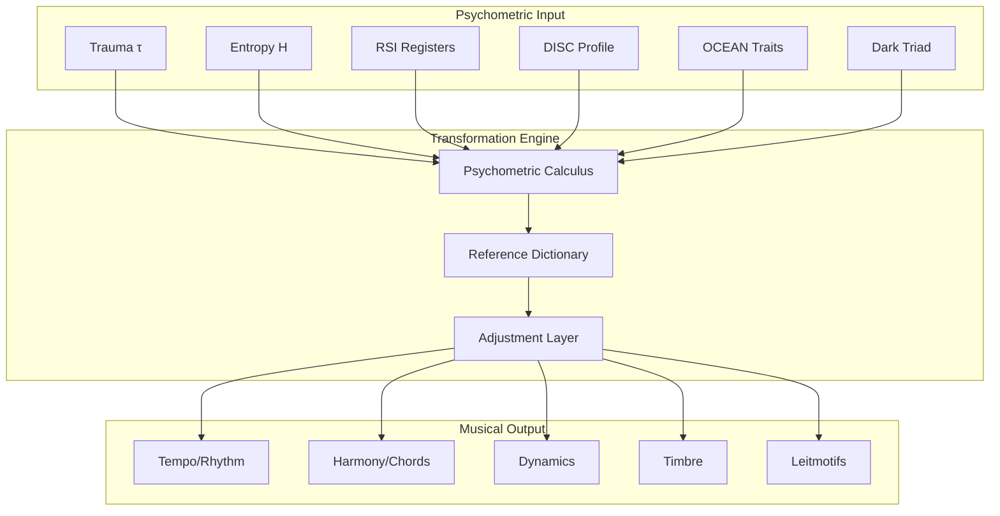

# 00. Introduction
## System Overview and Scope

**Author**: McKenney, J.  
**Document ID**: MPN-DOC-00  
**Version**: 3.0.0  
**Date**: December 31, 2025

---

## Navigation

← [README](./README.md) | [Next: 01_LACANIAN_FRAMEWORK →](./01_LACANIAN_FRAMEWORK.md)

**Related Documents**:
- [10_CORE_EQUATIONS](./10_CORE_EQUATIONS.md) - Mathematical foundations
- [40_SYSTEM_ARCHITECTURE](./40_SYSTEM_ARCHITECTURE.md) - Technical architecture
- [50_BIBLIOGRAPHY](./50_BIBLIOGRAPHY.md) - Complete citations

---

## 1. Purpose

The Musical Psychometric Notation (MPN) system provides a rigorous, 
mathematically-grounded framework for translating human psychological 
states into musical parameters. This enables:

1. **Automated Dramatic Scoring**: Generate music from narrative content
2. **Behavioral Analysis**: Create "musical fingerprints" of interactions
3. **Therapeutic Applications**: Music therapy driven by psychometrics
4. **Digital Twin Modeling**: Sound representations of agent states
5. **Cybersecurity Profiling**: Threat actor behavioral signatures

---

## 2. Theoretical Framework

---

## 3. Core Principles

### 3.1 Principle of Correspondence

Every psychometric dimension has a primary musical correlate:

| Psychometric | Musical | Rationale |
|--------------|---------|-----------|
| Trauma (τ) | Dynamics | Arousal → Volume |
| Entropy (H) | Rhythm | Uncertainty → Time |
| RSI Register | Mode/Scale | Register → Tonality |
| DISC | Instrument | Behavior → Timbre |
| Dark Triad | Timbre Mod | Pathology → Distortion |

**Citation**: McKenney, J. (2025). Correspondence principles in 
psychometric-musical translation. *OXOT Research*, RSCH-39.

### 3.2 Principle of Continuous Mapping

All mappings are continuous functions, not discrete categories:

$$
f: \mathbb{R}^n \rightarrow \mathcal{M}
$$

Where $\mathbb{R}^n$ is the psychometric state space and $\mathcal{M}$ 
is the musical parameter manifold.

**See**: [10_CORE_EQUATIONS](./10_CORE_EQUATIONS.md#continuous-mapping)

### 3.3 Principle of Adjustment

User-defined adjustments override defaults while preserving structure:

$$
p_{final} = \begin{cases}
p_{adjusted} & \text{if adjustment exists} \\
p_{default} & \text{otherwise}
\end{cases}
$$

**See**: [33_FLOW_ADJUSTMENT_SYSTEM](./33_FLOW_ADJUSTMENT_SYSTEM.md)

---

## 4. System Scope

### 4.1 Input Domain

| Input | Type | Range | Source |
|-------|------|-------|--------|
| Trauma | Float | [0.0, 1.0] | Agent state |
| Entropy | Float | [0.0, 1.0] | Shannon calculation |
| RSI | Vector | [0,1]³ | Lacanian analysis |
| DISC | Vector | [0,1]⁴ | Behavioral assessment |
| OCEAN | Vector | [0,1]⁵ | Personality test |
| Dark Triad | Vector | [0,1]³ | SD3 assessment |

### 4.2 Output Domain

| Output | Type | Range | Format |
|--------|------|-------|--------|
| Tempo | Integer | [40, 200] | BPM |
| Time Sig | String | — | "4/4", "5/4" |
| Key | String | — | "C Ionian" |
| Velocity | Integer | [0, 127] | MIDI |
| Instrument | Enum | — | Program # |
| Chord | String | — | "Cmaj7" |

---

## 5. Document Conventions

### 5.1 Mathematical Notation

| Symbol | Meaning | Domain |
|--------|---------|--------|
| τ | Trauma level | [0, 1] |
| H | Shannon entropy | [0, 1] |
| λ | Lyapunov exponent | ℝ |
| ρ | Relationship quality | [-1, 1] |
| v | MIDI velocity | [0, 127] |

### 5.2 Citation Format

All citations follow APA 7th Edition:

> McKenney, J. (2025). [Title]. *OXOT Research*, [Document ID].

### 5.3 Cross-References

Documents are interlinked using relative paths:
- `[Document Title](./DOCUMENT_NAME.md)` for forward links
- `← Previous | Next →` for navigation

---

## 6. Reading Order

### 6.1 Theoretical Track
1. [00_INTRODUCTION](./00_INTRODUCTION.md) (this document)
2. [01_LACANIAN_FRAMEWORK](./01_LACANIAN_FRAMEWORK.md)
3. [02_BORROMEAN_TOPOLOGY](./02_BORROMEAN_TOPOLOGY.md)
4. [03_PSYCHOMETRIC_THEORY](./03_PSYCHOMETRIC_THEORY.md)
5. [04_MUSICAL_SEMIOTICS](./04_MUSICAL_SEMIOTICS.md)

### 6.2 Mathematical Track
1. [10_CORE_EQUATIONS](./10_CORE_EQUATIONS.md)
2. [11_ENTROPY_CALCULUS](./11_ENTROPY_CALCULUS.md)
3. [12_LYAPUNOV_STABILITY](./12_LYAPUNOV_STABILITY.md)
4. [13_NEO_RIEMANNIAN_MATH](./13_NEO_RIEMANNIAN_MATH.md)

### 6.3 Implementation Track
1. [40_SYSTEM_ARCHITECTURE](./40_SYSTEM_ARCHITECTURE.md)
2. [42_API_SPECIFICATION](./42_API_SPECIFICATION.md)
3. [30-33: Process Flows](./30_FLOW_PSYCHOMETRIC_INPUT.md)

---

## 7. Version History

| Version | Date | Changes |
|---------|------|---------|
| 3.0.0 | 2025-12-31 | Complete wiki expansion |
| 2.4.0 | 2025-12-31 | Audio preview, verification |
| 2.0.0 | 2025-11-19 | Initial MPN system |

---

## References

McKenney, J. (2025a). Musical psychometric notation: A comprehensive 
framework. *OXOT Research*, RSCH-39.

McKenney, J. (2025b). Psychometric calculus foundations. *OXOT Research*, 
RSCH-43.

McKenney, J. (2025c). Seven-staff fugue model. *OXOT Research*, RSCH-41.

---

← [README](./README.md) | [Next: 01_LACANIAN_FRAMEWORK →](./01_LACANIAN_FRAMEWORK.md)
