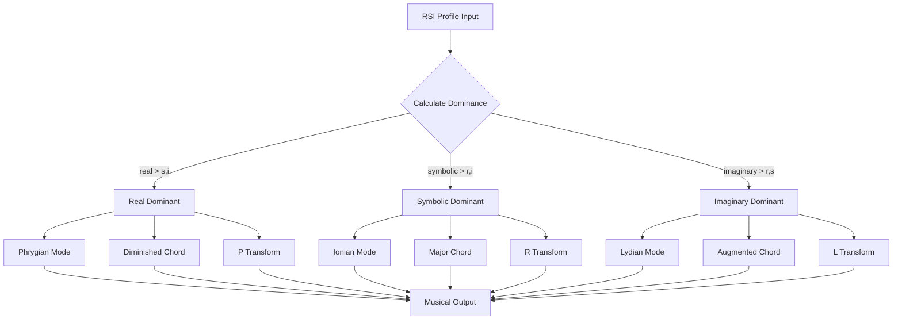

# 01. Lacanian Framework
## RSI Registers and the Topology of the Subject

**Author**: McKenney, J.  
**Document ID**: MPN-DOC-01  
**Version**: 3.0.0  
**Date**: December 31, 2025

---

## Navigation

← [00_INTRODUCTION](./00_INTRODUCTION.md) | 
[Next: 02_BORROMEAN_TOPOLOGY →](./02_BORROMEAN_TOPOLOGY.md)

**Related Documents**:
- [02_BORROMEAN_TOPOLOGY](./02_BORROMEAN_TOPOLOGY.md) - Stability mathematics
- [26_REF_MODE_DETAILED](./26_REF_MODE_DETAILED.md) - Mode/scale mappings
- [22_REF_HARMONY_DETAILED](./22_REF_HARMONY_DETAILED.md) - Chord operations
- [13_NEO_RIEMANNIAN_MATH](./13_NEO_RIEMANNIAN_MATH.md) - PLR transforms

---

## 1. Introduction

Jacques Lacan's theory of the three registers—Real, Symbolic, and 
Imaginary (RSI)—provides the foundational psychoanalytic framework for 
the MPN system. Each register maps to distinct musical characteristics.

---

## 2. The Three Registers

### 2.1 The Real (𝓡)

**Definition**: That which resists symbolization absolutely; the 
traumatic kernel that cannot be represented in language or image.

**Mathematical Representation**:

$$
\mathcal{R} = \{ x \in \mathcal{P} : \nexists s \in \mathcal{S} \text{ such that } s \mapsto x \}
$$

Where:
- $\mathcal{P}$ = psychic space
- $\mathcal{S}$ = symbolic system

**Musical Mapping**:

| Property | Musical Expression | Reference |
|----------|-------------------|-----------|
| Mode | Phrygian, Locrian | [26_REF_MODE](./26_REF_MODE_DETAILED.md) |
| Chord | Diminished, Tritone | [22_REF_HARMONY](./22_REF_HARMONY_DETAILED.md) |
| Neo-Riemannian | P (Parallel) | [13_NEO_RIEMANNIAN](./13_NEO_RIEMANNIAN_MATH.md) |
| Register | Low (16-256 Hz) | [20_REF_TIMBRE](./20_REF_TIMBRE_DETAILED.md) |
| Dynamic | fff (trauma) | [23_REF_DYNAMICS](./23_REF_DYNAMICS_DETAILED.md) |

**Citation**: Lacan, J. (1977). The agency of the letter in the 
unconscious. In *Écrits: A selection* (A. Sheridan, Trans., pp. 
146-178). W.W. Norton.

---

### 2.2 The Symbolic (𝓢)

**Definition**: The realm of language, law, and social order; the 
"big Other" that structures human experience.

**Mathematical Representation**:

$$
\mathcal{S} = \{ \sigma : \sigma \text{ is a signifier}, \sigma \in \text{Language} \}
$$

The Symbolic operates through differential relations:

$$
S_1 \rightarrow S_2 \rightarrow S_3 \rightarrow \cdots \rightarrow S_n
$$

**Musical Mapping**:

| Property | Musical Expression | Reference |
|----------|-------------------|-----------|
| Mode | Ionian (Major) | [26_REF_MODE](./26_REF_MODE_DETAILED.md) |
| Chord | Major, Major 7th | [22_REF_HARMONY](./22_REF_HARMONY_DETAILED.md) |
| Neo-Riemannian | R (Relative) | [13_NEO_RIEMANNIAN](./13_NEO_RIEMANNIAN_MATH.md) |
| Structure | Regular rhythm, 4/4 | [21_REF_RHYTHM](./21_REF_RHYTHM_DETAILED.md) |
| Texture | Homophonic | [25_REF_TEXTURE](./25_REF_TEXTURE_DETAILED.md) |

**Citation**: Lacan, J. (1977). The function and field of speech and 
language. In *Écrits: A selection* (pp. 30-113). W.W. Norton.

---

### 2.3 The Imaginary (𝓘)

**Definition**: The realm of images, ego, and identification; the 
mirror stage and narcissistic self-construction.

**Mathematical Representation**:

The mirror function:

$$
m: \text{Self} \rightarrow \text{Image}
$$

Subject-ego relation:

$$
\mathcal{I} = \{ i : i = m(s), s \in \text{Subject} \}
$$

**Musical Mapping**:

| Property | Musical Expression | Reference |
|----------|-------------------|-----------|
| Mode | Lydian, Whole-tone | [26_REF_MODE](./26_REF_MODE_DETAILED.md) |
| Chord | Augmented | [22_REF_HARMONY](./22_REF_HARMONY_DETAILED.md) |
| Neo-Riemannian | L (Leading-tone) | [13_NEO_RIEMANNIAN](./13_NEO_RIEMANNIAN_MATH.md) |
| Character | Ethereal, floating | — |
| Timbre | Bright, high register | [20_REF_TIMBRE](./20_REF_TIMBRE_DETAILED.md) |

**Citation**: Lacan, J. (1977). The mirror stage as formative of the 
function of the I. In *Écrits: A selection* (pp. 1-7). W.W. Norton.

---

## 3. Register Dominance Calculation

### 3.1 Dominance Function

Given an RSI profile vector:

$$
\vec{r} = \begin{pmatrix} r \\ s \\ i \end{pmatrix}, \quad r, s, i \in [0, 1]
$$

The dominant register is:

$$
D(\vec{r}) = \arg\max \{ r, s, i \}
$$

### 3.2 Implementation

```typescript
interface RSIProfile {
    real: number;      // r ∈ [0, 1]
    symbolic: number;  // s ∈ [0, 1]
    imaginary: number; // i ∈ [0, 1]
}

function getDominantRegister(rsi: RSIProfile): 'real' | 'symbolic' | 'imaginary' {
    const { real, symbolic, imaginary } = rsi;
    
    if (real >= symbolic && real >= imaginary) return 'real';
    if (symbolic >= imaginary) return 'symbolic';
    return 'imaginary';
}
```

**See**: [42_API_SPECIFICATION](./42_API_SPECIFICATION.md) for complete API

---

## 4. Object petit a (objet a)

### 4.1 Definition

The *objet a* is the unattainable object-cause of desire—not an object 
itself, but the void around which desire circulates.

**Mathematical Representation**:

$$
a = \lim_{n \to \infty} \frac{d^n}{dt^n} \text{Desire}(t) \neq \text{Object}
$$

The object is perpetually deferred:

$$
\text{Subject} \xrightarrow{\text{desire}} (a) \xrightarrow{\text{metonymy}} S_1 \rightarrow S_2 \rightarrow \cdots
$$

### 4.2 Musical Expression

The *objet a* manifests musically as:

| Expression | Musical Realization |
|------------|---------------------|
| Unresolved tension | Dominant 7th without resolution |
| Perpetual reaching | Ascending melodic contour |
| Deferred cadence | Deceptive cadence (V → vi) |
| Chromatic approach | Leading-tone without resolution |

**Reference**: [24_REF_MELODY_DETAILED](./24_REF_MELODY_DETAILED.md)

**Citation**: Lacan, J. (1998). The object and the thing. In 
*Seminar VII: The ethics of psychoanalysis* (pp. 121-135). W.W. Norton.

---

## 5. RSI to Music: Complete Mapping

### 5.1 Register-Mode Transform

$$
M: \text{RSI} \rightarrow \text{Mode}
$$

| Condition | Mode | Scale Formula |
|-----------|------|---------------|
| $D(\vec{r}) = \text{real}$ | Phrygian | [0,1,3,5,7,8,10] |
| $D(\vec{r}) = \text{symbolic}$ | Ionian | [0,2,4,5,7,9,11] |
| $D(\vec{r}) = \text{imaginary}$ | Lydian | [0,2,4,6,7,9,11] |

### 5.2 Register-Chord Transform

$$
C: \text{RSI} \rightarrow \text{ChordType}
$$

Definition via Neo-Riemannian operation priority:

$$
C(\vec{r}) = \begin{cases}
P(\text{current}) & \text{if } D(\vec{r}) = \text{real} \\
R(\text{current}) & \text{if } D(\vec{r}) = \text{symbolic} \\
L(\text{current}) & \text{if } D(\vec{r}) = \text{imaginary}
\end{cases}
$$

**See**: [13_NEO_RIEMANNIAN_MATH](./13_NEO_RIEMANNIAN_MATH.md) for 
PLR operation definitions.

---

## 6. Process Flow



---

## 7. Clinical Applications

### 7.1 Therapeutic Use

The RSI-music mapping enables therapeutic interventions:

1. **Real Intrusion**: When Real dominates, use grounding techniques 
   with Symbolic music (Major key, regular rhythm)
2. **Imaginary Inflation**: When Imaginary dominates, introduce 
   structuring elements (counterpoint, complex harmony)
3. **Symbolic Rigidity**: When Symbolic dominates, introduce 
   controlled disruption (tempo changes, modal mixture)

### 7.2 Diagnostic Use

Musical "fingerprints" reveal register imbalances:

$$
\text{Imbalance} = \frac{\max(\vec{r}) - \min(\vec{r})}{\operatorname{mean}(\vec{r})}
$$

High imbalance (> 0.5) suggests clinical significance.

---

## References

Lacan, J. (1977). *Écrits: A selection* (A. Sheridan, Trans.). 
W.W. Norton.

Lacan, J. (1998). *The seminar of Jacques Lacan, Book VII: The ethics 
of psychoanalysis* (D. Porter, Trans.). W.W. Norton.

McKenney, J. (2025). Lacanian registers in musical translation. 
*OXOT Research*, RSCH-02.

McKenney, J. (2025). Object petit a and harmonic desire. 
*OXOT Research*, RSCH-10.

---

← [00_INTRODUCTION](./00_INTRODUCTION.md) | 
[Next: 02_BORROMEAN_TOPOLOGY →](./02_BORROMEAN_TOPOLOGY.md)
