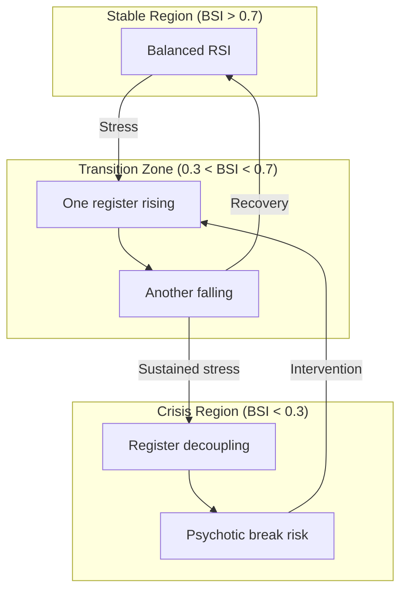

# 02. Borromean Topology
## Knot Stability and Register Interlocking

**Author**: McKenney, J.  
**Document ID**: MPN-DOC-02  
**Version**: 3.0.0  
**Date**: December 31, 2025

---

## Navigation

← [01_LACANIAN_FRAMEWORK](./01_LACANIAN_FRAMEWORK.md) | 
[Next: 03_PSYCHOMETRIC_THEORY →](./03_PSYCHOMETRIC_THEORY.md)

**Related Documents**:
- [12_LYAPUNOV_STABILITY](./12_LYAPUNOV_STABILITY.md) - Chaos metrics
- [01_LACANIAN_FRAMEWORK](./01_LACANIAN_FRAMEWORK.md) - RSI registers
- [22_REF_HARMONY_DETAILED](./22_REF_HARMONY_DETAILED.md) - Crisis chords

---

## 1. The Borromean Knot

### 1.1 Topological Definition

The Borromean knot consists of three interlocked rings such that 
cutting any one ring frees the other two. Lacan adopted this topology 
to represent the RSI registers.

```
        ╭──────────╮
       ╱            ╲
      │   SYMBOLIC   │
      │      (S)     │
       ╲            ╱
        ╰─────┬────╯
              │
    ╭─────────┼─────────╮
   ╱          │          ╲
  │   REAL    │  IMAGINARY│
  │    (R)    │    (I)    │
   ╲          │          ╱
    ╰─────────┴─────────╯
```

### 1.2 Mathematical Properties

The linking number between any two rings:

$$
\text{lk}(R, S) = \text{lk}(S, I) = \text{lk}(I, R) = 0
$$

But the three together are inseparable:

$$
\text{lk}(R \cup S \cup I) \neq 0
$$

This represents the fundamental structure of subjectivity: no single 
register can function alone.

---

## 2. Stability Measure

### 2.1 Borromean Stability Index (BSI)

The stability of the subject is measured by the balance of the three 
registers. Given an RSI vector:

$$
\vec{r} = \begin{pmatrix} r \\ s \\ i \end{pmatrix}
$$

The Borromean Stability Index is:

$$
\text{BSI} = \frac{\min(r, s, i)}{\max(r, s, i)}
$$

### 2.2 Interpretation

| BSI Range | Interpretation | Musical Manifestation |
|-----------|----------------|----------------------|
| 0.8 - 1.0 | Highly stable | Consonant harmony, regular rhythm |
| 0.5 - 0.8 | Moderately stable | Minor dissonance, tempo variation |
| 0.3 - 0.5 | Unstable | Strong dissonance, irregular meter |
| 0.0 - 0.3 | Crisis | Tritone, atonality, fragmentation |

### 2.3 Implementation

```typescript
function borromeanStability(rsi: RSIProfile): number {
    const { real, symbolic, imaginary } = rsi;
    const min = Math.min(real, symbolic, imaginary);
    const max = Math.max(real, symbolic, imaginary);
    return max > 0 ? min / max : 0;
}
```

**Reference**: [42_API_SPECIFICATION](./42_API_SPECIFICATION.md)

---

## 3. Variance Analysis

### 3.1 Register Variance

The variance of the RSI vector indicates register imbalance:

$$
\sigma^2_{\text{RSI}} = \frac{1}{3} \sum_{x \in \{r,s,i\}} (x - \bar{x})^2
$$

Where $\bar{x} = \frac{r + s + i}{3}$

### 3.2 Standard Deviation

$$
\sigma_{\text{RSI}} = \sqrt{\sigma^2_{\text{RSI}}}
$$

| σ Range | Condition | Example |
|---------|-----------|---------|
| < 0.1 | Balanced | (0.5, 0.5, 0.5) |
| 0.1-0.2 | Mild dominance | (0.6, 0.5, 0.4) |
| 0.2-0.3 | Clear dominance | (0.8, 0.45, 0.3) |
| > 0.3 | Severe imbalance | (0.95, 0.3, 0.1) |

---

## 4. Knot Dynamics

### 4.1 Temporal Evolution

The RSI vector evolves over time:

$$
\frac{d\vec{r}}{dt} = f(\vec{r}, \text{stress}, \text{context})
$$

Under stress, registers can decouple:

$$
\lim_{\text{stress} \to \infty} \text{BSI} \to 0
$$

### 4.2 Phase Portrait



---

## 5. Musical Representation of Stability

### 5.1 BSI to Harmonic Tension

$$
T(BSI) = 1 - BSI
$$

Where T = tension level, mapping to:

| Tension | Chord Type | Reference |
|---------|------------|-----------|
| T < 0.2 | Major, Perfect 5th | [27_REF_INTERVALS](./27_REF_INTERVALS_DETAILED.md) |
| T 0.2-0.4 | Minor, Major 7th | [22_REF_HARMONY](./22_REF_HARMONY_DETAILED.md) |
| T 0.4-0.6 | Dominant 7th | [22_REF_HARMONY](./22_REF_HARMONY_DETAILED.md) |
| T 0.6-0.8 | Diminished | [22_REF_HARMONY](./22_REF_HARMONY_DETAILED.md) |
| T > 0.8 | Tritone, Cluster | [22_REF_HARMONY](./22_REF_HARMONY_DETAILED.md) |

### 5.2 BSI to Time Signature

$$
\text{TimeSignature}(BSI) = \begin{cases}
\text{4/4} & \text{if } BSI > 0.7 \\
\text{3/4} & \text{if } 0.5 < BSI \leq 0.7 \\
\text{5/4 or 7/8} & \text{if } 0.3 < BSI \leq 0.5 \\
\text{Free} & \text{if } BSI \leq 0.3
\end{cases}
$$

**Reference**: [21_REF_RHYTHM_DETAILED](./21_REF_RHYTHM_DETAILED.md)

### 5.3 BSI to Texture

| BSI | Texture | Rationale |
|-----|---------|-----------|
| > 0.8 | Homophonic | Unity, consensus |
| 0.5-0.8 | Heterophonic | Slight variation |
| 0.3-0.5 | Polyphonic | Competing voices |
| < 0.3 | Disintegrated | Fragmentation |

**Reference**: [25_REF_TEXTURE_DETAILED](./25_REF_TEXTURE_DETAILED.md)

---

## 6. Seldon Crisis Detection

### 6.1 Definition

A "Seldon Crisis" occurs when BSI drops below critical threshold 
combined with high entropy:

$$
\text{SeldonCrisis} = (\text{BSI} < 0.3) \land (H > 0.8)
$$

Where H = Shannon entropy 
(see [11_ENTROPY_CALCULUS](./11_ENTROPY_CALCULUS.md)).

### 6.2 Musical Signature

During Seldon Crisis:
- Neo-Riemannian: PLP operation (tritone shift)
- Chord: Augmented tritone
- Time: Free meter or polyrhythm
- Dynamics: fff with sforzando

**Reference**: RSCH-09-SELDON_CRISIS (McKenney, 2025)

---

## 7. Complete Stability Calculation

### 7.1 Composite Stability Score

Incorporating Borromean and Lyapunov measures:

$$
S_{total} = \alpha \cdot \text{BSI} + (1-\alpha) \cdot (1 - \hat{\lambda})
$$

Where:
- $\alpha = 0.6$ (weighting factor)
- $\hat{\lambda} = \text{normalized Lyapunov exponent}$

**See**: [12_LYAPUNOV_STABILITY](./12_LYAPUNOV_STABILITY.md)

### 7.2 Decision Table

| BSI | λ | S_total | Recommended Action |
|-----|---|---------|-------------------|
| > 0.8 | < 0 | > 0.8 | Stable, maintain |
| 0.5-0.8 | 0 | 0.5-0.7 | Monitor, minor intervention |
| 0.3-0.5 | > 0 | 0.3-0.5 | Significant concern |
| < 0.3 | >> 0 | < 0.3 | Crisis intervention |

---

## 8. Implementation Code

```typescript
interface StabilityAnalysis {
    bsi: number;           // Borromean Stability Index
    variance: number;      // RSI variance
    tension: number;       // Harmonic tension
    seldonCrisis: boolean; // Crisis flag
}

function analyzeStability(
    rsi: RSIProfile, 
    entropy: number
): StabilityAnalysis {
    const { real, symbolic, imaginary } = rsi;
    
    // BSI calculation
    const min = Math.min(real, symbolic, imaginary);
    const max = Math.max(real, symbolic, imaginary);
    const bsi = max > 0 ? min / max : 0;
    
    // Variance calculation
    const mean = (real + symbolic + imaginary) / 3;
    const variance = (
        Math.pow(real - mean, 2) + 
        Math.pow(symbolic - mean, 2) + 
        Math.pow(imaginary - mean, 2)
    ) / 3;
    
    // Derived values
    const tension = 1 - bsi;
    const seldonCrisis = bsi < 0.3 && entropy > 0.8;
    
    return { bsi, variance, tension, seldonCrisis };
}
```

---

## References

Lacan, J. (1974-1975). *Seminar XXII: RSI*. Unpublished manuscript.

Lacan, J. (1976-1977). *Seminar XXIII: Le sinthome*. W.W. Norton.

McKenney, J. (2025). Borromean stability indices in psychometric 
analysis. *OXOT Research*, RSCH-01.

McKenney, J. (2025). Seldon crisis detection algorithms. *OXOT 
Research*, RSCH-09.

---

← [01_LACANIAN_FRAMEWORK](./01_LACANIAN_FRAMEWORK.md) | 
[Next: 03_PSYCHOMETRIC_THEORY →](./03_PSYCHOMETRIC_THEORY.md)
