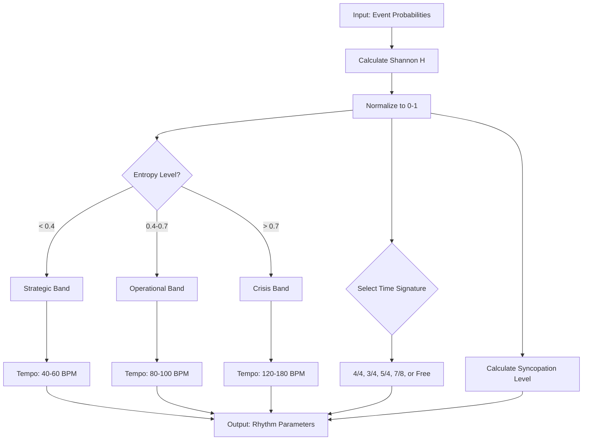

# 11. Entropy Calculus
## Shannon Entropy in Rhythmic Generation

**Author**: McKenney, J.  
**Document ID**: MPN-DOC-11  
**Version**: 3.0.0  
**Date**: December 31, 2025

---

## Navigation

← [10_CORE_EQUATIONS](./10_CORE_EQUATIONS.md) | 
[Next: 12_LYAPUNOV_STABILITY →](./12_LYAPUNOV_STABILITY.md)

**Related Documents**:
- [21_REF_RHYTHM_DETAILED](./21_REF_RHYTHM_DETAILED.md) - Rhythm mappings
- [10_CORE_EQUATIONS](./10_CORE_EQUATIONS.md) - Core transformations
- [12_LYAPUNOV_STABILITY](./12_LYAPUNOV_STABILITY.md) - Stability metrics

---

## 1. Shannon Entropy Definition

### 1.1 Discrete Entropy

For a discrete random variable $X$ with probability distribution 
$P = \{p_1, p_2, \ldots, p_n\}$:

$$
H(X) = -\sum_{i=1}^{n} p_i \log_2 p_i
$$

**Properties**:
- $H(X) \geq 0$
- $H(X) = 0$ iff $X$ is deterministic
- $H(X) \leq \log_2 n$ with equality iff uniform distribution

### 1.2 Normalized Entropy

For use in the MPN system, we normalize entropy to [0,1]:

$$
\hat{H}(X) = \frac{H(X)}{\log_2 n}
$$

This yields:
- $\hat{H} = 0$ for maximum predictability
- $\hat{H} = 1$ for maximum uncertainty

---

## 2. Entropy in Musical Context

### 2.1 Behavioral Entropy

Applied to human behavior patterns, entropy measures unpredictability:

$$
H_{\text{behavior}} = -\sum_{a \in \text{Actions}} P(a) \log_2 P(a)
$$

**Example calculation**:

| Action | Probability | Contribution |
|--------|-------------|--------------|
| Cooperate | 0.5 | -0.5 × log₂(0.5) = 0.5 |
| Defect | 0.3 | -0.3 × log₂(0.3) = 0.521 |
| Abstain | 0.2 | -0.2 × log₂(0.2) = 0.464 |
| **Total** | **1.0** | **H = 1.485 bits** |

Normalized: $\hat{H} = \frac{1.485}{\log_2(3)} = \frac{1.485}{1.585} = 0.937$

### 2.2 Script Entropy

For dialogue scripts, entropy is calculated over turn-taking:

$$
H_{\text{script}} = -\sum_{s \in \text{Speakers}} P(s) \log_2 P(s)
$$

| Entropy Level | Dialogue Pattern |
|---------------|------------------|
| Low (< 0.3) | Dominated by one speaker |
| Medium (0.3-0.7) | Balanced exchange |
| High (> 0.7) | Chaotic, unpredictable |

---

## 3. Entropy to Rhythm Transformation

### 3.1 Time Signature Selection

$$
\mu: [0, 1] \rightarrow \{\text{Time Signatures}\}
$$

**Formal definition**:

$$
\mu(\hat{H}) = \begin{cases}
\frac{4}{4} & \hat{H} \in [0.00, 0.30) \\
\frac{3}{4} & \hat{H} \in [0.30, 0.50) \\
\frac{6}{8} & \hat{H} \in [0.50, 0.60) \\
\frac{5}{4} & \hat{H} \in [0.60, 0.70) \\
\frac{7}{8} & \hat{H} \in [0.70, 0.85) \\
\text{free} & \hat{H} \in [0.85, 1.00]
\end{cases}
$$

**Rationale**:

| Time Signature | Beats | Entropy Connection |
|----------------|-------|-------------------|
| 4/4 | 4 | Most predictable, highest symmetry |
| 3/4 | 3 | Slight asymmetry, dance-like |
| 6/8 | 6 (compound) | Dual layering (3+3 or 2+2+2) |
| 5/4 | 5 | Asymmetric, cognitive disruption |
| 7/8 | 7 | Highly irregular, anxiety-inducing |
| Free | N/A | No pattern, maximum uncertainty |

### 3.2 Tempo Variance

Higher entropy produces greater tempo instability:

$$
\sigma_T(\hat{H}) = \sigma_{\text{base}} \cdot (1 + 2\hat{H})
$$

Where $\sigma_{\text{base}} = 2$ BPM.

| Entropy | σ_T | Effect |
|---------|-----|--------|
| 0.0 | 2 BPM | Very stable |
| 0.5 | 4 BPM | Moderate rubato |
| 1.0 | 6 BPM | Significant fluctuation |

---

## 4. Information-Theoretic Rhythm

### 4.1 Rhythmic Redundancy

Low entropy = high redundancy:

$$
R = 1 - \hat{H}
$$

High redundancy produces:
- Regular patterns
- Predictable downbeats
- Minimal syncopation

### 4.2 Syncopation Index

Syncopation increases with entropy:

$$
\text{Syncopation}(\hat{H}) = \lfloor 4\hat{H} \rfloor
$$

| Level | Description |
|-------|-------------|
| 0 | No syncopation |
| 1 | Light syncopation |
| 2 | Moderate syncopation |
| 3 | Heavy syncopation |
| 4 | Maximum syncopation |

---

## 5. Tempo Calculation

### 5.1 Base Tempo Function

Given stability level $\sigma$:

$$
T(\hat{H}, \sigma) = T_{\min}(\sigma) + \hat{H} \cdot \Delta T(\sigma)
$$

Where $\Delta T = T_{\max} - T_{\min}$.

### 5.2 Stability Bands

| Band | $T_{\min}$ | $T_{\max}$ | $\Delta T$ |
|------|-----------|-----------|------------|
| Strategic | 40 | 60 | 20 |
| Operational | 80 | 100 | 20 |
| Crisis | 120 | 180 | 60 |

### 5.3 Example Calculations

**Example 1**: Operational, $\hat{H} = 0.3$

$$
T = 80 + 0.3 \times 20 = 86 \text{ BPM}
$$

**Example 2**: Crisis, $\hat{H} = 0.8$

$$
T = 120 + 0.8 \times 60 = 168 \text{ BPM}
$$

---

## 6. Entropy and Stability Categories

### 6.1 Stability Selection

$$
\sigma(\hat{H}) = \begin{cases}
\text{strategic} & \hat{H} < 0.4 \\
\text{operational} & 0.4 \leq \hat{H} < 0.7 \\
\text{crisis} & \hat{H} \geq 0.7
\end{cases}
$$

### 6.2 Cross-Reference Table

| $\hat{H}$ | Stability | Tempo | Time Sig | Syncopation |
|-----------|-----------|-------|----------|-------------|
| 0.1 | Strategic | 42 | 4/4 | 0 |
| 0.3 | Strategic | 46 | 4/4 | 1 |
| 0.5 | Operational | 90 | 6/8 | 2 |
| 0.7 | Crisis | 162 | 7/8 | 2 |
| 0.9 | Crisis | 174 | Free | 3 |

---

## 7. Implementation

```typescript
interface EntropyAnalysis {
    normalizedEntropy: number;
    stability: 'strategic' | 'operational' | 'crisis';
    tempo: number;
    timeSignature: string;
    syncopationLevel: number;
    redundancy: number;
}

function analyzeEntropy(probabilityDistribution: number[]): EntropyAnalysis {
    // Calculate Shannon entropy
    const H = -probabilityDistribution.reduce((sum, p) => {
        if (p > 0) sum += p * Math.log2(p);
        return sum;
    }, 0);
    
    // Normalize to [0, 1]
    const maxEntropy = Math.log2(probabilityDistribution.length);
    const normalizedEntropy = maxEntropy > 0 ? H / maxEntropy : 0;
    
    // Determine stability
    let stability: 'strategic' | 'operational' | 'crisis' = 'operational';
    if (normalizedEntropy < 0.4) stability = 'strategic';
    else if (normalizedEntropy >= 0.7) stability = 'crisis';
    
    // Calculate tempo
    const tempoRanges = {
        strategic: { min: 40, max: 60 },
        operational: { min: 80, max: 100 },
        crisis: { min: 120, max: 180 }
    };
    const range = tempoRanges[stability];
    const tempo = Math.round(
        range.min + normalizedEntropy * (range.max - range.min)
    );
    
    // Time signature
    let timeSignature = '4/4';
    if (normalizedEntropy >= 0.85) timeSignature = 'free';
    else if (normalizedEntropy >= 0.7) timeSignature = '7/8';
    else if (normalizedEntropy >= 0.6) timeSignature = '5/4';
    else if (normalizedEntropy >= 0.5) timeSignature = '6/8';
    else if (normalizedEntropy >= 0.3) timeSignature = '3/4';
    
    return {
        normalizedEntropy,
        stability,
        tempo,
        timeSignature,
        syncopationLevel: Math.floor(4 * normalizedEntropy),
        redundancy: 1 - normalizedEntropy
    };
}
```

---

## 8. Process Flow



---

## References

Shannon, C.E. (1948). A mathematical theory of communication. 
*Bell System Technical Journal*, 27(3), 379-423.

McKenney, J. (2025). Entropy-based rhythm generation in psychometric 
music. *OXOT Research*, RSCH-05.

McKenney, J. (2025). Musical psychometric notation. *OXOT Research*, 
RSCH-39.

---

← [10_CORE_EQUATIONS](./10_CORE_EQUATIONS.md) | 
[Next: 12_LYAPUNOV_STABILITY →](./12_LYAPUNOV_STABILITY.md)
