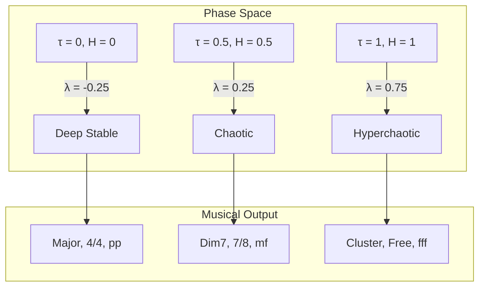

# 12. Lyapunov Stability
## Chaos Theory and System Stability Metrics

**Author**: McKenney, J.  
**Document ID**: MPN-DOC-12  
**Version**: 3.0.0  
**Date**: December 31, 2025

---

## Navigation

← [11_ENTROPY_CALCULUS](./11_ENTROPY_CALCULUS.md) | 
[Next: 13_NEO_RIEMANNIAN_MATH →](./13_NEO_RIEMANNIAN_MATH.md)

**Related Documents**:
- [02_BORROMEAN_TOPOLOGY](./02_BORROMEAN_TOPOLOGY.md) - BSI calculation
- [10_CORE_EQUATIONS](./10_CORE_EQUATIONS.md) - Core transformations
- [11_ENTROPY_CALCULUS](./11_ENTROPY_CALCULUS.md) - Entropy metrics

---

## 1. Lyapunov Exponent Theory

### 1.1 Classical Definition

The Lyapunov exponent measures the rate of separation of 
infinitesimally close trajectories in phase space:

$$
\lambda = \lim_{t \to \infty} \lim_{\|\delta \vec{Z}_0\| \to 0} 
\frac{1}{t} \ln \frac{\|\delta \vec{Z}(t)\|}{\|\delta \vec{Z}_0\|}
$$

Where:
- $\delta \vec{Z}_0$ = initial separation vector
- $\delta \vec{Z}(t)$ = separation at time $t$

### 1.2 Interpretation

| λ Value | System Behavior |
|---------|-----------------|
| λ < 0 | Stable (trajectories converge) |
| λ = 0 | Neutral (Lyapunov stable) |
| λ > 0 | Chaotic (trajectories diverge) |

**Citation**: Lyapunov, A.M. (1892/1992). *The general problem of 
the stability of motion*. Taylor & Francis.

---

## 2. MPN Lyapunov Approximation

### 2.1 Simplified Formula

For the MPN system, we approximate Lyapunov using trauma (τ) and 
entropy (H):

$$
\lambda_{MPN} = \frac{\tau + H - 0.5}{2}
$$

**Derivation**:

1. Trauma and entropy are both destabilizing factors
2. At equilibrium ($\tau = H = 0.25$), $\lambda = 0$
3. The factor of 2 normalizes to reasonable range

### 2.2 Properties

**Range**:

$$
\lambda_{MPN} \in \left[-0.25, 0.75\right]
$$

**Boundary conditions**:
- $\lambda_{min} = \frac{0 + 0 - 0.5}{2} = -0.25$ (maximum stability)
- $\lambda_{max} = \frac{1 + 1 - 0.5}{2} = 0.75$ (maximum chaos)

---

## 3. Stability Classification

### 3.1 Stability Zones

$$
\sigma(\lambda) = \begin{cases}
\text{converging} & \lambda < 0 \\
\text{edge of chaos} & 0 \leq \lambda < 0.1 \\
\text{chaotic} & 0.1 \leq \lambda < 0.3 \\
\text{hyperchaotic} & \lambda \geq 0.3
\end{cases}
$$

### 3.2 Complete Classification Table

| Zone | λ Range | τ + H | Musical Character |
|------|---------|-------|-------------------|
| Deep stable | [-0.25, -0.1) | < 0.3 | Consonant, regular |
| Stable | [-0.1, 0) | 0.3-0.5 | Minor tension |
| Edge | [0, 0.1) | 0.5-0.7 | Suspended tension |
| Chaotic | [0.1, 0.3) | 0.7-1.1 | Dissonance, irregular |
| Hyperchaotic | [0.3, 0.75] | > 1.1 | Atonality, noise |

---

## 4. Musical Manifestations

### 4.1 Stability to Harmony Mapping

$$
H_{chord}(\lambda) = \begin{cases}
\text{major} & \lambda < -0.1 \\
\text{minor} & -0.1 \leq \lambda < 0 \\
\text{dominant 7} & 0 \leq \lambda < 0.15 \\
\text{diminished} & 0.15 \leq \lambda < 0.3 \\
\text{tritone/cluster} & \lambda \geq 0.3
\end{cases}
$$

### 4.2 Stability to Rhythm Mapping

$$
R_{meter}(\lambda) = \begin{cases}
\text{4/4, steady} & \lambda < 0 \\
\text{3/4 or 6/8} & 0 \leq \lambda < 0.1 \\
\text{5/4 or 7/8} & 0.1 \leq \lambda < 0.2 \\
\text{polyrhythm} & 0.2 \leq \lambda < 0.3 \\
\text{aleatory} & \lambda \geq 0.3
\end{cases}
$$

### 4.3 Reference Links

- [22_REF_HARMONY_DETAILED](./22_REF_HARMONY_DETAILED.md)
- [21_REF_RHYTHM_DETAILED](./21_REF_RHYTHM_DETAILED.md)

---

## 5. Composite Stability Score

### 5.1 Integration with BSI

Combining Lyapunov with Borromean Stability Index:

$$
S_{total} = \alpha \cdot \text{BSI} + (1 - \alpha) \cdot (1 - \hat{\lambda})
$$

Where:
- $\alpha = 0.6$ (BSI weight)
- $\hat{\lambda} = \frac{\lambda - \lambda_{min}}{\lambda_{max} - \lambda_{min}}$ (normalized λ)

### 5.2 Normalization

$$
\hat{\lambda} = \frac{\lambda + 0.25}{1.0} = \lambda + 0.25
$$

### 5.3 Individual Term Contributions

| Component | Description | Weight |
|-----------|-------------|--------|
| BSI | Register balance | 60% |
| (1 - λ̂) | Dynamic stability | 40% |

---

## 6. Crisis Detection

### 6.1 Seldon Crisis Condition

A Seldon Crisis occurs when:

$$
\text{SeldonCrisis} = (\text{BSI} < 0.3) \land (\lambda > 0.2)
$$

This corresponds to:
- Register decoupling (BSI < 0.3)
- System divergence (λ > 0.2)

### 6.2 Crisis Severity

$$
\text{Severity} = \frac{(0.3 - \text{BSI}) + (\lambda - 0.2)}{0.3 + 0.55}
$$

Clamped to [0, 1].

### 6.3 Crisis Musical Signature

| Element | Crisis Expression |
|---------|-------------------|
| Chord | Tritone (augmented 4th) |
| Mode | Locrian or chromatic |
| Time | Free meter |
| Dynamics | fff with sfz accents |
| Transform | PLP (tritone shift) |

**Reference**: [13_NEO_RIEMANNIAN_MATH](./13_NEO_RIEMANNIAN_MATH.md)

---

## 7. Phase Diagram



### 7.1 Iso-λ Curves

In the (τ, H) plane, constant λ curves are:

$$
\tau + H = 2\lambda + 0.5 = c
$$

These are straight lines with slope -1.

---

## 8. Implementation

```typescript
interface LyapunovAnalysis {
    lambda: number;           // Raw Lyapunov exponent
    normalizedLambda: number; // [0, 1]
    zone: 'converging' | 'edge' | 'chaotic' | 'hyperchaotic';
    seldonCrisis: boolean;
    crisisSeverity: number;
    totalStability: number;
}

function analyzeLyapunov(
    trauma: number,
    entropy: number,
    bsi: number
): LyapunovAnalysis {
    // Calculate Lyapunov exponent: λ = (τ + H - 0.5) / 2
    const lambda = (trauma + entropy - 0.5) / 2;
    
    // Normalize to [0, 1]: λ̂ = λ + 0.25
    const normalizedLambda = Math.max(0, Math.min(1, lambda + 0.25));
    
    // Determine zone
    let zone: LyapunovAnalysis['zone'] = 'converging';
    if (lambda >= 0.3) zone = 'hyperchaotic';
    else if (lambda >= 0.1) zone = 'chaotic';
    else if (lambda >= 0) zone = 'edge';
    
    // Seldon Crisis detection
    const seldonCrisis = bsi < 0.3 && lambda > 0.2;
    
    // Crisis severity
    let crisisSeverity = 0;
    if (seldonCrisis) {
        crisisSeverity = Math.min(1, 
            ((0.3 - bsi) + (lambda - 0.2)) / 0.85
        );
    }
    
    // Total stability: S = 0.6×BSI + 0.4×(1 - λ̂)
    const totalStability = 0.6 * bsi + 0.4 * (1 - normalizedLambda);
    
    return {
        lambda,
        normalizedLambda,
        zone,
        seldonCrisis,
        crisisSeverity,
        totalStability
    };
}
```

---

## 9. Worked Examples

### Example 1: Calm Dialogue

**Input**: τ = 0.2, H = 0.1, BSI = 0.9

$$
\lambda = \frac{0.2 + 0.1 - 0.5}{2} = \frac{-0.2}{2} = -0.1
$$

- Zone: Stable
- Crisis: No
- S_total = 0.6(0.9) + 0.4(1 - 0.15) = 0.54 + 0.34 = 0.88

### Example 2: Tense Negotiation

**Input**: τ = 0.6, H = 0.5, BSI = 0.5

$$
\lambda = \frac{0.6 + 0.5 - 0.5}{2} = \frac{0.6}{2} = 0.3
$$

- Zone: Hyperchaotic
- Crisis: BSI 0.5 > 0.3, so No (barely)
- S_total = 0.6(0.5) + 0.4(1 - 0.55) = 0.30 + 0.18 = 0.48

### Example 3: Crisis State

**Input**: τ = 0.9, H = 0.85, BSI = 0.2

$$
\lambda = \frac{0.9 + 0.85 - 0.5}{2} = \frac{1.25}{2} = 0.625
$$

- Zone: Hyperchaotic
- Crisis: Yes (BSI 0.2 < 0.3, λ 0.625 > 0.2)
- Severity = ((0.3 - 0.2) + (0.625 - 0.2)) / 0.85 = 0.625 / 0.85 = 0.74

---

## References

Lyapunov, A.M. (1892/1992). *The general problem of the stability 
of motion* (A.T. Fuller, Trans.). Taylor & Francis.

Strogatz, S.H. (2015). *Nonlinear dynamics and chaos* (2nd ed.). 
Westview Press.

McKenney, J. (2025). Lyapunov stability in psychometric systems. 
*OXOT Research*, RSCH-08.

McKenney, J. (2025). Seldon crisis detection. *OXOT Research*, 
RSCH-09.

---

← [11_ENTROPY_CALCULUS](./11_ENTROPY_CALCULUS.md) | 
[Next: 13_NEO_RIEMANNIAN_MATH →](./13_NEO_RIEMANNIAN_MATH.md)
