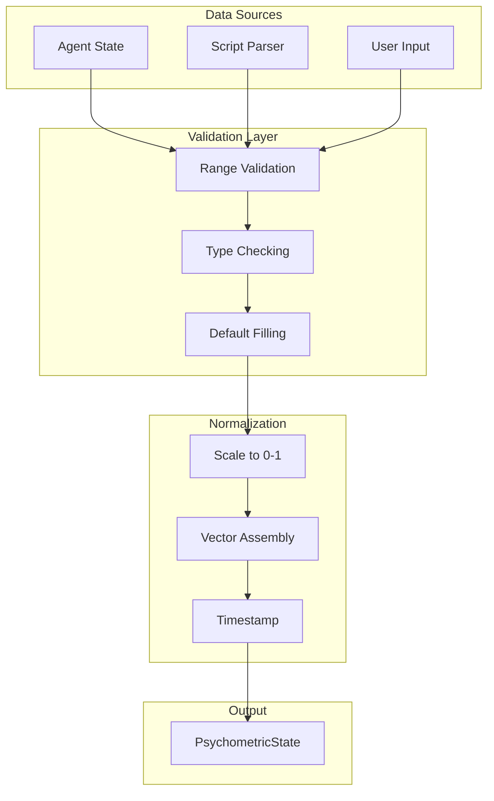
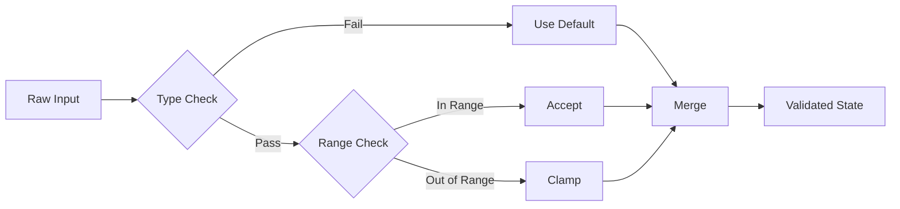

# 30. Process Flow: Psychometric Input
## Input Processing Pipeline

**Author**: McKenney, J.  
**Document ID**: MPN-DOC-30  
**Version**: 3.0.0  
**Date**: December 31, 2025

---

## Navigation

← [29_REF_SILENCE_DETAILED](./29_REF_SILENCE_DETAILED.md) | 
[Next: 31_FLOW_CALCULUS_ENGINE →](./31_FLOW_CALCULUS_ENGINE.md)

**Related Documents**:
- [03_PSYCHOMETRIC_THEORY](./03_PSYCHOMETRIC_THEORY.md) - Input dimensions
- [10_CORE_EQUATIONS](./10_CORE_EQUATIONS.md) - Transformations
- [42_API_SPECIFICATION](./42_API_SPECIFICATION.md) - API details

---

## 1. Input Flow Overview



---

## 2. Input Sources

### 2.1 Agent State

Digital twin agent providing real-time psychometric values:

```typescript
interface AgentStateInput {
    trauma: number;      // [0, 1]
    entropy: number;     // [0, 1]
    rsi: RSIProfile;     // Real, Symbolic, Imaginary
    disc: DISCProfile;   // D, I, S, C
}
```

### 2.2 Script Parser

Narrative content analyzed for psychometric indicators:

```typescript
interface ParsedScriptInput {
    speaker: string;
    dialogue: string;
    inferredTrauma: number;
    inferredEntropy: number;
    emotion: string;
}
```

### 2.3 User Input

Direct parameter adjustment from UI controls:

```typescript
interface UserAdjustmentInput {
    parameterKey: string;  // e.g., 'rhythm-006'
    dimension: string;     // 'tempo' | 'dynamics' | etc.
    value: number;
}
```

---

## 3. Validation Rules

### 3.1 Range Validation

$$
\forall x \in \text{input}: x' = \max(0, \min(1, x))
$$

Clamp all numeric inputs to [0, 1].

### 3.2 Required Fields

| Field | Type | Default | Required |
|-------|------|---------|----------|
| trauma | number | 0.3 | No |
| entropy | number | 0.3 | No |
| rsi.real | number | 0.33 | No |
| rsi.symbolic | number | 0.33 | No |
| rsi.imaginary | number | 0.34 | No |
| disc.D | number | 0.25 | No |
| disc.I | number | 0.25 | No |
| disc.S | number | 0.25 | No |
| disc.C | number | 0.25 | No |

### 3.3 Validation Flow



---

## 4. Normalization Process

### 4.1 Scale Normalization

For inputs on different scales:

$$
x_{norm} = \frac{x - x_{min}}{x_{max} - x_{min}}
$$

### 4.2 RSI Vector Normalization

Ensure RSI sums to 1:

$$
\vec{r}_{norm} = \frac{\vec{r}}{\|\vec{r}\|_1}
$$

Where $\|\vec{r}\|_1 = r + s + i$

### 4.3 DISC Vector Normalization

Similarly for DISC:

$$
\vec{d}_{norm} = \frac{\vec{d}}{\|\vec{d}\|_1}
$$

---

## 5. State Assembly

### 5.1 Complete State Vector

$$
\vec{p} = \begin{pmatrix}
\tau \\
H \\
r \\
s \\
i \\
D \\
I_d \\
S_d \\
C \\
\vdots
\end{pmatrix}
$$

### 5.2 TypeScript Interface

```typescript
interface PsychometricState {
    // Core measures
    trauma: number;           // τ
    entropy: number;          // H
    arrhythmia: number;       // Heart rate variance
    
    // Lacanian registers
    rsi: {
        real: number;
        symbolic: number;
        imaginary: number;
    };
    
    // DISC profile
    disc: {
        D: number;
        I: number;
        S: number;
        C: number;
    };
    
    // Big Five
    ocean: {
        O: number;
        C: number;
        E: number;
        A: number;
        N: number;
    };
    
    // Dark Triad
    darkTriad: {
        narcissism: number;
        machiavellianism: number;
        psychopathy: number;
    };
    
    // Metadata
    timestamp: number;
    source: 'agent' | 'script' | 'user';
}
```

---

## 6. Error Handling

### 6.1 Error Types

| Error | Cause | Recovery |
|-------|-------|----------|
| RangeError | Value outside [0,1] | Clamp |
| TypeError | Wrong type | Use default |
| MissingField | Required field absent | Use default |
| NaN | Invalid calculation | Use default |

### 6.2 Logging

```typescript
function validateAndLog(input: unknown, field: string): number {
    if (typeof input !== 'number' || isNaN(input)) {
        console.warn(`[MPN] Invalid ${field}, using default`);
        return DEFAULT_VALUES[field];
    }
    if (input < 0 || input > 1) {
        console.warn(`[MPN] ${field} out of range, clamping`);
        return Math.max(0, Math.min(1, input));
    }
    return input;
}
```

---

## 7. Implementation

```typescript
function processInput(
    rawInput: Partial<PsychometricState>
): PsychometricState {
    // Default state
    const defaults: PsychometricState = {
        trauma: 0.3,
        entropy: 0.3,
        arrhythmia: 0.2,
        rsi: { real: 0.33, symbolic: 0.34, imaginary: 0.33 },
        disc: { D: 0.25, I: 0.25, S: 0.25, C: 0.25 },
        ocean: { O: 0.5, C: 0.5, E: 0.5, A: 0.5, N: 0.5 },
        darkTriad: { narcissism: 0.2, machiavellianism: 0.2, psychopathy: 0.2 },
        timestamp: Date.now(),
        source: 'user'
    };
    
    // Merge with validation
    const result: PsychometricState = {
        trauma: clamp(rawInput.trauma ?? defaults.trauma),
        entropy: clamp(rawInput.entropy ?? defaults.entropy),
        arrhythmia: clamp(rawInput.arrhythmia ?? defaults.arrhythmia),
        rsi: normalizeRSI(rawInput.rsi ?? defaults.rsi),
        disc: normalizeDISC(rawInput.disc ?? defaults.disc),
        ocean: rawInput.ocean ?? defaults.ocean,
        darkTriad: rawInput.darkTriad ?? defaults.darkTriad,
        timestamp: Date.now(),
        source: rawInput.source ?? 'user'
    };
    
    return result;
}

function clamp(value: number): number {
    return Math.max(0, Math.min(1, value));
}

function normalizeRSI(rsi: RSIProfile): RSIProfile {
    const sum = rsi.real + rsi.symbolic + rsi.imaginary;
    if (sum === 0) return { real: 0.33, symbolic: 0.34, imaginary: 0.33 };
    return {
        real: rsi.real / sum,
        symbolic: rsi.symbolic / sum,
        imaginary: rsi.imaginary / sum
    };
}
```

---

## 8. Output

The validated `PsychometricState` is passed to the Calculus Engine.

**Next Step**: [31_FLOW_CALCULUS_ENGINE](./31_FLOW_CALCULUS_ENGINE.md)

---

## References

McKenney, J. (2025). Psychometric state validation. *OXOT Research*, 
RSCH-43.

McKenney, J. (2025). MPN input processing pipeline. *OXOT Research*, 
RSCH-39.

---

← [29_REF_SILENCE_DETAILED](./29_REF_SILENCE_DETAILED.md) | 
[Next: 31_FLOW_CALCULUS_ENGINE →](./31_FLOW_CALCULUS_ENGINE.md)
