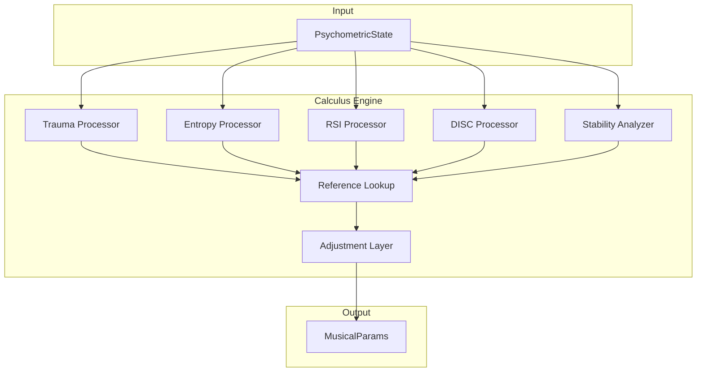
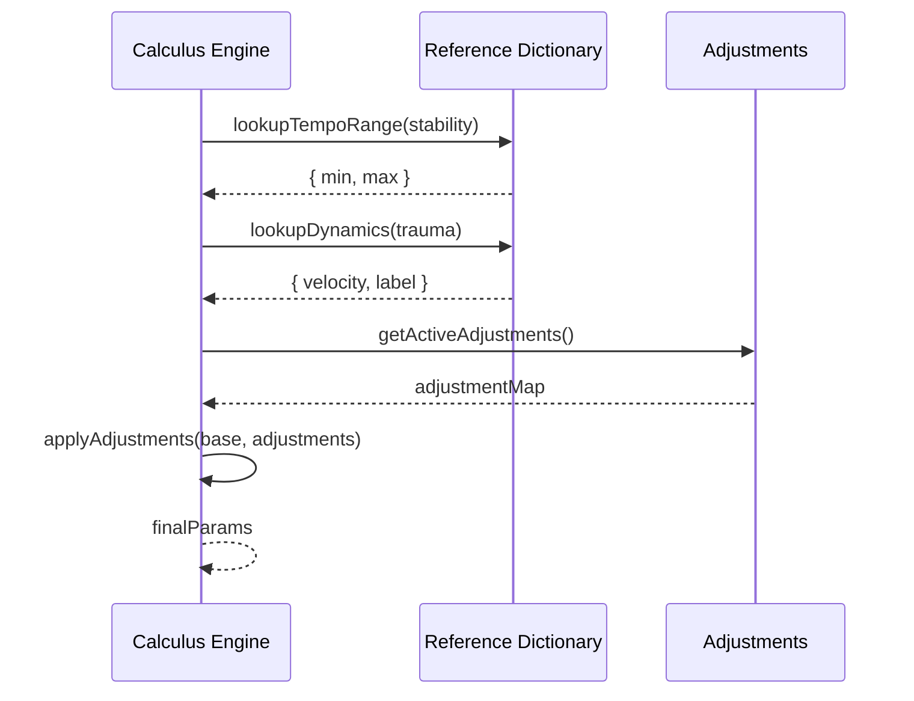
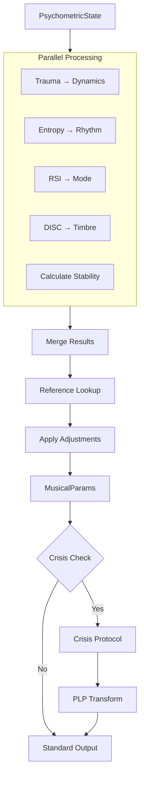

# 31. Process Flow: Calculus Engine
## Transformation Pipeline

**Author**: McKenney, J.  
**Document ID**: MPN-DOC-31  
**Version**: 3.0.0  
**Date**: December 31, 2025

---

## Navigation

← [30_FLOW_PSYCHOMETRIC_INPUT](./30_FLOW_PSYCHOMETRIC_INPUT.md) | 
[Next: 32_FLOW_SCORE_GENERATION →](./32_FLOW_SCORE_GENERATION.md)

**Related Documents**:
- [10_CORE_EQUATIONS](./10_CORE_EQUATIONS.md) - Mathematical formulas
- [11_ENTROPY_CALCULUS](./11_ENTROPY_CALCULUS.md) - Entropy calculations
- [12_LYAPUNOV_STABILITY](./12_LYAPUNOV_STABILITY.md) - Stability metrics

---

## 1. Engine Overview



---

## 2. Processing Stages

### Stage 1: Trauma Processing

**Input**: τ ∈ [0, 1]

**Calculations**:

$$
v = 20 + 107\tau
$$

$$
\delta = \begin{cases}
\text{ppp} & \tau < 0.1 \\
\text{pp} & 0.1 \leq \tau < 0.2 \\
\vdots & \\
\text{fff} & \tau \geq 0.9
\end{cases}
$$

**Output**: `{ velocity: number, label: string }`

**Reference**: [10_CORE_EQUATIONS](./10_CORE_EQUATIONS.md#trauma-equations)

---

### Stage 2: Entropy Processing

**Input**: H ∈ [0, 1]

**Calculations**:

$$
\sigma = \begin{cases}
\text{strategic} & H < 0.4 \\
\text{operational} & 0.4 \leq H < 0.7 \\
\text{crisis} & H \geq 0.7
\end{cases}
$$

$$
T = T_{min}(\sigma) + H \cdot (T_{max}(\sigma) - T_{min}(\sigma))
$$

$$
\mu = \text{timeSignature}(H)
$$

**Output**: `{ tempo: number, timeSignature: string, stability: string }`

**Reference**: [11_ENTROPY_CALCULUS](./11_ENTROPY_CALCULUS.md)

---

### Stage 3: RSI Processing

**Input**: (r, s, i) ∈ [0, 1]³

**Calculations**:

$$
D_{reg} = \arg\max\{r, s, i\}
$$

$$
M = \text{mode}(D_{reg})
$$

$$
\text{NRO} = \text{operation}(D_{reg})
$$

**Output**: `{ mode: string, neoRiemannian: 'P' | 'R' | 'L' }`

**Reference**: [01_LACANIAN_FRAMEWORK](./01_LACANIAN_FRAMEWORK.md), 
[13_NEO_RIEMANNIAN_MATH](./13_NEO_RIEMANNIAN_MATH.md)

---

### Stage 4: DISC Processing

**Input**: (D, I, S, C) ∈ [0, 1]⁴

**Calculations**:

$$
D_{disc} = \arg\max\{D, I, S, C\}
$$

$$
\mathcal{I} = \text{instrument}(D_{disc})
$$

$$
\mathcal{A} = \text{articulation}(D_{disc})
$$

**Output**: `{ instrument: string, articulation: string }`

**Reference**: [03_PSYCHOMETRIC_THEORY](./03_PSYCHOMETRIC_THEORY.md#disc-theory)

---

### Stage 5: Stability Analysis

**Input**: τ, H, BSI

**Calculations**:

$$
\lambda = \frac{\tau + H - 0.5}{2}
$$

$$
\text{BSI} = \frac{\min(r, s, i)}{\max(r, s, i)}
$$

$$
\text{Crisis} = (\lambda > 0.2) \land (\text{BSI} < 0.3)
$$

**Output**: `{ lyapunov: number, bsi: number, seldonCrisis: boolean }`

**Reference**: [12_LYAPUNOV_STABILITY](./12_LYAPUNOV_STABILITY.md)

---

## 3. Reference Lookup

### 3.1 Lookup Process



### 3.2 Lookup Table Structure

| Lookup Function | Input | Output | Ref Doc |
|----------------|-------|--------|---------|
| lookupTempoRange | stability | {min, max} | [21_REF_RHYTHM](./21_REF_RHYTHM_DETAILED.md) |
| lookupDynamics | trauma | {velocity, label} | [23_REF_DYNAMICS](./23_REF_DYNAMICS_DETAILED.md) |
| lookupMode | register | mode string | [26_REF_MODE](./26_REF_MODE_DETAILED.md) |
| lookupInstrument | DISC | instrument | [20_REF_TIMBRE](./20_REF_TIMBRE_DETAILED.md) |
| lookupTimeSignature | entropy | time sig | [21_REF_RHYTHM](./21_REF_RHYTHM_DETAILED.md) |

---

## 4. Adjustment Application

### 4.1 Override Logic

$$
p_{final} = \begin{cases}
p_{adjusted} & \text{if } \exists \text{ adjustment for } p \\
p_{calculated} & \text{otherwise}
\end{cases}
$$

### 4.2 Implementation

```typescript
function applyAdjustments(
    calculated: MusicalParams,
    adjustments: Record<string, ParameterAdjustment>
): MusicalParams {
    const result = { ...calculated };
    
    // Tempo override
    if (adjustments['rhythm-006']?.tempo) {
        result.tempo = adjustments['rhythm-006'].tempo;
    }
    
    // Dynamics override
    if (adjustments['dynamics-002']?.dynamics) {
        result.velocity = adjustments['dynamics-002'].dynamics;
        result.dynamics = velocityToLabel(adjustments['dynamics-002'].dynamics);
    }
    
    // Humanization (tempo variance)
    if (adjustments['rhythm-007']?.humanization) {
        const variance = adjustments['rhythm-007'].humanization;
        result.tempo += Math.random() * variance * 2 - variance;
    }
    
    return result;
}
```

**Reference**: [33_FLOW_ADJUSTMENT_SYSTEM](./33_FLOW_ADJUSTMENT_SYSTEM.md)

---

## 5. Complete Pipeline



---

## 6. Output Structure

### 6.1 MusicalParams Interface

```typescript
interface MusicalParams {
    // Rhythm
    tempo: number;              // BPM
    timeSignature: string;      // "4/4", "5/4", etc.
    stability: 'strategic' | 'operational' | 'crisis';
    
    // Dynamics
    dynamics: string;           // "mf", "ff", etc.
    velocity: number;           // 0-127
    
    // Tonality
    key: string;                // "C Ionian"
    mode: string;               // "Ionian", "Phrygian", etc.
    neoRiemannian: 'P' | 'R' | 'L';
    
    // Timbre
    instrument: string;         // "Brass", "Strings", etc.
    articulation: string;       // "legato", "staccato"
    
    // Stability
    lyapunov: number;
    bsi: number;
    seldonCrisis: boolean;
}
```

---

## 7. Performance Considerations

### 7.1 Computation Time

| Stage | Typical Time |
|-------|--------------|
| Trauma Processing | <1ms |
| Entropy Processing | <1ms |
| RSI Processing | <1ms |
| DISC Processing | <1ms |
| Reference Lookup | ~2ms |
| Adjustment Apply | <1ms |
| **Total** | **~5ms** |

### 7.2 Caching

```typescript
const lookupCache = new Map<string, any>();

function cachedLookup<T>(key: string, fn: () => T): T {
    if (lookupCache.has(key)) {
        return lookupCache.get(key);
    }
    const result = fn();
    lookupCache.set(key, result);
    return result;
}
```

---

## References

McKenney, J. (2025). Psychometric calculus engine design. *OXOT 
Research*, RSCH-43.

McKenney, J. (2025). MPN transformation pipeline. *OXOT Research*, 
RSCH-39.

---

← [30_FLOW_PSYCHOMETRIC_INPUT](./30_FLOW_PSYCHOMETRIC_INPUT.md) | 
[Next: 32_FLOW_SCORE_GENERATION →](./32_FLOW_SCORE_GENERATION.md)
