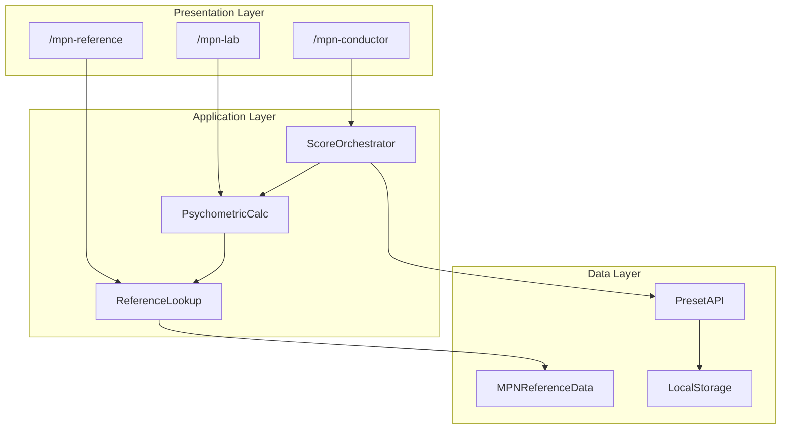
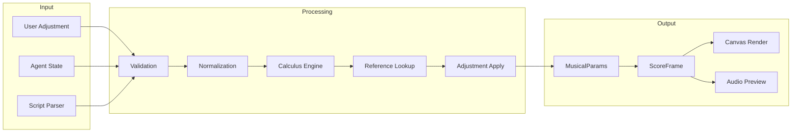
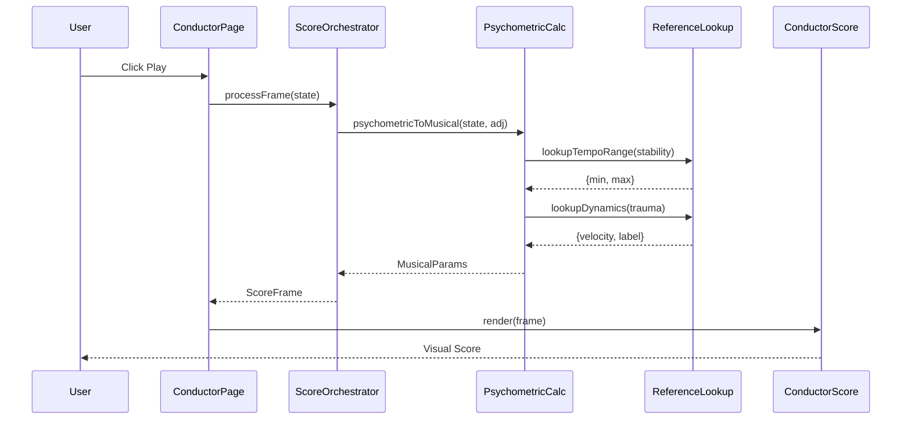
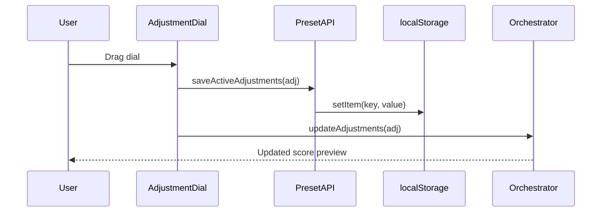

# 40. System Architecture
## Complete Component and Data Flow Diagrams

**Author**: McKenney, J.  
**Document ID**: MPN-DOC-40  
**Version**: 3.0.0  
**Date**: December 31, 2025

---

## Navigation

← [33_FLOW_ADJUSTMENT_SYSTEM](./33_FLOW_ADJUSTMENT_SYSTEM.md) | 
[Next: 41_DATA_ARCHITECTURE →](./41_DATA_ARCHITECTURE.md)

**Related Documents**:
- [30_FLOW_PSYCHOMETRIC_INPUT](./30_FLOW_PSYCHOMETRIC_INPUT.md) - Input flow
- [31_FLOW_CALCULUS_ENGINE](./31_FLOW_CALCULUS_ENGINE.md) - Transform flow
- [42_API_SPECIFICATION](./42_API_SPECIFICATION.md) - API details

---

## 1. High-Level Architecture



---

## 2. Component Diagram

```
┌─────────────────────────────────────────────────────────────────────────────┐
│                              MPN SYSTEM v3.0                                │
├─────────────────────────────────────────────────────────────────────────────┤
│                                                                             │
│  ┌─────────────────────────────────────────────────────────────────────┐   │
│  │                         PRESENTATION LAYER                           │   │
│  ├─────────────────────────────────────────────────────────────────────┤   │
│  │                                                                       │   │
│  │  ┌─────────────────┐ ┌─────────────────┐ ┌─────────────────┐        │   │
│  │  │  ConductorPage  │ │  ReferencePage  │ │    LabPage      │        │   │
│  │  │  - Canvas score │ │  - Filter/Cards │ │  - Digital twin │        │   │
│  │  │  - Playback     │ │  - Categories   │ │  - Experiments  │        │   │
│  │  └────────┬────────┘ └────────┬────────┘ └────────┬────────┘        │   │
│  │           │                   │                   │                   │   │
│  │  ┌────────┴───────────────────┴───────────────────┴────────┐        │   │
│  │  │                  UI Components                           │        │   │
│  │  │  - ConductorScore.tsx    - AdjustmentDial.tsx           │        │   │
│  │  │  - ParameterAdjustmentPanel.tsx  - PresetManager.tsx    │        │   │
│  │  └──────────────────────────┬──────────────────────────────┘        │   │
│  │                              │                                        │   │
│  └──────────────────────────────┼────────────────────────────────────────┘   │
│                                 │                                            │
│  ┌──────────────────────────────┼────────────────────────────────────────┐   │
│  │                         APPLICATION LAYER                             │   │
│  ├──────────────────────────────┼────────────────────────────────────────┤   │
│  │                              ▼                                         │   │
│  │  ┌─────────────────────────────────────────────────────────────────┐  │   │
│  │  │                     ScoreOrchestrator.ts                         │  │   │
│  │  │  - processFrame(state) → PsychometricScoreFrame                  │  │   │
│  │  │  - updateAdjustments(adj)                                        │  │   │
│  │  │  - generateScore(script)                                         │  │   │
│  │  └────────────────────────────┬────────────────────────────────────┘  │   │
│  │                               │                                        │   │
│  │  ┌────────────────────────────▼────────────────────────────────────┐  │   │
│  │  │                  psychometric_calculus.ts                        │  │   │
│  │  │  - psychometricToMusical(state, adj) → MusicalParams             │  │   │
│  │  │  - traumaToDynamics(τ, adj)                                      │  │   │
│  │  │  - entropyToRhythm(H, adj)                                       │  │   │
│  │  │  - rsiToMode(r, s, i)                                            │  │   │
│  │  └────────────────────────────┬────────────────────────────────────┘  │   │
│  │                               │                                        │   │
│  │  ┌────────────────────────────▼────────────────────────────────────┐  │   │
│  │  │                   mpn_reference_lookup.ts                        │  │   │
│  │  │  - lookupTempoRange(stability, adj)                              │  │   │
│  │  │  - lookupDynamics(trauma, adj)                                   │  │   │
│  │  │  - lookupMode(register)                                          │  │   │
│  │  │  - lookupAllParams(...)                                          │  │   │
│  │  └────────────────────────────┬────────────────────────────────────┘  │   │
│  │                               │                                        │   │
│  └───────────────────────────────┼────────────────────────────────────────┘   │
│                                  │                                            │
│  ┌───────────────────────────────┼────────────────────────────────────────┐   │
│  │                          DATA LAYER                                    │   │
│  ├───────────────────────────────┼────────────────────────────────────────┤   │
│  │                               ▼                                         │   │
│  │  ┌─────────────────────────────────────────────────────────────────┐   │   │
│  │  │                    mpn_reference_data.ts                         │   │   │
│  │  │  - MPN_REFERENCE_DICTIONARY: MPNReferenceEntry[]                 │   │   │
│  │  │  - TIMBRE_ENTRIES, RHYTHM_ENTRIES, etc.                          │   │   │
│  │  │  - 55 total entries across 10 categories                         │   │   │
│  │  └─────────────────────────────────────────────────────────────────┘   │   │
│  │                                                                         │   │
│  │  ┌─────────────────────────────────────────────────────────────────┐   │   │
│  │  │                      mpn_preset_api.ts                           │   │   │
│  │  │  - getActiveAdjustments() → Record<string, adj>                  │   │   │
│  │  │  - saveActiveAdjustments(adj)                                    │   │   │
│  │  │  - getPresets(), savePreset(), deletePreset()                    │   │   │
│  │  └────────────────────────────┬────────────────────────────────────┘   │   │
│  │                               │                                         │   │
│  │                               ▼                                         │   │
│  │  ┌─────────────────────────────────────────────────────────────────┐   │   │
│  │  │                       localStorage                               │   │   │
│  │  │  - oxot_mpn_presets: MPNPreset[]                                 │   │   │
│  │  │  - oxot_mpn_active_adjustments: Record<string, any>              │   │   │
│  │  └─────────────────────────────────────────────────────────────────┘   │   │
│  │                                                                         │   │
│  └─────────────────────────────────────────────────────────────────────────┘   │
│                                                                             │
└─────────────────────────────────────────────────────────────────────────────┘
```

---

## 3. Data Flow Diagram



---

## 4. Technology Stack

| Layer | Technology | Version |
|-------|------------|---------|
| Framework | Next.js | 15.x |
| UI Library | React | 19.x |
| Animation | Framer Motion | 11.x |
| Audio | Tone.js | 15.x |
| Canvas | HTML5 Canvas | — |
| State | React useState | — |
| Storage | localStorage | — |
| Testing | Vitest | — |
| Styling | Tailwind CSS | 3.x |

---

## 5. File Structure

```
src/components/mpn-lab/
├── __tests__/
│   └── mpn_calculus.test.ts
├── AdjustmentDial.tsx
├── ConductorScore.tsx
├── MPNExperiment_NeuralPropagation.tsx
├── ParameterAdjustmentPanel.tsx
├── PresetManager.tsx
├── mpn_preset_api.ts
├── mpn_reference_data.ts
├── mpn_reference_lookup.ts
├── mpn_reference_types.ts
├── psychometric_calculus.ts
├── score_orchestrator.ts
└── score_types.ts

src/app/
├── mpn-conductor/
│   └── page.tsx
├── mpn-reference/
│   └── page.tsx
└── mpn-lab/
    └── page.tsx
```

---

## 6. Sequence Diagrams

### 6.1 Score Generation Sequence



### 6.2 Adjustment Sequence



---

## 7. Dependencies

```json
{
  "dependencies": {
    "next": "^15.0.0",
    "react": "^19.0.0",
    "framer-motion": "^11.0.0",
    "tone": "^15.0.0",
    "lucide-react": "^0.300.0"
  },
  "devDependencies": {
    "vitest": "^1.0.0",
    "typescript": "^5.0.0"
  }
}
```

---

## References

McKenney, J. (2025). MPN system architecture. *OXOT Research*, 
RSCH-39.

McKenney, J. (2025). Score orchestration patterns. *OXOT Research*, 
RSCH-42.

---

← [33_FLOW_ADJUSTMENT_SYSTEM](./33_FLOW_ADJUSTMENT_SYSTEM.md) | 
[Next: 41_DATA_ARCHITECTURE →](./41_DATA_ARCHITECTURE.md)
